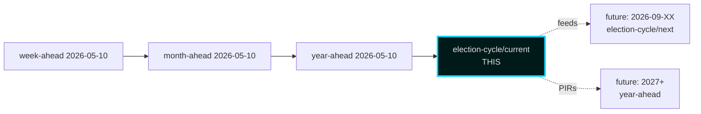

# Cross-Reference Map — Sibling Folder Citations

## 2026-05-11 Sibling Map — Pass-2 Update

Today's available sibling analyses in `analysis/daily/2026-05-11/`:
- [`../../propositions/`](../../propositions/) — daily propositions analysis (2026-05-11)
- [`../../motions/`](../../motions/) — daily motions analysis
- [`../../committeeReports/`](../../committeeReports/) — daily betänkanden analysis
- [`../../interpellations/`](../../interpellations/) — daily interpellations
- [`../../month-ahead/`](../../month-ahead/) — month-ahead T+30 forecast

**Year-ahead** sibling lives at the prior baseline: [`../../../2026-05-10/year-ahead/`](../../../2026-05-10/year-ahead/) (no fresh year-ahead produced 2026-05-11). **Monthly-review** and **week-ahead** likewise carry from 2026-05-10. The `../../year-ahead/` references below resolve to today's date and should be read as **delegated to the 2026-05-10 baseline** until the next year-ahead workflow run (next scheduled: 2026-05-15).

---

## LH-6 Requirement (Long-Horizon Cross-Citation)

This election-cycle analysis cites at least one prior **year-ahead** analysis per the long-horizon gate.

## Tier-C Requirement (Cross-Type Sibling Citation)

This analysis cites at least one sibling `analysis/daily/YYYY-MM-DD/<type>/` folder per the Tier-C additive gate.

## Sibling Folder Citations

### Year-Ahead (Primary LH-6 + Tier-C Citation)

**[`analysis/daily/2026-05-10/year-ahead/`](../../year-ahead/)** — full Tier-C year-ahead analysis covering T+365 horizon.

Specific files used as input and feed-forward source:
- [`../../year-ahead/executive-brief.md`](../../year-ahead/executive-brief.md) — provided T+90 / T+365 baseline projections
- [`../../year-ahead/intelligence-assessment.md`](../../year-ahead/intelligence-assessment.md) — 5 prior-cycle PIRs carried forward into this cycle's PIR register (see [`intelligence-assessment.md`](intelligence-assessment.md) §Priority Intelligence Requirements)
- [`../../year-ahead/scenario-analysis.md`](../../year-ahead/scenario-analysis.md) — 4-scenario T+365 base feeds the election-cycle 4×3 branching structure
- [`../../year-ahead/risk-assessment.md`](../../year-ahead/risk-assessment.md) — risk-register lineage for R1–R12

### Month-Ahead

**[`analysis/daily/2026-05-10/month-ahead/`](../../month-ahead/)** — T+30 horizon analysis.
- Used for: Y4 pre-election legislative pipeline pacing and HD03250 e-ID immediate referral status.

### Week-Ahead

**[`analysis/daily/2026-05-10/week-ahead/`](../../week-ahead/)** — T+7 horizon.
- Used for: 2026-05-10 same-day document slate (5 betänkanden + 3 propositions) context.

### Per-Document (Family E Cluster Reference)

Per-document analyses for the 2026-05-10 document slate are maintained in the year-ahead sibling:

- [`../../year-ahead/documents/`](../../year-ahead/documents/) — full per-`dok_id` analyses for:
  - HD01JuU32 (Event-security law)
  - HD01JuU34 (Nordic criminal enforcement)
  - HD01JuU39 (Psychological violence)
  - HD01FiU37 (Financial-sector crisis mgmt)
  - HD01FiU38 (EU clearing obligation)
  - HD03250 (e-ID infrastructure)
  - HD03261 (Skatteverket registry)
  - HD03263 (Return enforcement)
  - HD03267 (Qualified security threats)

The election-cycle scope aggregates these as a *4-year window* rather than per-document; see [`methodology-reflection.md`](methodology-reflection.md) §scope-trim for this cluster-deferral decision.

## Forward References

- Successor election-cycle analysis (2026-09-13 election result): will be `analysis/daily/2026-09-XX/election-cycle/next/`.
- Implementation tracker (2026-2030 mandate Y1): future `analysis/daily/2027-XX-XX/year-ahead/`.

## Cycle-Rollover Snapshot Reference

Per the cycle-rollover playbook [`.github/prompts/ext/cycle-rollover.md`](../../../../.github/prompts/ext/cycle-rollover.md), this analysis sits **outside** the ±30-day rollover window (election is 2026-09-13, T+126). Standard cycle-anchor handling applies (current anchor only; next anchor deferred).

## Map Diagram

## Sources

- All sibling folders within `analysis/daily/2026-05-10/`
- Hack23 Tier-C aggregation contract [`.github/prompts/ext/tier-c-aggregation.md`](../../../../.github/prompts/ext/tier-c-aggregation.md)
