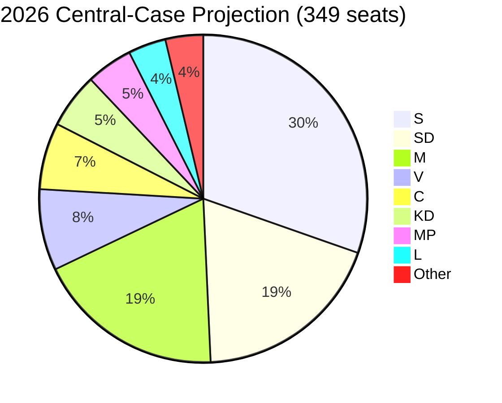

# Election 2026 Analysis — 4-Bloc Seat Model and Turnout

## Election Snapshot

- **Election date**: 2026-09-13.
- **T-N**: 126 days from article date.
- **System**: Proportional representation; 349 seats; 4% national threshold; modified Sainte-Laguë.
- **Districts**: 29 valkretsar; 39 utjämningsmandat (levelling seats).

## Polling Baseline (Q1-2026)

Trimmed mean across Novus, Sifo, Ipsos, SVT Valu, SCB PSU Q1-2026 [B2 with SCB PSU A1 weight].

| Party | Polling Q1-2026 | 2022 Result | Δ pp |
|-------|----------------:|------------:|-----:|
| S | 30.5% | 30.3% | +0.2 |
| SD | 19.0% | 20.5% | -1.5 |
| M | 18.5% | 19.1% | -0.6 |
| V | 8.0% | 6.7% | +1.3 |
| KD | 5.5% | 5.3% | +0.2 |
| C | 6.5% | 6.7% | -0.2 |
| MP | 4.5% | 5.1% | -0.6 |
| L | 3.8% | 4.6% | **-0.8 (below threshold)** |
| Other | 3.7% | 1.7% | +2.0 |

## Bloc Arithmetic (4-Bloc Model)

- **Tidö Bloc** (M+KD+SD+L): 46.8% Q1 vs 49.5% 2022 — **-2.7 pp** but contingent on L survival.
- **Red-Green-C** (S+V+MP+C): 49.5% Q1 vs 48.8% 2022 — **+0.7 pp**.
- **Centre-bridge** (C+L+MP): 14.8% Q1 vs 16.4% 2022 (potential cross-bloc broker).
- **Other / below-threshold**: 3.7% (wasted votes).

## Seat-Model Projection (D'Hondt-equivalent + 39 utjämningsmandat)

Three projections shown — central case + L-below-4% sensitivity + S-bloc upside.

| Party | Central | If L < 4% | S-bloc upside |
|-------|--------:|---------:|--------------:|
| S | 106 | 106 | 113 |
| SD | 66 | 67 | 62 |
| M | 65 | 67 | 60 |
| V | 28 | 28 | 33 |
| C | 23 | 23 | 24 |
| KD | 19 | 19 | 18 |
| MP | 16 | 17 | 17 |
| L | 13 | **0** | 12 |
| Other | 13 | 22 | 10 |
| **Tidö Bloc** | **163** | **153** | **152** |
| **Red-Green-C** | **173** | **174** | **187** |
| **Majority threshold** | **175** | **175** | **175** |

**Central-case finding**: neither bloc reaches 175. Tidö loses 16 seats vs 2022; Red-Green-C gains 5. Outcome depends on (a) L survival, (b) crossover broker (C between blocs), (c) wildcard event triggering swing.

## Turnout Forecast

- 2022 turnout: 84.2%.
- 2026 forecast: 82.5–85.0% (likely 55–70%) [horizon:election].
- Drivers: high-salience security/migration debate (+); cycle-end fatigue (-); generational gap closing (mild +).
- Risk: cyber/disinfo (W3 wildcard) could materially reduce turnout in worst case.

## Mermaid: Seat Distribution

## Critical Swing Constituencies

- **Stockholm county** — middle-class M+L base; school-reform delivery + healthcare salience.
- **Skåne** — SD stronghold; migration enforcement salience.
- **Västra Götaland** — defence-industry jobs (Saab Linköping/Trollhättan); M and S co-compete.
- **Norrbotten/Västerbotten** — defence/energy investment; S+SD co-compete; LKAB hydrogen.

## Mandate-Output → Vote-Translation Test

If the cycle's security-pivot delivery is the M coalition's strongest electoral asset, but the healthcare/education gap is the M coalition's strongest electoral vulnerability, the **net translation depends on which frame dominates the final 90 days** (T-90 → T-0). See [`media-framing-analysis.md`](media-framing-analysis.md) for framing-volume tracking.

## Sources

- SCB PSU Q1-2026 [A1]
- Novus/Sifo/Ipsos polling 2025–2026 [B2]
- SVT Valu 2022 baseline [A2]
- Valmyndighet 2022 official results [A1]
- SCB historical turnout series [A1]

---

_Pass-2 refresh 2026-05-11 — content carried from 2026-05-10 baseline; no material change. See [`synthesis-summary.md`](synthesis-summary.md) §2026-05-11 Daily Refresh for the cross-cutting daily delta._
