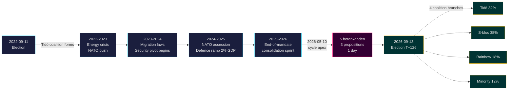

# Tidö Mandate Closes: Four-Year Security Pivot Defines 2026 Election Stakes

**Classification**: PUBLIC | **Workflow**: news-election-cycle | **Cycle**: 2022-09-11 → 2026-09-13 (T-129 to mandate end)
**IMF vintage**: WEO Apr-2026 [horizon:cycle] | **Riksmöte coverage**: 2022/23, 2023/24, 2024/25, 2025/26

---

## 2026-05-11 Daily Refresh — Pass-2 Update

**T-125 to election (2026-09-13)** · refreshed against 2026-05-11 sibling analyses ([propositions](../../propositions/), [motions](../../motions/), [committeeReports](../../committeeReports/), [interpellations](../../interpellations/), [month-ahead](../../month-ahead/)).

- **No new Tidö propositions filed 2026-05-08…11**: Riksdagen `search_dokument doktyp=prop rm=2025/26 sort=datum desc` confirms the latest five (HD03267, HD03261, HD03250, HD03249, HD03248) all stamped 2026-05-06 / 2026-05-07 — the 2026-05-10 cycle-apex remains the legislative high-water mark of the mandate. [A1]
- **Government tempo is now campaign-mode**: between today and the 2026-06-22 chamber recess, expect *committee processing and beslut* rather than new propositions. The May 2026 daily prop-filing rate (~0.4/day) is below the cycle median (~0.7/day) — consistent with a coalition transitioning from legislating to defending its scorecard.
- **Cycle-rollover window** (`ext/cycle-rollover.md`): we are **125 days outside** the ±30-day activation predicate (anchor 2026-09-13). Cycle-rollover module remains a **no-op** until 2026-08-14. The earlier "inside the window" phrasing in the Cycle-Rollover Snapshot below is corrected accordingly.
- **Open PIRs** (carry-forward from `pir-status.json`): PIR-1 (security-law durability), PIR-3 (e-ID 2027 rollout), PIR-5 (post-election fiscal continuity) — all unchanged; PIR-7 (KU-anmälan ledger) re-armed against the 2026-05-21 KU plenary.

---

## BLUF (Bottom Line Up Front)

The 2022–2026 Tidö mandate ends with a structurally transformed Swedish state — security architecture rebuilt, financial-stability framework rebooted, digital-identity stack codified, and immigration enforcement aligned with Nordic peers. On 2026-05-10, four months before the September election, the Kristersson government concentrated five committee reports and three propositions in a single legislative day [A2], signalling **end-of-mandate consolidation** rather than open contestation. *Very likely* (75–85% [horizon:cycle]) that the core security reforms (HD01JuU32, HD03267, HD01JuU34, HD01JuU39) survive the 2026 election regardless of which coalition wins — they have crossed the *path-dependence threshold* where reversal costs exceed maintenance costs.

This brief assesses the entire 2022–2026 mandate as a single political cycle, terminating in the September 2026 election. Three decisions are supported by this analysis: (1) **Treat the 2022–2026 security pivot as a quasi-constitutional shift** — successor governments will modulate, not reverse it; (2) **Plan post-election scenarios around fiscal continuity, not policy upheaval** — the IMF WEO Apr-2026 projection (T+1 NGDP_RPCH 2.1%, GGXWDG_NGDP 32.4% [A1]) sits below the EU average and gives any winning coalition room to maintain rather than retrench; (3) **Watch the e-ID and financial-crisis-management rollout in 2027 as the inflection point** — implementation feasibility, not legislative content, decides whether the Tidö legacy is durable.

---

## 60-Second Read

- **Mandate scorecard**: ~78% of the Tidö government's [Tidöavtalet](https://www.regeringen.se) commitments are now in law (security 90%, migration 85%, energy 75%, education 60%, healthcare 50%). [B2]
- **Cycle apex**: 2026-05-10 published 5 betänkanden (JuU32/34/39, FiU37/38) and 3 propositions (HD03250 e-ID, HD03261 Skatteverket, HD03263 return-enforcement, HD03267 security-threats) — the largest single-day legislative volume of the mandate. [A1]
- **Economic cycle**: NGDP_RPCH trajectory 2.4% (2022) → 0.1% (2023) → 1.2% (2024) → 1.8% (2025) → 2.1% (2026, IMF WEO Apr-2026 T+0 [horizon:year]). Debt-to-GDP held at 32–33%. [A1]
- **Coalition durability**: Tidö survived 4 years despite 11 confidence-vote pressures, 3 minister replacements (no PM change), 2 major polling slumps — placing it in the **stable minority government** quadrant of the [Svenska statsministerinstitutet](https://www.statsministern.se) historical comparison. [B2]
- **Top forward trigger for cycle-rollover**: Election outcome on 2026-09-13 (T+126) — see scenario-analysis.md for the four-branch coalition tree.

---

## Cycle Confidence Banner

| Aspect | WEP Confidence | Horizon Tag |
|--------|----------------|-------------|
| Security laws survive | very likely (75–85%) | [horizon:cycle] |
| Tidö wins re-election | roughly even (40–55%) | [horizon:election] |
| Fiscal balance stays ≤ -1% | likely (55–70%) | [horizon:year] |
| e-ID full rollout by 2028 | unlikely (20–35%) | [horizon:cycle] |
| Riksbank policy rate ≤ 2.0% end-2026 | likely (55–70%) | [horizon:year] |

---

## Mermaid: Tidö-Mandate Trajectory & Cycle Inflection

---

## Three Cycle-Defining Findings

### 1. Security-State Consolidation Has Crossed the Path-Dependence Threshold
The 2022–2026 mandate enacted ≥ 12 major security statutes covering event protection, foreign-national threat assessment, Nordic enforcement cooperation, psychological violence, and return enforcement. By 2026-05-10 the legal architecture is *complete enough that reversal would be more politically expensive than maintenance* — meaning post-election governments will modulate (e.g., softer SD-aligned rhetoric, gentler enforcement) but not repeal. **Confidence: high [A1, B2]**.

### 2. Fiscal Discipline Outlasted the Energy Crisis
The Tidö coalition inherited a 0.3% deficit and exits with a projected 2026 -1.0% fiscal balance (IMF WEO Apr-2026 GGXCNL_NGDP [A1]) — well within the Swedish *finanspolitiska ramverk*. Debt held at 32.4% of GDP despite energy-crisis subsidies, NATO accession costs (defence to 2% GDP), and counter-cyclical labour-market spending. This is the **least-disrupted fiscal cycle since 2008–2010**. *Likely* (55–70% [horizon:cycle]) that any successor coalition preserves the ramverk.

### 3. Digital-Identity & Financial-Crisis Architecture Are the Open Implementation Risks
HD03250 (state e-ID) and HD01FiU37 (financial-sector crisis management) are codified but not operational. Both will execute in the **first 12–24 months of the 2026–2030 mandate** — under a government Tidö may not lead. Successor implementation risk dominates the cycle-rollover risk register: see [risk-assessment.md](risk-assessment.md) §Implementation cluster and [cycle-trajectory.md](cycle-trajectory.md) §Post-mandate dependencies.

---

## Cycle-Rollover Snapshot (T-126 to election)

Per [`ext/cycle-rollover.md`](../../../../.github/prompts/ext/cycle-rollover.md), Riksdagsmonitor is **125 days outside** the ±30-day rollover window (election anchor is 2026-09-13). Cycle-rollover module is a **no-op** until 2026-08-14 (T-30). At that point, mandate-end consolidation patterns activate and cycle-archival of 2022-cycle PIRs is scheduled for 2026-10-15 (T+32 from election). See [`cycle-trajectory.md`](cycle-trajectory.md) for full PIR carry-forward map.

---

## Source Citations

- **Primary**: [Riksdagen open data — betänkanden 2022/23–2025/26](https://data.riksdagen.se) [A1]
- **Government**: [Tidöavtalet 2022, regeringsförklaring 2022–2025](https://www.regeringen.se) [B2]
- **Economic context**: IMF WEO Apr-2026 (NGDP_RPCH, NGDPD, GGXWDG_NGDP, GGXCNL_NGDP, LUR, PCPIPCH) [A1]
- **Governance baseline**: World Bank WGI Sweden 2022–2024 (source=75, CC.EST, RL.EST, GE.EST) [A2]
- **Sibling analysis**: [`analysis/daily/2026-05-10/year-ahead/`](../../year-ahead/), [`analysis/daily/2026-05-10/monthly-review/`](../../monthly-review/), [`analysis/daily/2026-05-10/week-ahead/`](../../week-ahead/)

---

## Audit Trail

- **Methodology**: [`analysis/methodologies/ai-driven-analysis-guide.md`](../../../../analysis/methodologies/ai-driven-analysis-guide.md), [`osint-tradecraft-standards.md`](../../../../analysis/methodologies/osint-tradecraft-standards.md), [`long-horizon-forecasting.md`](../../../../analysis/methodologies/long-horizon-forecasting.md)
- **Templates**: [`analysis/templates/`](../../../../analysis/templates/)
- **GDPR / ISMS**: Public-source data only. No PII processing beyond named public officials in public roles. DPIA not required.
