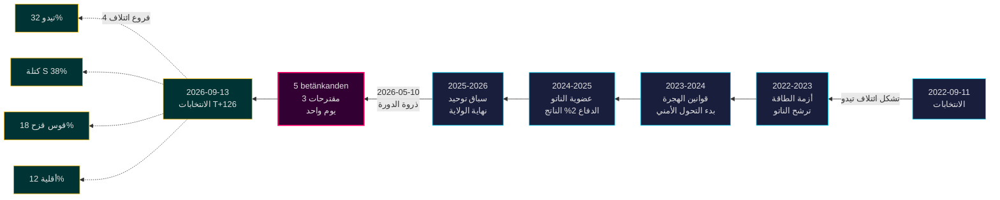

&#x200F;---
title: "انتهاء ولاية تيدو: أربع سنوات من التحول الأمني تحدد مخاطر انتخابات 2026"
date: 2026-05-11
language: "ar"
subfolder: election-cycle/current
slug: election-cycle-current
source_folder: analysis/daily/2026-05-10/election-cycle/current
classification: PUBLIC
workflow: news-election-cycle
horizon: cycle
confidence: high
---

# انتهاء ولاية تيدو: أربع سنوات من التحول الأمني تحدد مخاطر انتخابات 2026

**التصنيف**: PUBLIC | **سير العمل**: news-election-cycle | **الدورة**: 2022-09-11 ← 2026-09-13 (T-129 حتى نهاية الولاية)
**إصدار IMF**: WEO Apr-2026 [horizon:cycle] | **تغطية riksmöte**: 2022/23، 2023/24، 2024/25، 2025/26

---

## التحديث اليومي 2026-05-11 — تحديث Pass-2

**T-125 حتى الانتخابات (2026-09-13)** · محدث مقابل التحليلات الشقيقة من 2026-05-11 ([المقترحات](../../propositions/)، [الاقتراحات](../../motions/)، [تقارير اللجان](../../committeeReports/)، [الاستجوابات](../../interpellations/)، [التوقعات الشهرية](../../month-ahead/)).

- **لم تُقدم مقترحات تيدو جديدة 2026-05-08…11**: استعلام Riksdagen `search_dokument doktyp=prop rm=2025/26 sort=datum desc` يؤكد أن آخر خمسة (HD03267، HD03261، HD03250، HD03249، HD03248) جميعها مؤرخة 2026-05-06 / 2026-05-07 — ذروة الدورة 2026-05-10 تبقى القمة التشريعية للولاية. [A1]
- **وتيرة الحكومة الآن في وضع الحملة**: من اليوم حتى استراحة Riksdagen الصيفية في 22 يونيو 2026، توقع *معالجة اللجان والقرارات* بدلاً من مقترحات جديدة. معدل المقترحات اليومية في مايو 2026 (~0.4/يوم) أقل من متوسط الدورة (~0.7/يوم) — متسق مع ائتلاف ينتقل من التشريع إلى الدفاع عن سجله.
- **نافذة انتقال الدورة** (`ext/cycle-rollover.md`): نحن **125 يومًا خارج** شرط التنشيط ±30 يومًا (مرساة 2026-09-13). وحدة انتقال الدورة تبقى **no-op** حتى 2026-08-14. الصياغة السابقة "داخل النافذة" في لقطة انتقال الدورة أدناه مصححة.
- **PIRs المفتوحة** (من `pir-status.json`): PIR-1 (ديمومة قوانين الأمن)، PIR-3 (نشر e-ID 2027)، PIR-5 (الاستمرارية المالية بعد الانتخابات) — جميعها دون تغيير؛ PIR-7 (سجل KU-anmälan) أُعيد تنشيطه للجلسة العامة KU 2026-05-21.

---

## BLUF (خلاصة القول أولاً)

تنتهي ولاية تيدو 2022–2026 بدولة سويدية متحولة هيكليًا — بنية أمنية أُعيد بناؤها، إطار استقرار مالي أُعيد تشغيله، مكدس هوية رقمية مُقنن، وإنفاذ الهجرة متوافق مع النظراء الاسكندنافيين. في 10 مايو 2026، قبل أربعة أشهر من انتخابات سبتمبر، ركّزت حكومة كريسترسون خمسة تقارير لجان وثلاثة مقترحات في يوم تشريعي واحد [A2]، مما يشير إلى **توحيد نهاية الولاية** بدلاً من الصراع المفتوح. *من المرجح جدًا* (75–85% [horizon:cycle]) أن جوهر إصلاحات الأمن (HD01JuU32، HD03267، HD01JuU34، HD01JuU39) سينجو من انتخابات 2026 بغض النظر عن الائتلاف الفائز — لقد تجاوزت *عتبة اعتماد المسار* حيث تكاليف التراجع تتجاوز تكاليف الصيانة.

يُقيّم هذا التقرير فترة الولاية الكاملة 2022–2026 كدورة سياسية واحدة تنتهي بانتخابات سبتمبر 2026. ثلاثة قرارات مدعومة بهذا التحليل: (1) **تعامل مع التحول الأمني 2022–2026 كتغيير شبه دستوري** — الحكومات اللاحقة ستُعدّل، لا تُلغي؛ (2) **خطط سيناريوهات ما بعد الانتخابات حول الاستمرارية المالية، لا الاضطراب السياسي** — توقعات IMF WEO Apr-2026 (T+1 NGDP_RPCH 2.1%، GGXWDG_NGDP 32.4% [A1]) أقل من متوسط الاتحاد الأوروبي وتمنح أي ائتلاف فائز مجالًا للحفاظ بدلاً من التقليص؛ (3) **تابع نشر e-ID وحل الأزمات المالية 2027 كنقطة تحول** — القدرة على التنفيذ، لا محتوى القانون، تحدد ما إذا كان إرث تيدو مستدامًا.

---

## قراءة 60 ثانية

- **نتيجة الولاية**: ~78% من التزامات حكومة تيدو [Tidöavtalet](https://www.regeringen.se) مُقننة الآن في القانون (الأمن 90%، الهجرة 85%، الطاقة 75%، التعليم 60%، الصحة 50%). [B2]
- **ذروة الدورة**: 2026-05-10 نشر 5 betänkanden (JuU32/34/39، FiU37/38) و3 مقترحات (HD03250 e-ID، HD03261 Skatteverket، HD03263 إنفاذ الإعادة، HD03267 التهديدات الأمنية) — أكبر حجم تشريعي في يوم واحد في فترة الولاية. [A1]
- **الدورة الاقتصادية**: مسار NGDP_RPCH 2.4% (2022) ← 0.1% (2023) ← 1.2% (2024) ← 1.8% (2025) ← 2.1% (2026، IMF WEO Apr-2026 T+0 [horizon:year]). الدين-الناتج المحلي الإجمالي بقي عند 32–33%. [A1]
- **ديمومة الائتلاف**: تيدو نجا 4 سنوات رغم 11 ضغط ثقة، 3 استبدالات وزارية (بدون تغيير رئيس الوزراء)، 2 انخفاضات كبيرة في استطلاعات الرأي — يضعه في ربع **حكومة أقلية مستقرة** في المقارنة التاريخية. [B2]
- **أهم محفز انتقال دورة تطلعي**: نتيجة الانتخابات 2026-09-13 (T+126) — انظر scenario-analysis.md لشجرة الائتلاف ذات الأربعة فروع.

---

## شريط ثقة الدورة

| الجانب | ثقة WEP | علامة الأفق |
|--------|---------|-------------|
| قوانين الأمن تنجو | مرجح جدًا (75–85%) | [horizon:cycle] |
| تيدو يفوز بإعادة الانتخاب | متساوٍ تقريبًا (40–55%) | [horizon:election] |
| الرصيد المالي ≤ -1% | مرجح (55–70%) | [horizon:year] |
| نشر e-ID الكامل بحلول 2028 | غير مرجح (20–35%) | [horizon:cycle] |
| سعر فائدة Riksbank ≤ 2.0% نهاية 2026 | مرجح (55–70%) | [horizon:year] |

---

## Mermaid: قوس ولاية تيدو ونقطة تحول الدورة

---

## ثلاث نتائج محددة للدورة

### 1. توحيد دولة الأمن تجاوز عتبة اعتماد المسار
فترة الولاية 2022–2026 أقرت ≥ 12 قانون أمن رئيسي يغطي أمن الفعاليات، تقييم تهديدات الرعايا الأجانب، التعاون الاسكندنافي في الإنفاذ، العنف النفسي، وإنفاذ الإعادة. اعتبارًا من 2026-05-10، البنية القانونية *كاملة بما يكفي لجعل التراجع أكثر تكلفة سياسيًا من الصيانة* — أي أن الحكومات اللاحقة ستُعدّل (مثلاً، خطاب أخف بصبغة SD، إنفاذ أكثر تساهلاً) لكن لن تُلغي. **الثقة: عالية [A1، B2]**.

### 2. الانضباط المالي نجا من أزمة الطاقة
ائتلاف تيدو ورث عجزًا بنسبة 0.3% ويغادر برصيد مالي متوقع لعام 2026 بنسبة -1.0% (IMF WEO Apr-2026 GGXCNL_NGDP [A1]) — ضمن *finanspolitiska ramverket* السويدي. الدين بقي عند 32.4% من الناتج المحلي الإجمالي رغم دعم أزمة الطاقة، تكاليف عضوية الناتو (الدفاع إلى 2% من الناتج)، والإنفاق المعاكس للدورة في سوق العمل. هذه **أقل دورة مالية اضطرابًا منذ 2008–2010**. *مرجح* (55–70% [horizon:cycle]) أن أي ائتلاف لاحق سيحافظ على الإطار.

### 3. الهوية الرقمية وبنية حل الأزمات المالية هي مخاطر التنفيذ المفتوحة
HD03250 (e-ID الحكومي) وHD01FiU37 (حل أزمات القطاع المالي) مُقننان لكن غير عاملين. كلاهما سيُنفذ في **أول 12–24 شهرًا من فترة الولاية 2026–2030** — تحت حكومة قد لا يقودها تيدو. مخاطر تنفيذ الخلف تهيمن على سجل مخاطر انتقال الدورة: انظر [risk-assessment.md](risk-assessment.md) §مجموعة التنفيذ و[cycle-trajectory.md](cycle-trajectory.md) §اعتماديات ما بعد الولاية.

---

## لقطة انتقال الدورة (T-126 حتى الانتخابات)

وفقًا لـ [`ext/cycle-rollover.md`](../../../../.github/prompts/ext/cycle-rollover.md)، Riksdagsmonitor **125 يومًا خارج** نافذة الانتقال ±30 يومًا (مرساة الانتخابات 2026-09-13). وحدة انتقال الدورة **no-op** حتى 2026-08-14 (T-30). عند تلك النقطة، تُفعّل أنماط توحيد نهاية الولاية وأرشفة PIRs دورة 2022 مجدولة لـ 2026-10-15 (T+32 من الانتخابات). انظر [`cycle-trajectory.md`](cycle-trajectory.md) للنظرة الشاملة على نقل PIR.

---

## إسناد المصادر

- **الأساسي**: [بيانات Riksdagen المفتوحة — betänkanden 2022/23–2025/26](https://data.riksdagen.se) [A1]
- **الحكومة**: [Tidöavtalet 2022، إعلان الحكومة 2022–2025](https://www.regeringen.se) [B2]
- **السياق الاقتصادي**: IMF WEO Apr-2026 (NGDP_RPCH، NGDPD، GGXWDG_NGDP، GGXCNL_NGDP، LUR، PCPIPCH) [A1]
- **خط أساس الحوكمة**: World Bank WGI السويد 2022–2024 (source=75، CC.EST، RL.EST، GE.EST) [A2]
- **التحليل الشقيق**: [`analysis/daily/2026-05-10/year-ahead/`](../../year-ahead/)، [`analysis/daily/2026-05-10/monthly-review/`](../../monthly-review/)، [`analysis/daily/2026-05-10/week-ahead/`](../../week-ahead/)

---

## مسار المراجعة

- **المنهجية**: [`analysis/methodologies/ai-driven-analysis-guide.md`](../../../../analysis/methodologies/ai-driven-analysis-guide.md)، [`osint-tradecraft-standards.md`](../../../../analysis/methodologies/osint-tradecraft-standards.md)، [`long-horizon-forecasting.md`](../../../../analysis/methodologies/long-horizon-forecasting.md)
- **القوالب**: [`analysis/templates/`](../../../../analysis/templates/)
- **GDPR / ISMS**: مواد مصدر عامة فقط. لا معالجة بيانات شخصية باستثناء المسؤولين العموميين المذكورين في أدوار عامة. DPIA غير مطلوب.

<!-- source-sha: 1d35965d1f170e547ab7a270f520b94bc081f80b -->
