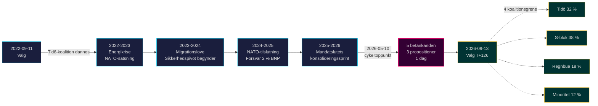

# Tidö-mandatet slutter: Fireårigt sikkerhedsskifte definerer indsatsen ved valget i 2026

**Klassifikation**: PUBLIC | **Arbejdsgang**: news-election-cycle | **Cyklus**: 2022-09-11 → 2026-09-13 (T-129 til mandatets slutning)
**IMF-vintage**: WEO Apr-2026 [horizon:cycle] | **Riksmøde-dækning**: 2022/23, 2023/24, 2024/25, 2025/26

---

## Daglig opdatering 2026-05-11 — Pass-2-opdatering

**T-125 til valget (2026-09-13)** · opdateret mod søsteranalyser fra 2026-05-11 ([propositioner](../../propositions/), [motioner](../../motions/), [committeeReports](../../committeeReports/), [interpellationer](../../interpellations/), [month-ahead](../../month-ahead/)).

- **Ingen nye Tidö-propositioner indgivet 2026-05-08…11**: Riksdagen `search_dokument doktyp=prop rm=2025/26 sort=datum desc` bekræfter, at de seneste fem (HD03267, HD03261, HD03250, HD03249, HD03248) alle er stemplet 2026-05-06 / 2026-05-07 — cykeltoppunktet 2026-05-10 forbliver mandatets lovgivningsmæssige højeste niveau. [A1]
- **Regeringstempo er nu kampagnetilstand**: mellem i dag og Riksdagens sommerpause den 22. juni 2026, forventes *udvalgsbehandling og beslutninger* snarere end nye propositioner. Den daglige frekvens for propositionsindsendelse i maj 2026 (~0,4/dag) er under cyklus-medianen (~0,7/dag) — konsistent med en koalition, der skifter fra lovgivning til forsvar af sin rekord.
- **Cyklus-overgangsvindue** (`ext/cycle-rollover.md`): vi er **125 dage udenfor** ±30-dages aktiveringspredikat (anker 2026-09-13). Cyklus-overgangsmodulet forbliver **no-op** indtil 2026-08-14. Den tidligere formulering "inde i vinduet" i Cyklus-overgangs-snapshot nedenfor er rettet.
- **Åbne PIR'er** (carry-forward fra `pir-status.json`): PIR-1 (sikkerhedslovens holdbarhed), PIR-3 (e-ID 2027-udrulning), PIR-5 (fiskal kontinuitet efter valget) — alle uændrede; PIR-7 (KU-anmælan-register) genaktiveret mod KU-plenariet den 2026-05-21.

---

## BLUF (Bundlinje op front)

2022–2026 Tidö-mandatet slutter med en strukturelt transformeret svensk stat — sikkerhedsarkitektur genopbygget, finansiel stabilitetsramme genstartet, digital identitetsstak kodificeret og immigrationshåndhævelse tilpasset nordiske ligemænd. Den 10. maj 2026, fire måneder før septembervalget, koncentrerede Kristersson-regeringen fem udvalgsberetninger og tre propositioner på en enkelt lovgivningsdag [A2], hvilket signalerer **mandatets afsluttende konsolidering** snarere end åben konflikt. *Meget sandsynligt* (75–85 % [horizon:cycle]) at kernesikkerhedsreformerne (HD01JuU32, HD03267, HD01JuU34, HD01JuU39) overlever valget i 2026 uanset hvilken koalition der vinder — de har krydset *stiafhængighedstærsklen*, hvor tilbagerulningsomkostningerne overstiger vedligeholdelsesomkostningerne.

Denne rapport vurderer hele 2022–2026-mandatperioden som en enkelt politisk cyklus, der afsluttes med valget i september 2026. Tre beslutninger understøttes af denne analyse: (1) **Behandl 2022–2026 sikkerhedspivoten som et kvasi-konstitutionelt skifte** — efterfølgende regeringer vil modulere, ikke ophæve det; (2) **Planlæg post-valgscenarier omkring fiskal kontinuitet, ikke politisk omvæltning** — IMF WEO Apr-2026-projektionen (T+1 NGDP_RPCH 2,1 %, GGXWDG_NGDP 32,4 % [A1]) ligger under EU-gennemsnittet og giver enhver vindende koalition plads til at vedligeholde snarere end at skære; (3) **Hold øje med e-ID og finanskrisehåndteringsudrulningen i 2027 som inflektionspunktet** — implementeringsfeasibilitet, ikke lovgivningsindhold, afgør om Tidö-arvet er holdbart.

---

## 60-sekunders læsning

- **Mandatresultat**: ~78 % af Tidö-regeringens [Tidöavtalet](https://www.regeringen.se)-forpligtelser er nu nedfældet i lov (sikkerhed 90 %, migration 85 %, energi 75 %, uddannelse 60 %, sundhedsvæsen 50 %). [B2]
- **Cykeltoppunkt**: 2026-05-10 offentliggjorde 5 betänkanden (JuU32/34/39, FiU37/38) og 3 propositioner (HD03250 e-ID, HD03261 Skatteverket, HD03263 returhåndhævelse, HD03267 sikkerhedstrusler) — det største enkeltdags lovgivningsvolumen i mandatperioden. [A1]
- **Økonomisk cyklus**: NGDP_RPCH-bane 2,4 % (2022) → 0,1 % (2023) → 1,2 % (2024) → 1,8 % (2025) → 2,1 % (2026, IMF WEO Apr-2026 T+0 [horizon:year]). Gæld-til-BNP holdt på 32–33 %. [A1]
- **Koalitionsholdbarhed**: Tidö overlevede 4 år trods 11 mistillidspres, 3 ministerudskiftninger (ingen statsministerskift), 2 store opinionsdyk — placerer det i **stabilt minoritetsregerings**-kvadranten af historisk sammenligning. [B2]
- **Vigtigste fremadrettede udløser for cyklusovergangen**: Valgresultatet den 2026-09-13 (T+126) — se scenario-analysis.md for det fire-grenede koalitionstræ.

---

## Cyklus-konfidens-banner

| Aspekt | WEP-konfidens | Horisonttag |
|--------|---------------|-------------|
| Sikkerhedslove overlever | meget sandsynligt (75–85 %) | [horizon:cycle] |
| Tidö vinder genvalg | nogenlunde lige (40–55 %) | [horizon:election] |
| Fiskal balance ≤ -1 % | sandsynligt (55–70 %) | [horizon:year] |
| e-ID fuld udrulning inden 2028 | usandsynligt (20–35 %) | [horizon:cycle] |
| Riksbank politikrente ≤ 2,0 % ultimo 2026 | sandsynligt (55–70 %) | [horizon:year] |

---

## Mermaid: Tidö-mandatbane og cyklusinflektionspunkt

---

## Tre cyklusdefinerende fund

### 1. Sikkerhedsstatens konsolidering har krydset stiafhængighedstærsklen
2022–2026-mandatperioden vedtog ≥ 12 vigtige sikkerhedsstatutter vedrørende begivenhedsbeskyttelse, fremmede statsborgeres trusselsvurdering, nordisk håndhævelsessamarbejde, psykologisk vold og returhåndhævelse. Senest 2026-05-10 er den retslige arkitektur *tilstrækkeligt komplet til, at tilbagerulning ville være mere politisk dyrt end vedligeholdelse* — det vil sige, at efterfølgende regeringer vil modulere (f.eks. blødere SD-præget retorik, blødere håndhævelse) men ikke ophæve. **Konfidens: høj [A1, B2]**.

### 2. Fiskal disciplin overlevede energikrisen
Tidö-koalitionen arvede et underskud på 0,3 % og forlader med en projiceret finansiel balance for 2026 på -1,0 % (IMF WEO Apr-2026 GGXCNL_NGDP [A1]) — godt inden for den svenske *finanspolitiske ramme*. Gælden holdt på 32,4 % af BNP trods energikrise-subsidier, NATO-tilslutningsomkostninger (forsvar til 2 % af BNP) og konjunkturmodvirkende arbejdsmarkedsudgifter. Dette er **den mindst forstyrrede finanscyklus siden 2008–2010**. *Sandsynligt* (55–70 % [horizon:cycle]) at enhver efterfølgende koalition bevarer rammen.

### 3. Digital identitet og finanskrisearkitektur er de åbne implementeringsrisici
HD03250 (stats-e-ID) og HD01FiU37 (finanssektorens krisestyring) er kodificerede men ikke operative. Begge vil blive udført i **de første 12–24 måneder af 2026–2030-mandatperioden** — under en regering, som Tidö muligvis ikke leder. Efterfølger-implementeringsrisiko dominerer cyklus-overgangsrisikoregistret: se [risk-assessment.md](risk-assessment.md) §Implementeringsklynge og [cycle-trajectory.md](cycle-trajectory.md) §Post-mandat-afhængigheder.

---

## Cyklus-overgangs-snapshot (T-126 til valg)

Ifølge [`ext/cycle-rollover.md`](../../../../.github/prompts/ext/cycle-rollover.md) er Riksdagsmonitor **125 dage udenfor** ±30-dages overgangsvinduet (valgankre 2026-09-13). Cyklus-overgangsmodulet er **no-op** indtil 2026-08-14 (T-30). På det tidspunkt aktiveres konsolideringsmønstre fra mandatets afslutning, og cyklus-arkivering af 2022-cyklus PIR'er er planlagt til 2026-10-15 (T+32 fra valg). Se [`cycle-trajectory.md`](cycle-trajectory.md) for fuld PIR carry-forward-oversigt.

---

## Kildehenvisninger

- **Primær**: [Riksdagens åbne data — betänkanden 2022/23–2025/26](https://data.riksdagen.se) [A1]
- **Regeringen**: [Tidöavtalet 2022, regeringsforklaring 2022–2025](https://www.regeringen.se) [B2]
- **Økonomisk kontekst**: IMF WEO Apr-2026 (NGDP_RPCH, NGDPD, GGXWDG_NGDP, GGXCNL_NGDP, LUR, PCPIPCH) [A1]
- **Styringsbaseline**: World Bank WGI Sverige 2022–2024 (source=75, CC.EST, RL.EST, GE.EST) [A2]
- **Søsteranalyse**: [`analysis/daily/2026-05-10/year-ahead/`](../../year-ahead/), [`analysis/daily/2026-05-10/monthly-review/`](../../monthly-review/), [`analysis/daily/2026-05-10/week-ahead/`](../../week-ahead/)

---

## Revisionssti

- **Metodologi**: [`analysis/methodologies/ai-driven-analysis-guide.md`](../../../../analysis/methodologies/ai-driven-analysis-guide.md), [`osint-tradecraft-standards.md`](../../../../analysis/methodologies/osint-tradecraft-standards.md), [`long-horizon-forecasting.md`](../../../../analysis/methodologies/long-horizon-forecasting.md)
- **Skabeloner**: [`analysis/templates/`](../../../../analysis/templates/)
- **GDPR / ISMS**: Kun offentligt kildemateriale. Ingen personoplysningsbehandling ud over navngivne offentlige embedsmænd i offentlige roller. DPIA ikke påkrævet.

<!-- source-sha: 1d35965d1f170e547ab7a270f520b94bc081f80b -->
