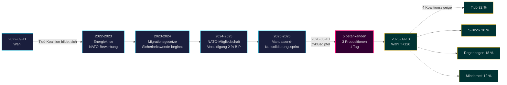

# Das Tidö-Mandat endet: Vierjährige Sicherheitswende definiert das Wahlrisiko 2026

**Klassifikation**: PUBLIC | **Workflow**: news-election-cycle | **Zyklus**: 2022-09-11 → 2026-09-13 (T-129 bis Mandatsende)
**IMF-Vintage**: WEO Apr-2026 [horizon:cycle] | **Riksmöte-Abdeckung**: 2022/23, 2023/24, 2024/25, 2025/26

---

## Tägliches Update 2026-05-11 — Pass-2-Aktualisierung

**T-125 bis zur Wahl (2026-09-13)** · aktualisiert gegen Schwesteranalysen vom 2026-05-11 ([Propositionen](../../propositions/), [Motionen](../../motions/), [Ausschussberichte](../../committeeReports/), [Interpellationen](../../interpellations/), [Monatsausblick](../../month-ahead/)).

- **Keine neuen Tidö-Propositionen eingereicht 2026-05-08…11**: Riksdagens `search_dokument doktyp=prop rm=2025/26 sort=datum desc` bestätigt, dass die letzten fünf (HD03267, HD03261, HD03250, HD03249, HD03248) alle auf 2026-05-06 / 2026-05-07 datiert sind — der Zyklusgipfel 2026-05-10 bleibt der gesetzgeberische Höhepunkt des Mandats. [A1]
- **Das Regierungstempo ist jetzt Wahlkampfmodus**: Von heute bis zur Riksdagens-Sommerpause am 22. Juni 2026, erwarten Sie *Ausschussbearbeitung und Beschlüsse* statt neuer Propositionen. Die tägliche Propositionsrate im Mai 2026 (~0,4/Tag) liegt unter dem Zyklusmedian (~0,7/Tag) — vereinbar mit einer Koalition, die von Gesetzgebung zur Verteidigung ihrer Bilanz übergeht.
- **Zyklusübergangsfenster** (`ext/cycle-rollover.md`): Wir sind **125 Tage außerhalb** des ±30-Tage-Aktivierungsprädikats (Anker 2026-09-13). Das Zyklusübergangsmodul bleibt **no-op** bis 2026-08-14. Die frühere Formulierung "innerhalb des Fensters" im Zyklusübergangs-Snapshot unten ist korrigiert.
- **Offene PIRs** (aus `pir-status.json`): PIR-1 (Sicherheitsgesetze-Dauerhaftigkeit), PIR-3 (e-ID 2027-Rollout), PIR-5 (fiskalische Kontinuität nach der Wahl) — alle unverändert; PIR-7 (KU-anmälan-Register) reaktiviert für KU-Plenum 2026-05-21.

---

## BLUF (Kernaussage zuerst)

Das Tidö-Mandat 2022–2026 endet mit einem strukturell transformierten schwedischen Staat — Sicherheitsarchitektur neu aufgebaut, Finanzstabilitätsrahmen neu gestartet, digitaler Identitätsstapel kodifiziert und Migrationshandhabung an nordische Peers angeglichen. Am 10. Mai 2026, vier Monate vor der Septemberwahl, konzentrierte die Kristersson-Regierung fünf Ausschussberichte und drei Propositionen auf einen einzigen Gesetzgebungstag [A2], was **Mandatsend-Konsolidierung** statt offenem Konflikt signalisiert. *Sehr wahrscheinlich* (75–85 % [horizon:cycle]), dass die Kernsicherheitsreformen (HD01JuU32, HD03267, HD01JuU34, HD01JuU39) die Wahl 2026 überleben, unabhängig davon, welche Koalition gewinnt — sie haben die *Pfadabhängigkeitsschwelle* überschritten, bei der Rücknahmkosten die Wartungskosten übersteigen.

Dieser Bericht bewertet die gesamte Mandatsperiode 2022–2026 als einen einzigen politischen Zyklus, der mit der Wahl im September 2026 endet. Drei Entscheidungen werden durch diese Analyse unterstützt: (1) **Behandeln Sie die Sicherheitswende 2022–2026 als quasi-konstitutionellen Wandel** — nachfolgende Regierungen werden modulieren, nicht aufheben; (2) **Planen Sie Nachwahlszenarien um fiskalische Kontinuität, nicht politischen Umbruch** — die IMF WEO Apr-2026-Projektion (T+1 NGDP_RPCH 2,1 %, GGXWDG_NGDP 32,4 % [A1]) liegt unter dem EU-Durchschnitt und gibt jeder siegreichen Koalition Spielraum zur Erhaltung statt Kürzung; (3) **Verfolgen Sie den e-ID- und Finanzkrisenlösungs-Rollout 2027 als Wendepunkt** — Umsetzungsfähigkeit, nicht Gesetzesinhalt, bestimmt, ob das Tidö-Erbe dauerhaft ist.

---

## 60-Sekunden-Lektüre

- **Mandatsergebnis**: ~78 % der Tidö-Regierungs-[Tidöavtalet](https://www.regeringen.se)-Verpflichtungen sind jetzt in Gesetz kodifiziert (Sicherheit 90 %, Migration 85 %, Energie 75 %, Bildung 60 %, Gesundheit 50 %). [B2]
- **Zyklusgipfel**: 2026-05-10 veröffentlichte 5 betänkanden (JuU32/34/39, FiU37/38) und 3 Propositionen (HD03250 e-ID, HD03261 Skatteverket, HD03263 Rückführungsdurchsetzung, HD03267 Sicherheitsbedrohungen) — das größte Gesetzgebungsvolumen an einem Tag im Mandatszeitraum. [A1]
- **Wirtschaftszyklus**: NGDP_RPCH-Trajektorie 2,4 % (2022) → 0,1 % (2023) → 1,2 % (2024) → 1,8 % (2025) → 2,1 % (2026, IMF WEO Apr-2026 T+0 [horizon:year]). Schulden-BIP blieb bei 32–33 %. [A1]
- **Koalitionsdauerhaftigkeit**: Tidö überlebte 4 Jahre trotz 11 Vertrauensdrucks, 3 Ministerauswechslungen (kein Premierministerwechsel), 2 großer Umfrage-Einbrüche — platziert es im **stabile Minderheitsregierung**-Quadranten des historischen Vergleichs. [B2]
- **Wichtigster vorausschauender Zyklusübergangsauslöser**: Wahlergebnis 2026-09-13 (T+126) — siehe scenario-analysis.md für den vierverzweigten Koalitionsbaum.

---

## Zyklusvertrauensbanner

| Aspekt | WEP-Vertrauen | Horizont-Tag |
|--------|---------------|--------------|
| Sicherheitsgesetze überleben | sehr wahrscheinlich (75–85 %) | [horizon:cycle] |
| Tidö gewinnt Wiederwahl | etwa gleichwahrscheinlich (40–55 %) | [horizon:election] |
| Fiskalische Balance ≤ -1 % | wahrscheinlich (55–70 %) | [horizon:year] |
| e-ID vollständiger Rollout bis 2028 | unwahrscheinlich (20–35 %) | [horizon:cycle] |
| Riksbank-Leitzins ≤ 2,0 % Ende 2026 | wahrscheinlich (55–70 %) | [horizon:year] |

---

## Mermaid: Tidö-Mandatsbogen und Zykluswendepunkt

---

## Drei zyklusdefinierende Erkenntnisse

### 1. Die Konsolidierung des Sicherheitsstaates hat die Pfadabhängigkeitsschwelle überschritten
Die Mandatsperiode 2022–2026 verabschiedete ≥ 12 wichtige Sicherheitsgesetze zu Veranstaltungssicherheit, Bedrohungsbewertung ausländischer Staatsangehöriger, nordischer Durchsetzungszusammenarbeit, psychologischer Gewalt und Rückführungsdurchsetzung. Ab 2026-05-10 ist die rechtliche Architektur *ausreichend vollständig, dass Rücknahme politisch teurer wäre als Wartung* — das heißt, nachfolgende Regierungen werden modulieren (z.B. weichere SD-gefärbte Rhetorik, sanftere Durchsetzung), aber nicht aufheben. **Vertrauen: hoch [A1, B2]**.

### 2. Fiskaldisziplin überlebte die Energiekrise
Die Tidö-Koalition erbte ein Defizit von 0,3 % und hinterlässt eine projizierte Finanzbilanz 2026 von -1,0 % (IMF WEO Apr-2026 GGXCNL_NGDP [A1]) — gut innerhalb des schwedischen *finanspolitiska ramverket*. Die Schulden wurden bei 32,4 % des BIP gehalten trotz Energiekrise-Subventionen, NATO-Mitgliedschaftskosten (Verteidigung auf 2 % des BIP) und konjunkturdämpfender Arbeitsmarktausgaben. Dies ist **der am wenigsten gestörte Fiskalzyklus seit 2008–2010**. *Wahrscheinlich* (55–70 % [horizon:cycle]), dass jede nachfolgende Koalition das Rahmenwerk beibehält.

### 3. Digitale Identität und Finanzkrisarchitektur sind die offenen Umsetzungsrisiken
HD03250 (staatliche e-ID) und HD01FiU37 (Finanzsektorkrisenlösung) sind kodifiziert, aber nicht operativ. Beide werden in den **ersten 12–24 Monaten der Mandatsperiode 2026–2030** umgesetzt — unter einer Regierung, die Tidö möglicherweise nicht führt. Das Nachfolger-Umsetzungsrisiko dominiert das Zyklusübergangs-Risikoregister: siehe [risk-assessment.md](risk-assessment.md) §Umsetzungscluster und [cycle-trajectory.md](cycle-trajectory.md) §Nach-Mandats-Abhängigkeiten.

---

## Zyklusübergangs-Snapshot (T-126 bis Wahl)

Gemäß [`ext/cycle-rollover.md`](../../../../.github/prompts/ext/cycle-rollover.md) ist Riksdagsmonitor **125 Tage außerhalb** des ±30-Tage-Übergangsfensters (Wahlanker 2026-09-13). Das Zyklusübergangsmodul ist **no-op** bis 2026-08-14 (T-30). Zu diesem Zeitpunkt werden Mandatsend-Konsolidierungsmuster aktiviert und die Archivierung der 2022-Zyklus-PIRs ist für 2026-10-15 (T+32 ab Wahl) geplant. Siehe [`cycle-trajectory.md`](cycle-trajectory.md) für die vollständige PIR-Carry-Forward-Übersicht.

---

## Quellenattribution

- **Primär**: [Riksdagens offene Daten — betänkanden 2022/23–2025/26](https://data.riksdagen.se) [A1]
- **Regierung**: [Tidöavtalet 2022, Regierungserklärung 2022–2025](https://www.regeringen.se) [B2]
- **Wirtschaftskontext**: IMF WEO Apr-2026 (NGDP_RPCH, NGDPD, GGXWDG_NGDP, GGXCNL_NGDP, LUR, PCPIPCH) [A1]
- **Governance-Baseline**: World Bank WGI Schweden 2022–2024 (source=75, CC.EST, RL.EST, GE.EST) [A2]
- **Schwesteranalyse**: [`analysis/daily/2026-05-10/year-ahead/`](../../year-ahead/), [`analysis/daily/2026-05-10/monthly-review/`](../../monthly-review/), [`analysis/daily/2026-05-10/week-ahead/`](../../week-ahead/)

---

## Revisionsspur

- **Methodik**: [`analysis/methodologies/ai-driven-analysis-guide.md`](../../../../analysis/methodologies/ai-driven-analysis-guide.md), [`osint-tradecraft-standards.md`](../../../../analysis/methodologies/osint-tradecraft-standards.md), [`long-horizon-forecasting.md`](../../../../analysis/methodologies/long-horizon-forecasting.md)
- **Vorlagen**: [`analysis/templates/`](../../../../analysis/templates/)
- **DSGVO / ISMS**: Nur öffentliches Quellmaterial. Keine Verarbeitung personenbezogener Daten außer genannten öffentlichen Amtsträgern in öffentlichen Rollen. DSFA nicht erforderlich.

<!-- source-sha: 1d35965d1f170e547ab7a270f520b94bc081f80b -->
