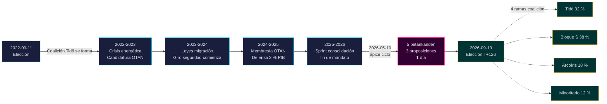

# El mandato Tidö finaliza: Cuatro años de giro de seguridad definen el riesgo electoral de 2026

**Clasificación**: PUBLIC | **Flujo de trabajo**: news-election-cycle | **Ciclo**: 2022-09-11 → 2026-09-13 (T-129 hasta el fin del mandato)
**Vintage IMF**: WEO Apr-2026 [horizon:cycle] | **Cobertura riksmöte**: 2022/23, 2023/24, 2024/25, 2025/26

---

## Actualización diaria 2026-05-11 — Actualización Pass-2

**T-125 hasta la elección (2026-09-13)** · actualizado contra análisis hermanos del 2026-05-11 ([proposiciones](../../propositions/), [mociones](../../motions/), [informes de comité](../../committeeReports/), [interpelaciones](../../interpellations/), [perspectiva mensual](../../month-ahead/)).

- **Ninguna nueva proposición Tidö presentada 2026-05-08…11**: La consulta Riksdagen `search_dokument doktyp=prop rm=2025/26 sort=datum desc` confirma que las últimas cinco (HD03267, HD03261, HD03250, HD03249, HD03248) están todas fechadas 2026-05-06 / 2026-05-07 — el ápice del ciclo 2026-05-10 sigue siendo el punto legislativo más alto del mandato. [A1]
- **El tempo del gobierno ahora es modo campaña**: desde hoy hasta el receso de verano del Riksdag el 22 de junio de 2026, espere *procesamiento en comité y decisiones* en lugar de nuevas proposiciones. La tasa diaria de proposiciones en mayo 2026 (~0,4/día) está por debajo de la mediana del ciclo (~0,7/día) — consistente con una coalición que pasa de legislar a defender su historial.
- **Ventana de transición de ciclo** (`ext/cycle-rollover.md`): estamos **125 días fuera** del predicado de activación de ±30 días (ancla 2026-09-13). El módulo de transición de ciclo permanece **no-op** hasta 2026-08-14. La redacción anterior "dentro de la ventana" en la Instantánea de transición de ciclo abajo está corregida.
- **PIRs abiertos** (de `pir-status.json`): PIR-1 (durabilidad de leyes de seguridad), PIR-3 (despliegue e-ID 2027), PIR-5 (continuidad fiscal poselectoral) — todos sin cambios; PIR-7 (registro KU-anmälan) reactivado para el pleno KU 2026-05-21.

---

## BLUF (Lo esencial primero)

El mandato Tidö 2022–2026 finaliza con un estado sueco estructuralmente transformado — arquitectura de seguridad reconstruida, marco de estabilidad financiera reiniciado, pila de identidad digital codificada y aplicación migratoria alineada con pares nórdicos. El 10 de mayo de 2026, cuatro meses antes de la elección de septiembre, el gobierno Kristersson concentró cinco informes de comité y tres proposiciones en un solo día legislativo [A2], señalando **consolidación de fin de mandato** en lugar de conflicto abierto. *Muy probable* (75–85 % [horizon:cycle]) que el núcleo de las reformas de seguridad (HD01JuU32, HD03267, HD01JuU34, HD01JuU39) sobreviva a la elección de 2026 independientemente de qué coalición gane — han cruzado el *umbral de dependencia del camino* donde los costos de reversión superan los costos de mantenimiento.

Este informe evalúa todo el período de mandato 2022–2026 como un único ciclo político que termina con la elección de septiembre 2026. Tres decisiones están respaldadas por este análisis: (1) **Tratar el giro de seguridad 2022–2026 como un cambio cuasi-constitucional** — los gobiernos sucesores modularán, no revertirán; (2) **Planificar escenarios poselectorales en torno a continuidad fiscal, no convulsión política** — la proyección IMF WEO Apr-2026 (T+1 NGDP_RPCH 2,1 %, GGXWDG_NGDP 32,4 % [A1]) está por debajo del promedio UE y da a cualquier coalición ganadora margen para mantener en lugar de recortar; (3) **Seguir el despliegue de e-ID y resolución de crisis financiera 2027 como punto de inflexión** — la capacidad de ejecución, no el contenido de la ley, determina si el legado Tidö es duradero.

---

## Lectura de 60 segundos

- **Resultado del mandato**: ~78 % de los compromisos [Tidöavtalet](https://www.regeringen.se) del gobierno Tidö están ahora codificados en ley (seguridad 90 %, migración 85 %, energía 75 %, educación 60 %, salud 50 %). [B2]
- **Ápice del ciclo**: 2026-05-10 publicó 5 betänkanden (JuU32/34/39, FiU37/38) y 3 proposiciones (HD03250 e-ID, HD03261 Skatteverket, HD03263 aplicación de retornos, HD03267 amenazas de seguridad) — el mayor volumen legislativo en un solo día del mandato. [A1]
- **Ciclo económico**: trayectoria NGDP_RPCH 2,4 % (2022) → 0,1 % (2023) → 1,2 % (2024) → 1,8 % (2025) → 2,1 % (2026, IMF WEO Apr-2026 T+0 [horizon:year]). Deuda-PIB mantenida en 32–33 %. [A1]
- **Durabilidad de la coalición**: Tidö sobrevivió 4 años a pesar de 11 presiones de confianza, 3 reemplazos ministeriales (sin cambio de PM), 2 caídas importantes en encuestas — lo coloca en el cuadrante **gobierno minoritario estable** de la comparación histórica. [B2]
- **Disparador de transición de ciclo más crítico hacia adelante**: Resultado electoral 2026-09-13 (T+126) — ver scenario-analysis.md para el árbol de coalición de cuatro ramas.

---

## Banner de confianza del ciclo

| Aspecto | Confianza WEP | Etiqueta horizonte |
|---------|---------------|-------------------|
| Leyes de seguridad sobreviven | muy probable (75–85 %) | [horizon:cycle] |
| Tidö gana reelección | aproximadamente igual (40–55 %) | [horizon:election] |
| Balance fiscal ≤ -1 % | probable (55–70 %) | [horizon:year] |
| Despliegue completo e-ID para 2028 | improbable (20–35 %) | [horizon:cycle] |
| Tasa directora Riksbank ≤ 2,0 % fin 2026 | probable (55–70 %) | [horizon:year] |

---

## Mermaid: Arco del mandato Tidö y punto de inflexión del ciclo

---

## Tres hallazgos que definen el ciclo

### 1. La consolidación del estado de seguridad ha cruzado el umbral de dependencia del camino
El período de mandato 2022–2026 aprobó ≥ 12 leyes de seguridad importantes que cubren seguridad de eventos, evaluación de amenazas de nacionales extranjeros, cooperación de aplicación nórdica, violencia psicológica y aplicación de retornos. A partir de 2026-05-10, la arquitectura legal es *suficientemente completa para que la reversión sea políticamente más costosa que el mantenimiento* — es decir, los gobiernos sucesores modularán (por ej., retórica más suave con tinte SD, aplicación más indulgente) pero no revertirán. **Confianza: alta [A1, B2]**.

### 2. La disciplina fiscal sobrevivió a la crisis energética
La coalición Tidö heredó un déficit del 0,3 % y deja un balance fiscal proyectado 2026 del -1,0 % (IMF WEO Apr-2026 GGXCNL_NGDP [A1]) — bien dentro del *finanspolitiska ramverket* sueco. La deuda se mantuvo en 32,4 % del PIB a pesar de los subsidios de crisis energética, costos de membresía OTAN (defensa al 2 % del PIB) y gasto contracíclico del mercado laboral. Este es **el ciclo fiscal menos perturbado desde 2008–2010**. *Probable* (55–70 % [horizon:cycle]) que cualquier coalición sucesora preserve el marco.

### 3. La identidad digital y la arquitectura de resolución de crisis financiera son los riesgos de ejecución abiertos
HD03250 (e-ID estatal) y HD01FiU37 (resolución de crisis del sector financiero) están codificados pero no operativos. Ambos se ejecutarán en los **primeros 12–24 meses del mandato 2026–2030** — bajo un gobierno que Tidö puede no liderar. El riesgo de ejecución del sucesor domina el registro de riesgos de transición de ciclo: ver [risk-assessment.md](risk-assessment.md) §Clúster de ejecución y [cycle-trajectory.md](cycle-trajectory.md) §Dependencias post-mandato.

---

## Instantánea de transición de ciclo (T-126 hasta la elección)

Según [`ext/cycle-rollover.md`](../../../../.github/prompts/ext/cycle-rollover.md), Riksdagsmonitor está **125 días fuera** de la ventana de transición de ±30 días (ancla electoral 2026-09-13). El módulo de transición de ciclo es **no-op** hasta 2026-08-14 (T-30). En ese punto, los patrones de consolidación de fin de mandato se activan y el archivo de PIRs del ciclo 2022 está programado para 2026-10-15 (T+32 desde la elección). Ver [`cycle-trajectory.md`](cycle-trajectory.md) para el resumen completo de carry-forward de PIR.

---

## Atribución de fuentes

- **Primaria**: [Datos abiertos del Riksdag — betänkanden 2022/23–2025/26](https://data.riksdagen.se) [A1]
- **Gobierno**: [Tidöavtalet 2022, declaración gubernamental 2022–2025](https://www.regeringen.se) [B2]
- **Contexto económico**: IMF WEO Apr-2026 (NGDP_RPCH, NGDPD, GGXWDG_NGDP, GGXCNL_NGDP, LUR, PCPIPCH) [A1]
- **Línea base de gobernanza**: World Bank WGI Suecia 2022–2024 (source=75, CC.EST, RL.EST, GE.EST) [A2]
- **Análisis hermano**: [`analysis/daily/2026-05-10/year-ahead/`](../../year-ahead/), [`analysis/daily/2026-05-10/monthly-review/`](../../monthly-review/), [`analysis/daily/2026-05-10/week-ahead/`](../../week-ahead/)

---

## Pista de revisión

- **Metodología**: [`analysis/methodologies/ai-driven-analysis-guide.md`](../../../../analysis/methodologies/ai-driven-analysis-guide.md), [`osint-tradecraft-standards.md`](../../../../analysis/methodologies/osint-tradecraft-standards.md), [`long-horizon-forecasting.md`](../../../../analysis/methodologies/long-horizon-forecasting.md)
- **Plantillas**: [`analysis/templates/`](../../../../analysis/templates/)
- **RGPD / SGSI**: Solo material fuente público. Sin procesamiento de datos personales excepto funcionarios públicos nombrados en roles públicos. EIPD no requerida.

<!-- source-sha: 1d35965d1f170e547ab7a270f520b94bc081f80b -->
