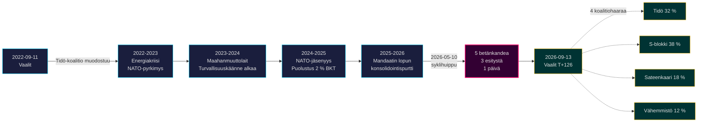

# Tidö-mandaatti päättyy: Neljän vuoden turvallisuuskäänne määrittää vuoden 2026 vaaliriskin

**Luokitus**: PUBLIC | **Työnkulku**: news-election-cycle | **Sykli**: 2022-09-11 → 2026-09-13 (T-129 mandaatin loppuun)
**IMF-vintage**: WEO Apr-2026 [horizon:cycle] | **Valtiopäiväkattavuus**: 2022/23, 2023/24, 2024/25, 2025/26

---

## Päivittäinen päivitys 2026-05-11 — Pass-2-päivitys

**T-125 vaaleihin (2026-09-13)** · päivitetty sisaranalyysien perusteella 2026-05-11 ([esitykset](../../propositions/), [aloitteet](../../motions/), [valiokuntamietinnöt](../../committeeReports/), [välikysymykset](../../interpellations/), [kuukausiennuste](../../month-ahead/)).

- **Ei uusia Tidö-esityksiä jätetty 2026-05-08…11**: Riksdagenin `search_dokument doktyp=prop rm=2025/26 sort=datum desc` vahvistaa, että viimeisimmät viisi (HD03267, HD03261, HD03250, HD03249, HD03248) on kaikki päivätty 2026-05-06 / 2026-05-07 — syklihuippu 2026-05-10 pysyy mandaatin lainsäädännöllisenä huippuna. [A1]
- **Hallituksen tahti on nyt kampanjatila**: tästä päivästä valtiopäivien kesätaukoon 22.6.2026, odota *valiokuntakäsittelyä ja päätöksiä* uusien esitysten sijaan. Päivittäinen esitystahti toukokuussa 2026 (~0,4/pv) on syklin mediaanin (~0,7/pv) alapuolella — yhdenmukainen koalition kanssa, joka siirtyy lainsäädännöstä saavutustensa puolustamiseen.
- **Syklinvaihtumisen aikaikkuna** (`ext/cycle-rollover.md`): olemme **125 päivää ulkopuolella** ±30 päivän aktivointipredikaatista (ankkuri 2026-09-13). Syklinvaihtumismoduuli pysyy **no-op** tilassa 2026-08-14 asti. Aiempi muotoilu "ikkunan sisällä" alla olevassa Syklinvaihtumisen tilannekuvassa on korjattu.
- **Avoimet PIR:t** (kohteesta `pir-status.json`): PIR-1 (turvallisuuslakien kestävyys), PIR-3 (e-ID 2027-käyttöönotto), PIR-5 (vaalien jälkeinen finanssijatkuvuus) — kaikki muuttumattomat; PIR-7 (KU-anmälan-rekisteri) reaktivoitu KU:n täysistuntoa varten 2026-05-21.

---

## BLUF (Tärkeimmät asiat ensin)

Vuosien 2022–2026 Tidö-mandaatti päättyy rakenteellisesti muuttuneeseen ruotsalaiseen valtioon — turvallisuusarkkitehtuuri uudelleenrakennettu, rahoitusvakauskehys käynnistetty uudelleen, digitaalinen identiteettipino kodifioitu ja maahanmuuton täytäntöönpano kohdistettu pohjoismaisiin vertaisiin. Toukokuun 10. päivänä 2026, neljä kuukautta ennen syyskuun vaaleja, Kristerssonin hallitus keskitti viisi valiokuntamietintöä ja kolme esitystä yhteen lainsäädäntöpäivään [A2], signaloiden **mandaatin lopun konsolidointia** avoimen konfliktin sijaan. *Erittäin todennäköistä* (75–85 % [horizon:cycle]), että turvallisuusuudistusten ydin (HD01JuU32, HD03267, HD01JuU34, HD01JuU39) selviää vuoden 2026 vaaleista riippumatta siitä, mikä koalitio voittaa — ne ovat ylittäneet *polkuriippuvuuskynnyksen*, jossa peruuttamiskustannukset ylittävät ylläpitokustannukset.

Tämä raportti arvioi koko vuosien 2022–2026 mandaattikauden yhtenä poliittisena syklinä, joka päättyy syyskuun 2026 vaaleihin. Kolme päätöstä tuetaan tällä analyysillä: (1) **Kohtele vuosien 2022–2026 turvallisuuskäännettä kvasi-perustuslaillisena siirtymänä** — seuraavat hallitukset moduloivat, eivät kumoa sitä; (2) **Suunnittele vaalien jälkeiset skenaariot finanssijatkuvuuden, ei poliittisen mullistuksen ympärille** — IMF WEO Apr-2026 -ennuste (T+1 NGDP_RPCH 2,1 %, GGXWDG_NGDP 32,4 % [A1]) on EU:n keskiarvon alapuolella ja antaa mille tahansa voittavalle koalitiolle tilaa ylläpitää eikä leikata; (3) **Seuraa e-ID:n ja rahoituskriisinhallinnan käyttöönottoa 2027:ssä käännekohtana** — toimeenpanokyky, ei lainsäädännön sisältö, määrittää Tidö-perinnön kestävyyden.

---

## 60 sekunnin lukeminen

- **Mandaatin tulos**: ~78 % Tidö-hallituksen [Tidöavtalet](https://www.regeringen.se)-sitoumuksista on nyt kodifioitu lakiin (turvallisuus 90 %, maahanmuutto 85 %, energia 75 %, koulutus 60 %, terveys 50 %). [B2]
- **Syklihuippu**: 2026-05-10 julkaistiin 5 betänkandea (JuU32/34/39, FiU37/38) ja 3 esitystä (HD03250 e-ID, HD03261 Skatteverket, HD03263 palautustäytäntöönpano, HD03267 turvallisuusuhat) — mandaattikauden suurin yhden päivän lainsäädäntömäärä. [A1]
- **Taloussykli**: NGDP_RPCH-ura 2,4 % (2022) → 0,1 % (2023) → 1,2 % (2024) → 1,8 % (2025) → 2,1 % (2026, IMF WEO Apr-2026 T+0 [horizon:year]). Velka-BKT pysyi 32–33 %. [A1]
- **Koalition kestävyys**: Tidö selvisi 4 vuotta huolimatta 11 luottamuspaineesta, 3 ministerinvaihdosta (ei pääministerivaihdosta), 2 suuresta kannatuksen laskusta — sijoittaa sen **vakaa vähemmistöhallitus** -kvadranttiin historiallisessa vertailussa. [B2]
- **Tärkein eteenpäin katsova syklinvaihtumisen laukaisija**: Vaalitulos 2026-09-13 (T+126) — katso scenario-analysis.md nelihaaraiselle koalitiopuulle.

---

## Sykliluottamusbanneri

| Näkökohta | WEP-luottamus | Horisonttitagi |
|-----------|---------------|----------------|
| Turvallisuuslait selviävät | erittäin todennäköistä (75–85 %) | [horizon:cycle] |
| Tidö voittaa uudelleenvalinnan | suunnilleen tasan (40–55 %) | [horizon:election] |
| Finanssitasapaino ≤ -1 % | todennäköistä (55–70 %) | [horizon:year] |
| e-ID täysi käyttöönotto 2028 mennessä | epätodennäköistä (20–35 %) | [horizon:cycle] |
| Riksbankin ohjauskorko ≤ 2,0 % 2026 lopussa | todennäköistä (55–70 %) | [horizon:year] |

---

## Mermaid: Tidö-mandaatin kaari ja syklin käännekohta

---

## Kolme syklin määrittävää havaintoa

### 1. Turvallisuusvaltion konsolidointi on ylittänyt polkuriippuvuuskynnyksen
Vuosien 2022–2026 mandaattikausi hyväksyi ≥ 12 merkittävää turvallisuuslakia koskien tapahtumaturvallisuutta, ulkomaalaisten uhka-arviointia, pohjoismaista täytäntöönpanoyhteistyötä, psykologista väkivaltaa ja palautustäytäntöönpanoa. Vuoden 2026-05-10 jälkeen oikeudellinen arkkitehtuuri on *riittävän valmis, että peruuttaminen olisi poliittisesti kalliimpaa kuin ylläpito* — toisin sanoen seuraavat hallitukset moduloivat (esim. pehmeämpi SD-vivahteinen retoriikka, lempeämpi täytäntöönpano) mutta eivät kumoa. **Luottamus: korkea [A1, B2]**.

### 2. Finanssikuri selvisi energiakriisistä
Tidö-koalitio peri 0,3 %:n alijäämän ja jättää ennustetun 2026 finanssitasapainon -1,0 % (IMF WEO Apr-2026 GGXCNL_NGDP [A1]) — hyvin ruotsalaisen *finanssipoliittisen kehyksen* sisällä. Velka pidettiin 32,4 %:ssa BKT:sta huolimatta energiakriisituista, NATO-jäsenyyskustannuksista (puolustus 2 %:iin BKT:sta) ja suhdanteita tasoittavista työmarkkinamenoista. Tämä on **vähiten häiriintynyt finanssisykli vuosien 2008–2010 jälkeen**. *Todennäköistä* (55–70 % [horizon:cycle]), että mikä tahansa seuraava koalitio säilyttää kehyksen.

### 3. Digitaalinen identiteetti ja finanssikriisiarkkitehtuuri ovat avoimet toteutusriskit
HD03250 (valtion e-ID) ja HD01FiU37 (finanssisektorin kriisinhallinnan ratkaisu) on kodifioitu mutta ei vielä toiminnassa. Molemmat toteutetaan **vuosien 2026–2030 mandaattikauden ensimmäisten 12–24 kuukauden aikana** — hallituksen alaisuudessa, jota Tidö ei ehkä johda. Seuraajan toteutusriski hallitsee syklinvaihtumisen riskirekisteriä: katso [risk-assessment.md](risk-assessment.md) §Toteutusklusteri ja [cycle-trajectory.md](cycle-trajectory.md) §Mandaatin jälkeiset riippuvuudet.

---

## Syklinvaihtumisen tilannekuva (T-126 vaaleihin)

[`ext/cycle-rollover.md`](../../../../.github/prompts/ext/cycle-rollover.md):n mukaan Riksdagsmonitor on **125 päivää ±30 päivän vaihtumisikkunan ulkopuolella** (vaaliankkuri 2026-09-13). Syklinvaihtumismoduuli on **no-op** 2026-08-14 asti (T-30). Tuolloin mandaatin lopun konsolidointimallit aktivoituvat ja 2022-syklin PIR-arkistointi on ajoitettu 2026-10-15 (T+32 vaaleista). Katso [`cycle-trajectory.md`](cycle-trajectory.md) täydelliselle PIR carry-forward -yhteenvedolle.

---

## Lähdeviittaukset

- **Ensisijainen**: [Riksdagenin avoin data — betänkanden 2022/23–2025/26](https://data.riksdagen.se) [A1]
- **Hallitus**: [Tidöavtalet 2022, hallituksen julistus 2022–2025](https://www.regeringen.se) [B2]
- **Talouskonteksti**: IMF WEO Apr-2026 (NGDP_RPCH, NGDPD, GGXWDG_NGDP, GGXCNL_NGDP, LUR, PCPIPCH) [A1]
- **Hallintotason perustaso**: World Bank WGI Ruotsi 2022–2024 (source=75, CC.EST, RL.EST, GE.EST) [A2]
- **Sisaranalyysi**: [`analysis/daily/2026-05-10/year-ahead/`](../../year-ahead/), [`analysis/daily/2026-05-10/monthly-review/`](../../monthly-review/), [`analysis/daily/2026-05-10/week-ahead/`](../../week-ahead/)

---

## Tarkastusjälki

- **Metodologia**: [`analysis/methodologies/ai-driven-analysis-guide.md`](../../../../analysis/methodologies/ai-driven-analysis-guide.md), [`osint-tradecraft-standards.md`](../../../../analysis/methodologies/osint-tradecraft-standards.md), [`long-horizon-forecasting.md`](../../../../analysis/methodologies/long-horizon-forecasting.md)
- **Mallit**: [`analysis/templates/`](../../../../analysis/templates/)
- **GDPR / ISMS**: Vain julkista lähdematerialia. Ei henkilötietojen käsittelyä nimettyjä julkisia virkamiehiä julkisissa rooleissa lukuun ottamatta. DPIA ei tarpeen.

<!-- source-sha: 1d35965d1f170e547ab7a270f520b94bc081f80b -->
