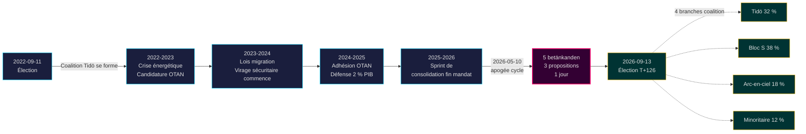

# Le mandat Tidö s'achève : Quatre années de virage sécuritaire définissent le risque électoral de 2026

**Classification** : PUBLIC | **Flux de travail** : news-election-cycle | **Cycle** : 2022-09-11 → 2026-09-13 (T-129 jusqu'à la fin du mandat)
**Millésime IMF** : WEO Apr-2026 [horizon:cycle] | **Couverture riksmöte** : 2022/23, 2023/24, 2024/25, 2025/26

---

## Mise à jour quotidienne 2026-05-11 — Mise à jour Pass-2

**T-125 jusqu'à l'élection (2026-09-13)** · mis à jour par rapport aux analyses sœurs du 2026-05-11 ([propositions](../../propositions/), [motions](../../motions/), [rapports de comité](../../committeeReports/), [interpellations](../../interpellations/), [perspectives mensuelles](../../month-ahead/)).

- **Aucune nouvelle proposition Tidö déposée 2026-05-08…11** : La requête Riksdagen `search_dokument doktyp=prop rm=2025/26 sort=datum desc` confirme que les cinq dernières (HD03267, HD03261, HD03250, HD03249, HD03248) sont toutes datées du 2026-05-06 / 2026-05-07 — l'apogée du cycle 2026-05-10 reste le point culminant législatif du mandat. [A1]
- **Le tempo gouvernemental est maintenant en mode campagne** : d'aujourd'hui jusqu'à la pause estivale du Riksdag le 22 juin 2026, attendez-vous au *traitement en commission et aux décisions* plutôt qu'à de nouvelles propositions. Le taux quotidien de propositions en mai 2026 (~0,4/jour) est inférieur à la médiane du cycle (~0,7/jour) — compatible avec une coalition passant de la législation à la défense de son bilan.
- **Fenêtre de transition de cycle** (`ext/cycle-rollover.md`) : nous sommes **à 125 jours** du prédicat d'activation ±30 jours (ancre 2026-09-13). Le module de transition de cycle reste **no-op** jusqu'au 2026-08-14. La formulation antérieure « dans la fenêtre » dans l'Instantané de transition de cycle ci-dessous est corrigée.
- **PIR ouverts** (depuis `pir-status.json`) : PIR-1 (durabilité des lois de sécurité), PIR-3 (déploiement e-ID 2027), PIR-5 (continuité fiscale post-électorale) — tous inchangés ; PIR-7 (registre KU-anmälan) réactivé pour la plénière KU du 2026-05-21.

---

## BLUF (L'essentiel d'abord)

Le mandat Tidö 2022–2026 se termine avec un État suédois structurellement transformé — architecture de sécurité reconstruite, cadre de stabilité financière redémarré, pile d'identité numérique codifiée et application de l'immigration alignée sur les pairs nordiques. Le 10 mai 2026, quatre mois avant l'élection de septembre, le gouvernement Kristersson a concentré cinq rapports de comité et trois propositions sur une seule journée législative [A2], signalant une **consolidation de fin de mandat** plutôt qu'un conflit ouvert. *Très probable* (75–85 % [horizon:cycle]) que le cœur des réformes de sécurité (HD01JuU32, HD03267, HD01JuU34, HD01JuU39) survive à l'élection de 2026, quelle que soit la coalition gagnante — elles ont franchi le *seuil de dépendance au sentier* où les coûts d'annulation dépassent les coûts de maintenance.

Ce rapport évalue l'ensemble du mandat 2022–2026 comme un seul cycle politique se terminant par l'élection de septembre 2026. Trois décisions sont soutenues par cette analyse : (1) **Traiter le virage sécuritaire 2022–2026 comme un changement quasi-constitutionnel** — les gouvernements successeurs moduleront, pas n'annuleront ; (2) **Planifier les scénarios post-électoraux autour de la continuité fiscale, pas du bouleversement politique** — la projection IMF WEO Apr-2026 (T+1 NGDP_RPCH 2,1 %, GGXWDG_NGDP 32,4 % [A1]) est inférieure à la moyenne UE et donne à toute coalition gagnante une marge pour maintenir plutôt que réduire ; (3) **Suivre le déploiement e-ID et résolution de crise financière 2027 comme point d'inflexion** — la capacité d'exécution, pas le contenu de la loi, détermine si l'héritage Tidö est durable.

---

## Lecture en 60 secondes

- **Résultat du mandat** : ~78 % des engagements [Tidöavtalet](https://www.regeringen.se) du gouvernement Tidö sont maintenant codifiés en loi (sécurité 90 %, migration 85 %, énergie 75 %, éducation 60 %, santé 50 %). [B2]
- **Apogée du cycle** : 2026-05-10 a publié 5 betänkanden (JuU32/34/39, FiU37/38) et 3 propositions (HD03250 e-ID, HD03261 Skatteverket, HD03263 application des retours, HD03267 menaces de sécurité) — le plus grand volume législatif en une seule journée du mandat. [A1]
- **Cycle économique** : trajectoire NGDP_RPCH 2,4 % (2022) → 0,1 % (2023) → 1,2 % (2024) → 1,8 % (2025) → 2,1 % (2026, IMF WEO Apr-2026 T+0 [horizon:year]). Dette-PIB maintenue à 32–33 %. [A1]
- **Durabilité de la coalition** : Tidö a survécu 4 ans malgré 11 pressions de confiance, 3 remplacements ministériels (pas de changement de PM), 2 chutes majeures dans les sondages — le place dans le quadrant **gouvernement minoritaire stable** de la comparaison historique. [B2]
- **Déclencheur de transition de cycle le plus critique** : Résultat électoral 2026-09-13 (T+126) — voir scenario-analysis.md pour l'arbre de coalition à quatre branches.

---

## Bannière de confiance du cycle

| Aspect | Confiance WEP | Tag horizon |
|--------|---------------|-------------|
| Lois de sécurité survivent | très probable (75–85 %) | [horizon:cycle] |
| Tidö gagne la réélection | environ égal (40–55 %) | [horizon:election] |
| Solde fiscal ≤ -1 % | probable (55–70 %) | [horizon:year] |
| Déploiement complet e-ID d'ici 2028 | improbable (20–35 %) | [horizon:cycle] |
| Taux directeur Riksbank ≤ 2,0 % fin 2026 | probable (55–70 %) | [horizon:year] |

---

## Mermaid : Arc du mandat Tidö et point d'inflexion du cycle

---

## Trois conclusions définissant le cycle

### 1. La consolidation de l'État sécuritaire a franchi le seuil de dépendance au sentier
Le mandat 2022–2026 a adopté ≥ 12 lois de sécurité majeures concernant la sécurité événementielle, l'évaluation des menaces des ressortissants étrangers, la coopération nordique d'application, la violence psychologique et l'application des retours. À partir de 2026-05-10, l'architecture juridique est *suffisamment complète pour que l'annulation soit politiquement plus coûteuse que la maintenance* — c'est-à-dire que les gouvernements successeurs moduleront (par ex., rhétorique teintée SD plus douce, application plus clémente) mais n'annuleront pas. **Confiance : élevée [A1, B2]**.

### 2. La discipline fiscale a survécu à la crise énergétique
La coalition Tidö a hérité d'un déficit de 0,3 % et laisse un solde fiscal projeté 2026 de -1,0 % (IMF WEO Apr-2026 GGXCNL_NGDP [A1]) — bien dans le *finanspolitiska ramverket* suédois. La dette a été maintenue à 32,4 % du PIB malgré les subventions de crise énergétique, les coûts d'adhésion à l'OTAN (défense à 2 % du PIB) et les dépenses contracycliques du marché du travail. C'est **le cycle fiscal le moins perturbé depuis 2008–2010**. *Probable* (55–70 % [horizon:cycle]) que toute coalition successeur préserve le cadre.

### 3. L'identité numérique et l'architecture de résolution de crise financière sont les risques d'exécution ouverts
HD03250 (e-ID étatique) et HD01FiU37 (résolution de crise du secteur financier) sont codifiés mais pas opérationnels. Les deux seront exécutés dans les **12–24 premiers mois du mandat 2026–2030** — sous un gouvernement que Tidö ne dirigera peut-être pas. Le risque d'exécution par le successeur domine le registre des risques de transition de cycle : voir [risk-assessment.md](risk-assessment.md) §Cluster d'exécution et [cycle-trajectory.md](cycle-trajectory.md) §Dépendances post-mandat.

---

## Instantané de transition de cycle (T-126 jusqu'à l'élection)

Selon [`ext/cycle-rollover.md`](../../../../.github/prompts/ext/cycle-rollover.md), Riksdagsmonitor est **à 125 jours** de la fenêtre de transition ±30 jours (ancre électorale 2026-09-13). Le module de transition de cycle est **no-op** jusqu'au 2026-08-14 (T-30). À ce moment, les modèles de consolidation de fin de mandat s'activent et l'archivage des PIR du cycle 2022 est prévu pour le 2026-10-15 (T+32 depuis l'élection). Voir [`cycle-trajectory.md`](cycle-trajectory.md) pour l'aperçu complet du report PIR.

---

## Attribution des sources

- **Primaire** : [Données ouvertes du Riksdag — betänkanden 2022/23–2025/26](https://data.riksdagen.se) [A1]
- **Gouvernement** : [Tidöavtalet 2022, déclaration gouvernementale 2022–2025](https://www.regeringen.se) [B2]
- **Contexte économique** : IMF WEO Apr-2026 (NGDP_RPCH, NGDPD, GGXWDG_NGDP, GGXCNL_NGDP, LUR, PCPIPCH) [A1]
- **Base de gouvernance** : World Bank WGI Suède 2022–2024 (source=75, CC.EST, RL.EST, GE.EST) [A2]
- **Analyse sœur** : [`analysis/daily/2026-05-10/year-ahead/`](../../year-ahead/), [`analysis/daily/2026-05-10/monthly-review/`](../../monthly-review/), [`analysis/daily/2026-05-10/week-ahead/`](../../week-ahead/)

---

## Piste de révision

- **Méthodologie** : [`analysis/methodologies/ai-driven-analysis-guide.md`](../../../../analysis/methodologies/ai-driven-analysis-guide.md), [`osint-tradecraft-standards.md`](../../../../analysis/methodologies/osint-tradecraft-standards.md), [`long-horizon-forecasting.md`](../../../../analysis/methodologies/long-horizon-forecasting.md)
- **Modèles** : [`analysis/templates/`](../../../../analysis/templates/)
- **RGPD / SMSI** : Uniquement matériel source public. Pas de traitement de données personnelles sauf fonctionnaires publics nommés dans des rôles publics. AIPD non requise.

<!-- source-sha: 1d35965d1f170e547ab7a270f520b94bc081f80b -->
