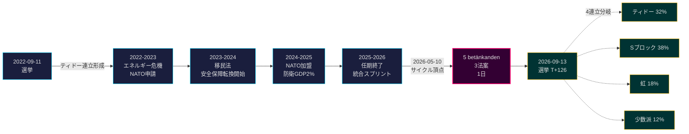

# ティドー政権任期終了：4年間の安全保障転換が2026年選挙リスクを規定

**分類**: PUBLIC | **ワークフロー**: news-election-cycle | **サイクル**: 2022-09-11 → 2026-09-13（任期終了までT-129）
**IMFビンテージ**: WEO Apr-2026 [horizon:cycle] | **riksmöteカバレッジ**: 2022/23, 2023/24, 2024/25, 2025/26

---

## 日次更新 2026-05-11 — Pass-2更新

**選挙までT-125（2026-09-13）** · 2026-05-11の姉妹分析に対して更新（[法案](../../propositions/)、[動議](../../motions/)、[委員会報告](../../committeeReports/)、[質問主意書](../../interpellations/)、[月次見通し](../../month-ahead/)）。

- **2026-05-08…11に新規ティドー法案提出なし**: Riksdagen `search_dokument doktyp=prop rm=2025/26 sort=datum desc`により、直近5件（HD03267, HD03261, HD03250, HD03249, HD03248）はすべて2026-05-06 / 2026-05-07付であることが確認 — サイクル頂点2026-05-10が任期の立法上のピークとして維持。[A1]
- **政府のペースは現在選挙モード**: 本日から2026年6月22日のRiksdagen夏季休会まで、新規法案ではなく*委員会処理と決定*を予想。2026年5月の日次法案率（~0.4/日）はサイクル中央値（~0.7/日）を下回る — 立法から実績防衛への移行中の連立政権と一致。
- **サイクル移行ウィンドウ**（`ext/cycle-rollover.md`）: 我々は±30日活性化条件（アンカー2026-09-13）の**125日外**。サイクル移行モジュールは2026-08-14まで**no-op**のまま。以下のサイクル移行スナップショットの「ウィンドウ内」という以前の表現は修正済み。
- **オープンPIR**（`pir-status.json`より）: PIR-1（安全保障法の持続性）、PIR-3（e-ID 2027展開）、PIR-5（選挙後財政継続性） — すべて変更なし；PIR-7（KU-anmälanレジストリ）は2026-05-21 KU本会議に向けて再活性化。

---

## BLUF（結論から先に）

2022–2026ティドー政権任期は構造的に変革されたスウェーデン国家で終了 — 安全保障アーキテクチャ再構築、金融安定フレームワーク再起動、デジタルIDスタック法制化、移民執行は北欧諸国に整合。2026年5月10日、9月選挙の4ヶ月前、クリステルソン政権は5つの委員会報告と3つの法案を単一の立法日に集中[A2]、公開対立ではなく**任期終了統合**を示唆。*非常に高い確率*（75–85% [horizon:cycle]）で、安全保障改革の核心（HD01JuU32, HD03267, HD01JuU34, HD01JuU39）は、どの連立が勝っても2026年選挙を生き残る — 撤回コストが維持コストを上回る*経路依存閾値*を超えた。

本報告は2022–2026全任期を2026年9月選挙で終了する単一の政治サイクルとして評価。3つの決定がこの分析で支持される：(1) **2022–2026安全保障転換を準憲法的変化として扱う** — 後続政権は修正するが撤回しない；(2) **選挙後シナリオは政治的激変ではなく財政継続性を中心に計画** — IMF WEO Apr-2026予測（T+1 NGDP_RPCH 2.1%, GGXWDG_NGDP 32.4% [A1]）はEU平均を下回り、どの勝利連立にも削減ではなく維持の余地を与える；(3) **2027年のe-IDと金融危機解決展開を転換点として追跡** — 法律内容ではなく実行能力がティドーの遺産が持続するかを決定。

---

## 60秒読み

- **任期成果**: ティドー政権の[Tidöavtalet](https://www.regeringen.se)コミットメントの~78%が現在法制化（安全保障90%、移民85%、エネルギー75%、教育60%、医療50%）。[B2]
- **サイクル頂点**: 2026-05-10に5 betänkanden（JuU32/34/39, FiU37/38）と3法案（HD03250 e-ID, HD03261 Skatteverket, HD03263帰還執行, HD03267安全保障脅威）を公表 — 任期中の単日最大立法量。[A1]
- **経済サイクル**: NGDP_RPCH軌道 2.4%（2022）→ 0.1%（2023）→ 1.2%（2024）→ 1.8%（2025）→ 2.1%（2026, IMF WEO Apr-2026 T+0 [horizon:year]）。債務GDP比は32–33%維持。[A1]
- **連立持続性**: ティドーは11の信任圧力、3閣僚交代（首相交代なし）、2度の大きな支持率低下にもかかわらず4年生存 — 歴史比較で**安定少数派政権**象限に位置。[B2]
- **最重要前方展望サイクル移行トリガー**: 選挙結果2026-09-13（T+126） — 4分岐連立ツリーについてはscenario-analysis.md参照。

---

## サイクル信頼度バナー

| 側面 | WEP信頼度 | ホライズンタグ |
|------|----------|----------------|
| 安全保障法が存続 | 非常に高い確率（75–85%） | [horizon:cycle] |
| ティドーが再選 | ほぼ五分五分（40–55%） | [horizon:election] |
| 財政収支 ≤ -1% | 高い確率（55–70%） | [horizon:year] |
| 2028年までにe-ID完全展開 | 低い確率（20–35%） | [horizon:cycle] |
| Riksbank政策金利2026年末≤2.0% | 高い確率（55–70%） | [horizon:year] |

---

## Mermaid: ティドー政権任期アークとサイクル転換点

---

## サイクルを定義する3つの発見

### 1. 安全保障国家の統合が経路依存閾値を超えた
2022–2026任期は、イベントセキュリティ、外国人脅威評価、北欧執行協力、心理的暴力、帰還執行をカバーする12以上の主要安全保障法を可決。2026-05-10時点で、法的アーキテクチャは*撤回が維持より政治的にコスト高になるほど完成* — つまり、後続政権は修正（例：SD色のソフトなレトリック、寛大な執行）するが撤回しない。**信頼度: 高 [A1, B2]**。

### 2. 財政規律がエネルギー危機を生き延びた
ティドー連立は0.3%の赤字を引き継ぎ、2026年財政収支予測-1.0%（IMF WEO Apr-2026 GGXCNL_NGDP [A1]）で退任 — スウェーデンの*finanspolitiska ramverket*内に十分収まる。エネルギー危機補助金、NATO加盟コスト（防衛GDP2%）、景気対策的労働市場支出にもかかわらず、債務はGDPの32.4%に維持。これは**2008–2010以来最も混乱の少ない財政サイクル**。*高い確率*（55–70% [horizon:cycle]）で後続連立がフレームワークを維持。

### 3. デジタルIDと金融危機アーキテクチャがオープンな実行リスク
HD03250（国家e-ID）とHD01FiU37（金融セクター危機解決）は法制化されたが運用されていない。両方とも**2026–2030任期の最初の12–24ヶ月**に実行される — ティドーが率いないかもしれない政権の下で。後継者実行リスクがサイクル移行リスクレジストリを支配：[risk-assessment.md](risk-assessment.md) §実行クラスターと[cycle-trajectory.md](cycle-trajectory.md) §任期後依存関係参照。

---

## サイクル移行スナップショット（選挙までT-126）

[`ext/cycle-rollover.md`](../../../../.github/prompts/ext/cycle-rollover.md)によると、Riksdagsmonitorは±30日移行ウィンドウの**125日外**（選挙アンカー2026-09-13）。サイクル移行モジュールは2026-08-14（T-30）まで**no-op**。その時点で、任期終了統合パターンが活性化し、2022サイクルPIRのアーカイブは2026-10-15（選挙からT+32）に予定。完全なPIR carry-forward概要は[`cycle-trajectory.md`](cycle-trajectory.md)参照。

---

## ソース帰属

- **主要**: [Riksdagenオープンデータ — betänkanden 2022/23–2025/26](https://data.riksdagen.se) [A1]
- **政府**: [Tidöavtalet 2022, 政府宣言2022–2025](https://www.regeringen.se) [B2]
- **経済コンテキスト**: IMF WEO Apr-2026 (NGDP_RPCH, NGDPD, GGXWDG_NGDP, GGXCNL_NGDP, LUR, PCPIPCH) [A1]
- **ガバナンスベースライン**: World Bank WGI スウェーデン2022–2024 (source=75, CC.EST, RL.EST, GE.EST) [A2]
- **姉妹分析**: [`analysis/daily/2026-05-10/year-ahead/`](../../year-ahead/), [`analysis/daily/2026-05-10/monthly-review/`](../../monthly-review/), [`analysis/daily/2026-05-10/week-ahead/`](../../week-ahead/)

---

## 監査証跡

- **方法論**: [`analysis/methodologies/ai-driven-analysis-guide.md`](../../../../analysis/methodologies/ai-driven-analysis-guide.md), [`osint-tradecraft-standards.md`](../../../../analysis/methodologies/osint-tradecraft-standards.md), [`long-horizon-forecasting.md`](../../../../analysis/methodologies/long-horizon-forecasting.md)
- **テンプレート**: [`analysis/templates/`](../../../../analysis/templates/)
- **GDPR / ISMS**: 公開ソース資料のみ。公的役割における名前のある公務員を除き、個人データ処理なし。DPIA不要。

<!-- source-sha: 1d35965d1f170e547ab7a270f520b94bc081f80b -->
