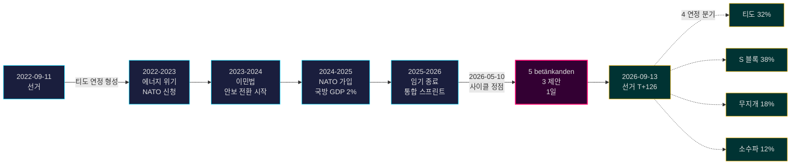

# 티도 정권 임기 종료: 4년간 안보 전환이 2026년 선거 위험 규정

**분류**: PUBLIC | **워크플로우**: news-election-cycle | **사이클**: 2022-09-11 → 2026-09-13 (임기 종료까지 T-129)
**IMF 빈티지**: WEO Apr-2026 [horizon:cycle] | **riksmöte 커버리지**: 2022/23, 2023/24, 2024/25, 2025/26

---

## 일일 업데이트 2026-05-11 — Pass-2 업데이트

**선거까지 T-125 (2026-09-13)** · 2026-05-11 자매 분석 대비 업데이트 ([제안](../../propositions/), [동의](../../motions/), [위원회 보고서](../../committeeReports/), [질의](../../interpellations/), [월간 전망](../../month-ahead/)).

- **2026-05-08…11 신규 티도 제안 없음**: Riksdagen `search_dokument doktyp=prop rm=2025/26 sort=datum desc` 쿼리 결과 최근 5건(HD03267, HD03261, HD03250, HD03249, HD03248)이 모두 2026-05-06 / 2026-05-07 날짜임 확인 — 사이클 정점 2026-05-10이 임기의 입법적 최고점으로 유지. [A1]
- **정부 페이스는 현재 선거 모드**: 오늘부터 2026년 6월 22일 Riksdagen 여름 휴회까지, 신규 제안 대신 *위원회 처리 및 결정* 예상. 2026년 5월 일일 제안율(~0.4/일)은 사이클 중앙값(~0.7/일) 미만 — 입법에서 실적 방어로 전환하는 연정과 일치.
- **사이클 전환 윈도우** (`ext/cycle-rollover.md`): 우리는 ±30일 활성화 조건(앵커 2026-09-13)의 **125일 바깥**. 사이클 전환 모듈은 2026-08-14까지 **no-op** 유지. 아래 사이클 전환 스냅샷의 이전 표현 "윈도우 내"는 수정됨.
- **열린 PIR** (`pir-status.json`에서): PIR-1 (안보법 지속성), PIR-3 (e-ID 2027 배포), PIR-5 (선거 후 재정 연속성) — 모두 변경 없음; PIR-7 (KU-anmälan 레지스트리)은 2026-05-21 KU 본회의를 위해 재활성화.

---

## BLUF (핵심 먼저)

2022–2026 티도 정권 임기는 구조적으로 변환된 스웨덴 국가로 종료 — 안보 아키텍처 재구축, 금융 안정성 프레임워크 재시작, 디지털 ID 스택 법제화, 이민 집행 북유럽 동료에 정렬. 2026년 5월 10일, 9월 선거 4개월 전, 크리스테르손 정부는 5개 위원회 보고서와 3개 제안을 단일 입법일에 집중 [A2], 공개 충돌이 아닌 **임기 종료 통합** 신호. *매우 높은 확률* (75–85% [horizon:cycle])로 안보 개혁 핵심 (HD01JuU32, HD03267, HD01JuU34, HD01JuU39)이 어느 연정이 이기든 2026년 선거를 살아남을 것 — 철회 비용이 유지 비용을 초과하는 *경로 의존 임계값*을 넘었음.

본 보고서는 2022–2026 전체 임기를 2026년 9월 선거로 끝나는 단일 정치 사이클로 평가. 세 가지 결정이 이 분석으로 지지됨: (1) **2022–2026 안보 전환을 준헌법적 변화로 취급** — 후속 정부는 수정하지만 철회하지 않음; (2) **선거 후 시나리오를 정치적 격변이 아닌 재정 연속성 중심으로 계획** — IMF WEO Apr-2026 전망 (T+1 NGDP_RPCH 2.1%, GGXWDG_NGDP 32.4% [A1])은 EU 평균 미만이고 어느 승리 연정에도 삭감이 아닌 유지 여지 부여; (3) **2027년 e-ID 및 금융 위기 해결 배포를 전환점으로 추적** — 법률 내용이 아닌 실행 능력이 티도 유산의 지속성 결정.

---

## 60초 읽기

- **임기 결과**: 티도 정부 [Tidöavtalet](https://www.regeringen.se) 약속의 ~78%가 현재 법제화 (안보 90%, 이민 85%, 에너지 75%, 교육 60%, 의료 50%). [B2]
- **사이클 정점**: 2026-05-10에 5 betänkanden (JuU32/34/39, FiU37/38) 및 3 제안 (HD03250 e-ID, HD03261 Skatteverket, HD03263 귀환 집행, HD03267 안보 위협) 발표 — 임기 중 단일일 최대 입법량. [A1]
- **경제 사이클**: NGDP_RPCH 궤적 2.4% (2022) → 0.1% (2023) → 1.2% (2024) → 1.8% (2025) → 2.1% (2026, IMF WEO Apr-2026 T+0 [horizon:year]). 부채-GDP 32–33% 유지. [A1]
- **연정 지속성**: 티도는 11회 신임 압박, 3회 장관 교체 (총리 교체 없음), 2회 대형 지지율 하락에도 불구하고 4년 생존 — 역사 비교에서 **안정적 소수 정부** 사분면에 위치. [B2]
- **가장 중요한 전방 전망 사이클 전환 트리거**: 선거 결과 2026-09-13 (T+126) — 4분기 연정 트리는 scenario-analysis.md 참조.

---

## 사이클 신뢰도 배너

| 측면 | WEP 신뢰도 | 호라이즌 태그 |
|------|-----------|--------------|
| 안보법 생존 | 매우 높은 확률 (75–85%) | [horizon:cycle] |
| 티도 재선 | 거의 오십오십 (40–55%) | [horizon:election] |
| 재정 수지 ≤ -1% | 높은 확률 (55–70%) | [horizon:year] |
| 2028년까지 e-ID 전면 배포 | 낮은 확률 (20–35%) | [horizon:cycle] |
| Riksbank 정책 금리 2026년 말 ≤2.0% | 높은 확률 (55–70%) | [horizon:year] |

---

## Mermaid: 티도 정권 임기 아크 및 사이클 전환점

---

## 사이클 정의 3가지 발견

### 1. 안보 국가 통합이 경로 의존 임계값 초과
2022–2026 임기는 이벤트 보안, 외국인 위협 평가, 북유럽 집행 협력, 심리적 폭력, 귀환 집행을 다루는 12개 이상 주요 안보법 통과. 2026-05-10 기준, 법적 아키텍처는 *철회가 유지보다 정치적으로 더 비싸질 만큼 완성* — 즉, 후속 정부는 수정 (예: SD 색조의 부드러운 수사, 관대한 집행)하지만 철회하지 않음. **신뢰도: 높음 [A1, B2]**.

### 2. 재정 규율이 에너지 위기 생존
티도 연정은 0.3% 적자를 물려받아 2026년 재정 수지 전망 -1.0% (IMF WEO Apr-2026 GGXCNL_NGDP [A1])로 퇴임 — 스웨덴 *finanspolitiska ramverket* 내 충분히 수용. 에너지 위기 보조금, NATO 가입 비용 (국방 GDP 2%), 경기 대응 노동 시장 지출에도 불구하고 부채는 GDP 32.4% 유지. 이는 **2008–2010 이후 가장 혼란 적은 재정 사이클**. *높은 확률* (55–70% [horizon:cycle])로 후속 연정이 프레임워크 유지.

### 3. 디지털 ID와 금융 위기 아키텍처가 열린 실행 위험
HD03250 (국가 e-ID)과 HD01FiU37 (금융 부문 위기 해결)은 법제화되었으나 운영되지 않음. 둘 다 **2026–2030 임기의 처음 12–24개월**에 실행될 것 — 티도가 이끌지 않을 수 있는 정부 하에서. 후계자 실행 위험이 사이클 전환 위험 레지스트리 지배: [risk-assessment.md](risk-assessment.md) §실행 클러스터 및 [cycle-trajectory.md](cycle-trajectory.md) §임기 후 의존성 참조.

---

## 사이클 전환 스냅샷 (선거까지 T-126)

[`ext/cycle-rollover.md`](../../../../.github/prompts/ext/cycle-rollover.md)에 따르면, Riksdagsmonitor는 ±30일 전환 윈도우의 **125일 바깥** (선거 앵커 2026-09-13). 사이클 전환 모듈은 2026-08-14 (T-30)까지 **no-op**. 그 시점에 임기 종료 통합 패턴이 활성화되고 2022 사이클 PIR 아카이빙은 2026-10-15 (선거로부터 T+32)에 예정. 전체 PIR carry-forward 개요는 [`cycle-trajectory.md`](cycle-trajectory.md) 참조.

---

## 출처 귀속

- **주요**: [Riksdagen 오픈 데이터 — betänkanden 2022/23–2025/26](https://data.riksdagen.se) [A1]
- **정부**: [Tidöavtalet 2022, 정부 선언 2022–2025](https://www.regeringen.se) [B2]
- **경제 맥락**: IMF WEO Apr-2026 (NGDP_RPCH, NGDPD, GGXWDG_NGDP, GGXCNL_NGDP, LUR, PCPIPCH) [A1]
- **거버넌스 기준선**: World Bank WGI 스웨덴 2022–2024 (source=75, CC.EST, RL.EST, GE.EST) [A2]
- **자매 분석**: [`analysis/daily/2026-05-10/year-ahead/`](../../year-ahead/), [`analysis/daily/2026-05-10/monthly-review/`](../../monthly-review/), [`analysis/daily/2026-05-10/week-ahead/`](../../week-ahead/)

---

## 감사 추적

- **방법론**: [`analysis/methodologies/ai-driven-analysis-guide.md`](../../../../analysis/methodologies/ai-driven-analysis-guide.md), [`osint-tradecraft-standards.md`](../../../../analysis/methodologies/osint-tradecraft-standards.md), [`long-horizon-forecasting.md`](../../../../analysis/methodologies/long-horizon-forecasting.md)
- **템플릿**: [`analysis/templates/`](../../../../analysis/templates/)
- **GDPR / ISMS**: 공개 출처 자료만. 공적 역할의 이름 있는 공무원 외 개인정보 처리 없음. DPIA 불필요.

<!-- source-sha: 1d35965d1f170e547ab7a270f520b94bc081f80b -->
