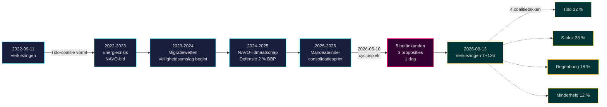

# Het Tidö-mandaat eindigt: Vier jaar veiligheidsomslag definieert verkiezingsrisico 2026

**Classificatie**: PUBLIC | **Workflow**: news-election-cycle | **Cyclus**: 2022-09-11 → 2026-09-13 (T-129 tot mandaateinde)
**IMF-vintage**: WEO Apr-2026 [horizon:cycle] | **Riksmöte-dekking**: 2022/23, 2023/24, 2024/25, 2025/26

---

## Dagelijkse update 2026-05-11 — Pass-2-update

**T-125 tot verkiezingen (2026-09-13)** · bijgewerkt tegen zusteranalyses van 2026-05-11 ([proposities](../../propositions/), [moties](../../motions/), [commissierapporten](../../committeeReports/), [interpellaties](../../interpellations/), [maandvooruitzicht](../../month-ahead/)).

- **Geen nieuwe Tidö-proposities ingediend 2026-05-08…11**: Riksdagen's `search_dokument doktyp=prop rm=2025/26 sort=datum desc` bevestigt dat de laatste vijf (HD03267, HD03261, HD03250, HD03249, HD03248) allemaal gedateerd zijn op 2026-05-06 / 2026-05-07 — de cycluspiek 2026-05-10 blijft het wetgevend hoogtepunt van het mandaat. [A1]
- **Het regeringstempo is nu campagnemodus**: vanaf vandaag tot het zomerreces van de Riksdag op 22 juni 2026, verwacht *commissiebehandeling en besluiten* in plaats van nieuwe proposities. De dagelijkse propositierate in mei 2026 (~0,4/dag) ligt onder de cyclusmediaan (~0,7/dag) — consistent met een coalitie die overgaat van wetgeving naar verdediging van haar staat van dienst.
- **Cyclusovergangsvenster** (`ext/cycle-rollover.md`): we zijn **125 dagen buiten** het ±30-dagen-activeringsvoorwaarde (anker 2026-09-13). De cyclusovergangsmodule blijft **no-op** tot 2026-08-14. De eerdere formulering "binnen het venster" in de Cyclusovergangs-snapshot hieronder is gecorrigeerd.
- **Open PIR's** (uit `pir-status.json`): PIR-1 (duurzaamheid veiligheidswetten), PIR-3 (e-ID 2027-uitrol), PIR-5 (fiscale continuïteit na verkiezingen) — allemaal ongewijzigd; PIR-7 (KU-anmälan-register) gereactiveerd voor KU-plenaire 2026-05-21.

---

## BLUF (Belangrijkste punt eerst)

Het Tidö-mandaat 2022–2026 eindigt met een structureel getransformeerde Zweedse staat — veiligheidsarchitectuur herbouwd, financiële stabiliteitskader herstart, digitale identiteitsstack gecodificeerd en migratie-handhaving afgestemd op Noordse collega's. Op 10 mei 2026, vier maanden voor de septemberverkiezingen, concentreerde de Kristersson-regering vijf commissierapporten en drie proposities op één wetgevende dag [A2], wat duidt op **mandaateinde-consolidatie** in plaats van open conflict. *Zeer waarschijnlijk* (75–85 % [horizon:cycle]) dat de kern van de veiligheidshervormingen (HD01JuU32, HD03267, HD01JuU34, HD01JuU39) de verkiezingen van 2026 overleeft ongeacht welke coalitie wint — ze hebben de *padafhankelijkheidsdrempel* overschreden waar terugdraaiingskosten de onderhoudskosten overtreffen.

Dit rapport beoordeelt de volledige mandaatperiode 2022–2026 als één politieke cyclus die eindigt met de verkiezingen van september 2026. Drie beslissingen worden ondersteund door deze analyse: (1) **Behandel de veiligheidsomslag 2022–2026 als quasi-constitutionele verschuiving** — opvolgende regeringen zullen moduleren, niet terugdraaien; (2) **Plan post-verkiezingsscenario's rond fiscale continuïteit, niet politieke omwenteling** — de IMF WEO Apr-2026-projectie (T+1 NGDP_RPCH 2,1 %, GGXWDG_NGDP 32,4 % [A1]) ligt onder het EU-gemiddelde en geeft elke winnende coalitie ruimte om te handhaven in plaats van te bezuinigen; (3) **Volg de e-ID- en financiële crisisoplossingsuitrol 2027 als keerpunt** — uitvoeringsvermogen, niet wetsinhoud, bepaalt of de Tidö-nalatenschap duurzaam is.

---

## 60-seconden lezing

- **Mandaatresultaat**: ~78 % van de Tidö-regering's [Tidöavtalet](https://www.regeringen.se)-verplichtingen zijn nu in wetgeving gecodificeerd (veiligheid 90 %, migratie 85 %, energie 75 %, onderwijs 60 %, gezondheidszorg 50 %). [B2]
- **Cycluspiek**: 2026-05-10 publiceerde 5 betänkanden (JuU32/34/39, FiU37/38) en 3 proposities (HD03250 e-ID, HD03261 Skatteverket, HD03263 terugkeerhandhaving, HD03267 veiligheidsdreigingen) — het grootste wetgevingsvolume op één dag in de mandaatperiode. [A1]
- **Economische cyclus**: NGDP_RPCH-traject 2,4 % (2022) → 0,1 % (2023) → 1,2 % (2024) → 1,8 % (2025) → 2,1 % (2026, IMF WEO Apr-2026 T+0 [horizon:year]). Schuld-BBP bleef op 32–33 %. [A1]
- **Coalitieduurzaamheid**: Tidö overleefde 4 jaar ondanks 11 vertrouwensdrukpunten, 3 ministerswisselingen (geen PM-wissel), 2 grote peilingdalingen — plaatst het in het **stabiele minderheidsregering**-kwadrant van historische vergelijking. [B2]
- **Belangrijkste vooruitblikkende cyclusovergangstrigger**: Verkiezingsresultaat 2026-09-13 (T+126) — zie scenario-analysis.md voor de viervertakte coalitieboom.

---

## Cyclusvertrouwensbanner

| Aspect | WEP-vertrouwen | Horizonttag |
|--------|----------------|-------------|
| Veiligheidswetten overleven | zeer waarschijnlijk (75–85 %) | [horizon:cycle] |
| Tidö wint herverkiezing | ongeveer gelijk (40–55 %) | [horizon:election] |
| Fiscaal saldo ≤ -1 % | waarschijnlijk (55–70 %) | [horizon:year] |
| e-ID volledige uitrol tegen 2028 | onwaarschijnlijk (20–35 %) | [horizon:cycle] |
| Riksbank beleidsrente ≤ 2,0 % eind 2026 | waarschijnlijk (55–70 %) | [horizon:year] |

---

## Mermaid: Tidö-mandaatboog en cyclus-keerpunt

---

## Drie cyclusbepalende bevindingen

### 1. De veiligheidsstaatsconsolidatie heeft de padafhankelijkheidsdrempel overschreden
De mandaatperiode 2022–2026 keurde ≥ 12 belangrijke veiligheidswetten goed over evenementenbeveiliging, dreigingsbeoordeling van buitenlandse onderdanen, Noordse handhavingssamenwerking, psychologisch geweld en terugkeerhandhaving. Vanaf 2026-05-10 is de juridische architectuur *voldoende compleet dat terugdraaien politiek duurder zou zijn dan onderhoud* — dat wil zeggen, opvolgende regeringen zullen moduleren (bijv. zachtere SD-getinte retoriek, milder handhaven) maar niet terugdraaien. **Vertrouwen: hoog [A1, B2]**.

### 2. Fiscale discipline overleefde de energiecrisis
De Tidö-coalitie erfde een tekort van 0,3 % en laat een geprojecteerd fiscaal saldo 2026 van -1,0 % achter (IMF WEO Apr-2026 GGXCNL_NGDP [A1]) — ruim binnen het Zweedse *finanspolitiska ramverket*. De schuld werd op 32,4 % van het BBP gehouden ondanks energiecrisissubsidies, NAVO-lidmaatschapskosten (defensie naar 2 % van BBP) en anticyclische arbeidsmarktuitgaven. Dit is **de minst verstoorde fiscale cyclus sinds 2008–2010**. *Waarschijnlijk* (55–70 % [horizon:cycle]) dat elke opvolgende coalitie het kader behoudt.

### 3. Digitale identiteit en financiële crisisarchitectuur zijn de open uitvoeringsrisico's
HD03250 (staats-e-ID) en HD01FiU37 (financiële sectorcrisisoplossing) zijn gecodificeerd maar niet operationeel. Beide worden uitgevoerd in de **eerste 12–24 maanden van de mandaatperiode 2026–2030** — onder een regering die Tidö mogelijk niet leidt. Opvolger-uitvoeringsrisico domineert het cyclusovergangsrisicoregister: zie [risk-assessment.md](risk-assessment.md) §Uitvoeringscluster en [cycle-trajectory.md](cycle-trajectory.md) §Post-mandaatafhankelijkheden.

---

## Cyclusovergangs-snapshot (T-126 tot verkiezingen)

Volgens [`ext/cycle-rollover.md`](../../../../.github/prompts/ext/cycle-rollover.md) is Riksdagsmonitor **125 dagen buiten** het ±30-dagen-overgangsvenster (verkiezingsanker 2026-09-13). De cyclusovergangsmodule is **no-op** tot 2026-08-14 (T-30). Op dat moment worden mandaateinde-consolidatiepatronen geactiveerd en is archivering van 2022-cyclus PIR's gepland voor 2026-10-15 (T+32 vanaf verkiezingen). Zie [`cycle-trajectory.md`](cycle-trajectory.md) voor het volledige PIR carry-forward-overzicht.

---

## Bronvermelding

- **Primair**: [Riksdagen open data — betänkanden 2022/23–2025/26](https://data.riksdagen.se) [A1]
- **Regering**: [Tidöavtalet 2022, regeringsverklaring 2022–2025](https://www.regeringen.se) [B2]
- **Economische context**: IMF WEO Apr-2026 (NGDP_RPCH, NGDPD, GGXWDG_NGDP, GGXCNL_NGDP, LUR, PCPIPCH) [A1]
- **Governance-baseline**: World Bank WGI Zweden 2022–2024 (source=75, CC.EST, RL.EST, GE.EST) [A2]
- **Zusteranalyse**: [`analysis/daily/2026-05-10/year-ahead/`](../../year-ahead/), [`analysis/daily/2026-05-10/monthly-review/`](../../monthly-review/), [`analysis/daily/2026-05-10/week-ahead/`](../../week-ahead/)

---

## Revisiespoor

- **Methodologie**: [`analysis/methodologies/ai-driven-analysis-guide.md`](../../../../analysis/methodologies/ai-driven-analysis-guide.md), [`osint-tradecraft-standards.md`](../../../../analysis/methodologies/osint-tradecraft-standards.md), [`long-horizon-forecasting.md`](../../../../analysis/methodologies/long-horizon-forecasting.md)
- **Sjablonen**: [`analysis/templates/`](../../../../analysis/templates/)
- **AVG / ISMS**: Alleen openbaar bronmateriaal. Geen verwerking van persoonsgegevens behalve genoemde ambtenaren in openbare rollen. DPIA niet vereist.

<!-- source-sha: 1d35965d1f170e547ab7a270f520b94bc081f80b -->
