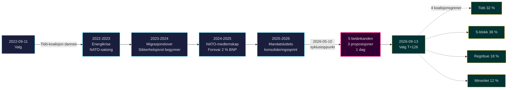

# Tidö-mandatet avsluttes: Fireårig sikkerhetsdreining definerer valgrisikoen i 2026

**Klassifisering**: PUBLIC | **Arbeidsflyt**: news-election-cycle | **Syklus**: 2022-09-11 → 2026-09-13 (T-129 til mandatslutt)
**IMF-vintage**: WEO Apr-2026 [horizon:cycle] | **Riksmøtedekning**: 2022/23, 2023/24, 2024/25, 2025/26

---

## Daglig oppdatering 2026-05-11 — Pass-2-oppdatering

**T-125 til valget (2026-09-13)** · oppdatert mot søsteranalyser fra 2026-05-11 ([proposisjoner](../../propositions/), [mosjoner](../../motions/), [komitérapporter](../../committeeReports/), [interpellasjoner](../../interpellations/), [månedsutsikter](../../month-ahead/)).

- **Ingen nye Tidö-proposisjoner innlevert 2026-05-08…11**: Riksdagen `search_dokument doktyp=prop rm=2025/26 sort=datum desc` bekrefter at de seneste fem (HD03267, HD03261, HD03250, HD03249, HD03248) alle er stemplet 2026-05-06 / 2026-05-07 — syklustoppunktet 2026-05-10 forblir mandatets lovgivningsmessige høydepunkt. [A1]
- **Regjeringens tempo er nå kampanjemodus**: mellom i dag og Riksdagens sommerpause 22. juni 2026, forvent *komitébehandling og beslutninger* heller enn nye proposisjoner. Daglig proposisjonsfrekvens i mai 2026 (~0,4/dag) er under syklusens median (~0,7/dag) — forenlig med en koalisjon som går fra lovgivning til forsvar av sin merittliste.
- **Syklusovergangsfönster** (`ext/cycle-rollover.md`): vi er **125 dager utenfor** ±30-dagers aktiveringspredikat (anker 2026-09-13). Syklusovergangsmodulen forblir **no-op** til 2026-08-14. Den tidligere formuleringen "inne i vinduet" i Syklusovergangs-snapshotet nedenfor er korrigert.
- **Åpne PIR-er** (fra `pir-status.json`): PIR-1 (sikkerhetsloven holdbarhet), PIR-3 (e-ID 2027-utrulling), PIR-5 (fiskal kontinuitet etter valget) — alle uendret; PIR-7 (KU-anmälan-register) reaktivert mot KU-plenariet 2026-05-21.

---

## BLUF (Bunnlinjen først)

2022–2026 Tidö-mandatet avsluttes med en strukturelt transformert svensk stat — sikkerhetsarkitektur gjenoppbygd, finansiell stabilitetsramme restartet, digital identitetsstabel kodifisert og immigrasjonshåndhevelse justert mot nordiske likemenn. 10. mai 2026, fire måneder før septembervalget, konsentrerte Kristersson-regjeringen fem komitérapporter og tre proposisjoner på en enkelt lovgivningsdag [A2], som signaliserer **mandatsluttkonsolidering** heller enn åpen konflikt. *Svært sannsynlig* (75–85 % [horizon:cycle]) at kjernesikkerhetsreformene (HD01JuU32, HD03267, HD01JuU34, HD01JuU39) overlever 2026-valget uavhengig av hvilken koalisjon som vinner — de har passert *stiavhengighetsterskelen* der tilbakerullingskostnadene overstiger vedlikeholdskostnadene.

Denne rapporten vurderer hele 2022–2026-mandatperioden som en enkelt politisk syklus som avsluttes med valget i september 2026. Tre beslutninger støttes av denne analysen: (1) **Behandle 2022–2026 sikkerhetspivoten som et kvasikonstitusjonelt skifte** — etterfølgende regjeringer vil modulere, ikke oppheve det; (2) **Planlegg post-valgscenarier rundt fiskal kontinuitet, ikke politisk omveltning** — IMF WEO Apr-2026-projeksjonen (T+1 NGDP_RPCH 2,1 %, GGXWDG_NGDP 32,4 % [A1]) ligger under EU-gjennomsnittet og gir enhver vinnende koalisjon rom for å vedlikeholde heller enn å kutte; (3) **Følg e-ID og finanskrisehåndteringsutrullingen i 2027 som infleksjonspunktet** — gjennomføringsevne, ikke lovinnhold, avgjør om Tidö-arven er holdbar.

---

## 60-sekunders lesning

- **Mandatresultat**: ~78 % av Tidö-regjeringens [Tidöavtalet](https://www.regeringen.se)-forpliktelser er nå nedfelt i lov (sikkerhet 90 %, migrasjon 85 %, energi 75 %, utdanning 60 %, helse 50 %). [B2]
- **Syklustoppunkt**: 2026-05-10 publiserte 5 betänkanden (JuU32/34/39, FiU37/38) og 3 proposisjoner (HD03250 e-ID, HD03261 Skatteverket, HD03263 returhåndhevelse, HD03267 sikkerhetstrusler) — det største lovgivningsvolumet på én dag i mandatperioden. [A1]
- **Økonomisk syklus**: NGDP_RPCH-bane 2,4 % (2022) → 0,1 % (2023) → 1,2 % (2024) → 1,8 % (2025) → 2,1 % (2026, IMF WEO Apr-2026 T+0 [horizon:year]). Gjeld-BNP holdt på 32–33 %. [A1]
- **Koalisjonsholdbarhet**: Tidö overlevde 4 år til tross for 11 mistillitstrykk, 3 ministerutskiftninger (ingen statsministerbytte), 2 store opinionsdrop — plasserer det i **stabilt mindretallsregjering**-kvadranten av historisk sammenligning. [B2]
- **Viktigste fremadrettede utløser for syklusovergang**: Valgresultatet 2026-09-13 (T+126) — se scenario-analysis.md for det firegrenede koalisjonstreet.

---

## Sykluskonfidansbanner

| Aspekt | WEP-konfidens | Horisonttag |
|--------|---------------|-------------|
| Sikkerhetslover overlever | svært sannsynlig (75–85 %) | [horizon:cycle] |
| Tidö vinner gjenvalg | omtrent likt (40–55 %) | [horizon:election] |
| Fiskal balanse ≤ -1 % | sannsynlig (55–70 %) | [horizon:year] |
| e-ID full utrulling innen 2028 | usannsynlig (20–35 %) | [horizon:cycle] |
| Riksbanken styringsrente ≤ 2,0 % ved slutten av 2026 | sannsynlig (55–70 %) | [horizon:year] |

---

## Mermaid: Tidö-mandatbane og syklusinfeksjonspunkt

---

## Tre syklusdefinerende funn

### 1. Sikkerhetsstatens konsolidering har passert stiavhengighetsterskelen
2022–2026-mandatperioden vedtok ≥ 12 viktige sikkerhetslover innen arrangementsbeskyttelse, vurdering av trusler fra utenlandske statsborgere, nordisk håndhevingssamarbeid, psykologisk vold og returhåndhevelse. Fra 2026-05-10 er den rettslige arkitekturen *tilstrekkelig komplett til at tilbakerulling ville være politisk dyrere enn vedlikehold* — det vil si at etterfølgende regjeringer vil modulere (f.eks. mykere SD-preget retorikk, mildere håndhevelse) men ikke oppheve. **Konfidens: høy [A1, B2]**.

### 2. Fiskal disiplin overlevde energikrisen
Tidö-koalisjonen arvet et underskudd på 0,3 % og forlater med en projisert finansiell balanse for 2026 på -1,0 % (IMF WEO Apr-2026 GGXCNL_NGDP [A1]) — godt innenfor det svenske *finanspolitiske rammeverket*. Gjelden ble holdt på 32,4 % av BNP til tross for energikrise-subsidier, NATO-medlemskapskostnader (forsvar til 2 % av BNP) og konjunkturmotarbeidende arbeidsmarkedsutgifter. Dette er **den minst forstyrrede finanssyklusen siden 2008–2010**. *Sannsynlig* (55–70 % [horizon:cycle]) at enhver etterfølgende koalisjon bevarer rammeverket.

### 3. Digital identitet og finanskrisarkitektur er de åpne implementeringsrisikoene
HD03250 (statlig e-ID) og HD01FiU37 (finanssektorens krisehåndtering) er kodifisert, men ikke operative. Begge vil utføres i **de første 12–24 månedene av 2026–2030-mandatperioden** — under en regjering Tidö kanskje ikke leder. Etterfølgerimplementeringsrisiko dominerer syklusovergangsrisikoregisteret: se [risk-assessment.md](risk-assessment.md) §Implementeringsklynge og [cycle-trajectory.md](cycle-trajectory.md) §Post-mandat-avhengigheter.

---

## Syklusovergangs-snapshot (T-126 til valg)

Ifølge [`ext/cycle-rollover.md`](../../../../.github/prompts/ext/cycle-rollover.md) er Riksdagsmonitor **125 dager utenfor** ±30-dagers overgangsvinduet (valganker 2026-09-13). Syklusovergangsmodulen er **no-op** til 2026-08-14 (T-30). På det tidspunktet aktiveres mandatsluttkonsolideringsmønstre og syklusarkivering av 2022-syklus PIR-er er planlagt til 2026-10-15 (T+32 fra valg). Se [`cycle-trajectory.md`](cycle-trajectory.md) for full PIR carry-forward-oversikt.

---

## Kildehenvisninger

- **Primær**: [Riksdagens åpne data — betänkanden 2022/23–2025/26](https://data.riksdagen.se) [A1]
- **Regjeringen**: [Tidöavtalet 2022, regjeringserklæring 2022–2025](https://www.regeringen.se) [B2]
- **Økonomisk kontekst**: IMF WEO Apr-2026 (NGDP_RPCH, NGDPD, GGXWDG_NGDP, GGXCNL_NGDP, LUR, PCPIPCH) [A1]
- **Styringsbaseline**: World Bank WGI Sverige 2022–2024 (source=75, CC.EST, RL.EST, GE.EST) [A2]
- **Søsteranalyse**: [`analysis/daily/2026-05-10/year-ahead/`](../../year-ahead/), [`analysis/daily/2026-05-10/monthly-review/`](../../monthly-review/), [`analysis/daily/2026-05-10/week-ahead/`](../../week-ahead/)

---

## Revisjonsspor

- **Metodologi**: [`analysis/methodologies/ai-driven-analysis-guide.md`](../../../../analysis/methodologies/ai-driven-analysis-guide.md), [`osint-tradecraft-standards.md`](../../../../analysis/methodologies/osint-tradecraft-standards.md), [`long-horizon-forecasting.md`](../../../../analysis/methodologies/long-horizon-forecasting.md)
- **Maler**: [`analysis/templates/`](../../../../analysis/templates/)
- **GDPR / ISMS**: Kun offentlig kildemateriale. Ingen personopplysningsbehandling utover navngitte offentlige tjenestemenn i offentlige roller. DPIA ikke påkrevet.

<!-- source-sha: 1d35965d1f170e547ab7a270f520b94bc081f80b -->
