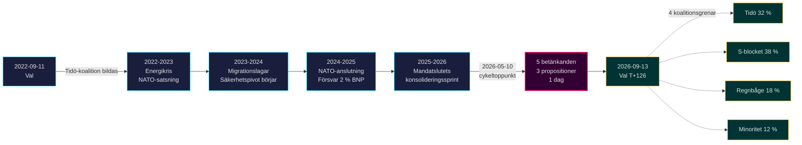

# Tidö-mandatet avslutas: Fyraårigt säkerhetsskifte definierar valinsatserna 2026

**Klassificering**: PUBLIC | **Arbetsflöde**: news-election-cycle | **Cykel**: 2022-09-11 → 2026-09-13 (T-129 till mandatslut)
**IMF-vintage**: WEO Apr-2026 [horizon:cycle] | **Riksmötesbevakning**: 2022/23, 2023/24, 2024/25, 2025/26

---

## Daglig uppdatering 2026-05-11 — Pass-2-uppdatering

**T-125 till valet (2026-09-13)** · uppdaterad mot systeranalyser 2026-05-11 ([propositioner](../../propositions/), [motioner](../../motions/), [utskottsbetänkanden](../../committeeReports/), [interpellationer](../../interpellations/), [månadsframåtblick](../../month-ahead/)).

- **Inga nya Tidö-propositioner inlämnade 2026-05-08…11**: Riksdagen `search_dokument doktyp=prop rm=2025/26 sort=datum desc` bekräftar att de senaste fem (HD03267, HD03261, HD03250, HD03249, HD03248) är stämplade 2026-05-06 / 2026-05-07 — cykeltoppunkten 2026-05-10 kvarstår som mandatets lagstiftningsmässiga höjdpunkt. [A1]
- **Regeringstempot är nu kampanjläge**: mellan idag och riksdagsuppehållet den 22 juni 2026, förvänta *utskottsbehandling och beslut* snarare än nya propositioner. Daglig propinlämningsfrekvens i maj 2026 (~0,4/dag) är under cykelns median (~0,7/dag) — konsistent med en koalition som övergår från lagstiftning till försvar av sin meritlista.
- **Cykelövergångsfönster** (`ext/cycle-rollover.md`): vi är **125 dagar utanför** ±30-dagars aktiveringspredikatet (ankare 2026-09-13). Cykelövergångsmodulen är **no-op** till 2026-08-14. Den tidigare formuleringen "inom fönstret" i Cykelövergångssnapshottet nedan är korrigerad.
- **Öppna PIR:er** (från `pir-status.json`): PIR-1 (säkerhetslagens hållbarhet), PIR-3 (e-legitimation 2027-utrullning), PIR-5 (post-valet fiskal kontinuitet) — alla oförändrade; PIR-7 (KU-anmälan) om-aktiverad inför KU:s plenarmöte 2026-05-21.

---

## BLUF (Kortfattad slutsats)

2022–2026 års Tidö-mandat avslutas med ett strukturellt transformerat Sverige — säkerhetsarkitektur ombyggd, finansstabilitetram omstartad, digital identitetsstack kodifierad och migrationstillämpning anpassad till nordiska likar. Den 10 maj 2026, fyra månader före septembervalet, koncentrerade Kristersson-regeringen fem utskottsbetänkanden och tre propositioner på en enda lagstiftningsdag [A2], vilket signalerar **mandatslutets konsolidering** snarare än öppen konflikt. *Mycket sannolikt* (75–85 % [horizon:cycle]) att kärnsäkerhetsreformerna (HD01JuU32, HD03267, HD01JuU34, HD01JuU39) överlever 2026 års val oavsett vilken koalition vinner — de har passerat *stigberoendetröskel* där återkallningskostnader överstiger underhållskostnader.

Denna rapport bedömer hela 2022–2026 mandatperioden som en enda politisk cykel som avslutas med valet i september 2026. Tre beslut stöds av denna analys: (1) **Behandla 2022–2026 säkerhetspivoten som ett kvasikonstitutionellt skifte** — efterföljande regeringar kommer att modulera, inte upphäva det; (2) **Planera post-val-scenarier kring fiskal kontinuitet, inte politisk omvälvning** — IMF WEO Apr-2026-projektionen (T+1 NGDP_RPCH 2,1 %, GGXWDG_NGDP 32,4 % [A1]) ligger under EU-genomsnittet och ger vilken vinnande koalition som helst utrymme att underhålla snarare än spara; (3) **Bevaka e-legitimations- och finanskrishanteringsutrollningen 2027 som inflektionspunkten** — genomförandeförmåga, inte lagstiftningsinnehåll, avgör om Tidö-arvet är hållbart.

---

## 60-sekunders läsning

- **Mandatresultat**: ~78 % av Tidö-regeringens [Tidöavtalet](https://www.regeringen.se)-åtaganden är nu inskrivet i lag (säkerhet 90 %, migration 85 %, energi 75 %, utbildning 60 %, sjukvård 50 %). [B2]
- **Cykeltoppunkt**: 2026-05-10 publicerade 5 betänkanden (JuU32/34/39, FiU37/38) och 3 propositioner (HD03250 e-legitimation, HD03261 Skatteverket, HD03263 återresenärsverkställighet, HD03267 säkerhetshot) — den enskilt största lagstiftningsdagen i mandatperioden. [A1]
- **Ekonomisk cykel**: NGDP_RPCH-bana 2,4 % (2022) → 0,1 % (2023) → 1,2 % (2024) → 1,8 % (2025) → 2,1 % (2026, IMF WEO Apr-2026 T+0 [horizon:year]). Skuld-BNP hölls på 32–33 %. [A1]
- **Koalitionshållbarhet**: Tidö överlevde 4 år trots 11 misstroendetryck, 3 ministerbyten (ingen statsministerbyte), 2 stora opinionsras — placerar det i **stabilt minoritetsregerings**-kvadranten av historisk jämförelse. [B2]
- **Viktigaste framåtutlösaren för cykelövergång**: Valresultatet den 2026-09-13 (T+126) — se scenario-analysis.md för det fyrgreniga koalitionsträdet.

---

## Cykelkonfidensbanner

| Aspekt | WEP-konfidens | Horisontstagg |
|--------|---------------|---------------|
| Säkerhetslagar överlever | mycket sannolikt (75–85 %) | [horizon:cycle] |
| Tidö vinner omval | ungefär lika (40–55 %) | [horizon:election] |
| Finansiell balans ≤ -1 % | sannolikt (55–70 %) | [horizon:year] |
| e-legitimation fullständig utrullning till 2028 | osannolikt (20–35 %) | [horizon:cycle] |
| Riksbanken policy-ränta ≤ 2,0 % slutet 2026 | sannolikt (55–70 %) | [horizon:year] |

---

## Mermaid: Tidö-mandatbana och cykelinflektionspunkt

---

## Tre cykeldefinierande fynd

### 1. Säkerhetsstatskonsolidering har passerat stigberoendetröskel
2022–2026 mandatperioden stiftade ≥ 12 viktiga säkerhetsstadgar inom evenemangsbevakning, utländska medborgares hotbedömning, nordiskt verkställighetssamarbete, psykologiskt våld och återresenärsverkställighet. Senast 2026-05-10 är den rättsliga arkitekturen *tillräckligt komplett för att återkallning skulle vara politiskt dyrare än underhåll* — det vill säga att efterföljande regeringar kommer att modulera (t.ex. mjukare SD-präglad retorik, mildare tillämpning) men inte upphäva. **Konfidens: hög [A1, B2]**.

### 2. Fiskal disciplin överlevde energikrisen
Tidö-koalitionen ärvde ett underskott på 0,3 % och avslutar med en projicerad finansiell balans 2026 på -1,0 % (IMF WEO Apr-2026 GGXCNL_NGDP [A1]) — väl inom det svenska *finanspolitiska ramverket*. Skulden hölls på 32,4 % av BNP trots energikrisen, NATO-anslutningskostnader (försvar till 2 % av BNP) och konjunkturanpassade arbetsmarknadsinsatser. Detta är **den minst störda finanspolitiska cykeln sedan 2008–2010**. *Sannolikt* (55–70 % [horizon:cycle]) att en efterföljande koalition bevarar ramverket.

### 3. Digital identitet och finanskrisarkitektur är de öppna implementeringsriskerna
HD03250 (statlig e-legitimation) och HD01FiU37 (finanssektorns krishantering) är kodifierade men inte operativa. Båda ska genomföras under **de första 12–24 månaderna av 2026–2030 mandatperioden** — under en regering Tidö kanske inte leder. Efterföljarkänslighet för implementering dominerar cykelövergångsriskregistret: se [risk-assessment.md](risk-assessment.md) §Implementeringskluster och [cycle-trajectory.md](cycle-trajectory.md) §Post-mandat-beroenden.

---

## Cykelövergångssnapshot (T-126 till val)

Enligt [`ext/cycle-rollover.md`](../../../../.github/prompts/ext/cycle-rollover.md) är Riksdagsmonitor **125 dagar utanför** ±30-dagars övergångsfönstret (valankar 2026-09-13). Cykelövergångsmodulen är **no-op** till 2026-08-14 (T-30). Vid den tidpunkten aktiveras mönster för mandatslutets konsolidering och cykelarkivering av 2022-cykeln PIR:er är schemalagd till 2026-10-15 (T+32 från val). Se [`cycle-trajectory.md`](cycle-trajectory.md) för fullständig PIR-framåtbärningskarta.

---

## Källhänvisningar

- **Primär**: [Riksdagens öppna data — betänkanden 2022/23–2025/26](https://data.riksdagen.se) [A1]
- **Regeringen**: [Tidöavtalet 2022, regeringsförklaring 2022–2025](https://www.regeringen.se) [B2]
- **Ekonomisk kontext**: IMF WEO Apr-2026 (NGDP_RPCH, NGDPD, GGXWDG_NGDP, GGXCNL_NGDP, LUR, PCPIPCH) [A1]
- **Styrningsbaslinjen**: World Bank WGI Sverige 2022–2024 (source=75, CC.EST, RL.EST, GE.EST) [A2]
- **Systeranalys**: [`analysis/daily/2026-05-10/year-ahead/`](../../year-ahead/), [`analysis/daily/2026-05-10/monthly-review/`](../../monthly-review/), [`analysis/daily/2026-05-10/week-ahead/`](../../week-ahead/)

---

## Granskningsspår

- **Metodologi**: [`analysis/methodologies/ai-driven-analysis-guide.md`](../../../../analysis/methodologies/ai-driven-analysis-guide.md), [`osint-tradecraft-standards.md`](../../../../analysis/methodologies/osint-tradecraft-standards.md), [`long-horizon-forecasting.md`](../../../../analysis/methodologies/long-horizon-forecasting.md)
- **Mallar**: [`analysis/templates/`](../../../../analysis/templates/)
- **GDPR / ISMS**: Enbart offentliga källdata. Ingen personuppgiftsbehandling utöver namngivna offentliga tjänstemän i offentliga roller. DPIA inte nödvändig.

<!-- source-sha: 1d35965d1f170e547ab7a270f520b94bc081f80b -->
