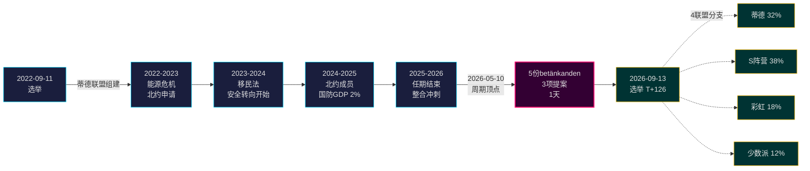

# 蒂德政府任期结束：四年安全转向定义2026年选举风险

**分类**: PUBLIC | **工作流**: news-election-cycle | **周期**: 2022-09-11 → 2026-09-13（距任期结束T-129）
**IMF版本**: WEO Apr-2026 [horizon:cycle] | **riksmöte覆盖**: 2022/23, 2023/24, 2024/25, 2025/26

---

## 每日更新 2026-05-11 — Pass-2更新

**距选举T-125（2026-09-13）** · 对照2026-05-11姐妹分析更新（[提案](../../propositions/)、[动议](../../motions/)、[委员会报告](../../committeeReports/)、[质询](../../interpellations/)、[月度展望](../../month-ahead/)）。

- **2026-05-08…11无新蒂德提案提交**: Riksdagen `search_dokument doktyp=prop rm=2025/26 sort=datum desc`查询确认最近五项（HD03267、HD03261、HD03250、HD03249、HD03248）均标注2026-05-06 / 2026-05-07 — 周期顶点2026-05-10仍为任期立法高峰。[A1]
- **政府节奏现为竞选模式**: 从今天到2026年6月22日Riksdagen夏季休会，预期*委员会处理和决定*而非新提案。2026年5月日均提案率（~0.4/日）低于周期中位数（~0.7/日） — 与从立法转向政绩辩护的联盟一致。
- **周期过渡窗口**（`ext/cycle-rollover.md`）: 我们**距离**±30天激活条件（锚点2026-09-13）**125天**。周期过渡模块保持**no-op**至2026-08-14。下方周期过渡快照中先前的"窗口内"表述已更正。
- **开放PIR**（来自`pir-status.json`）: PIR-1（安全法持久性）、PIR-3（e-ID 2027部署）、PIR-5（选后财政连续性） — 均无变化；PIR-7（KU-anmälan登记）为2026-05-21 KU全体会议重新激活。

---

## BLUF（结论优先）

2022–2026蒂德政府任期以结构性转型的瑞典国家告终 — 安全架构重建、金融稳定框架重启、数字身份堆栈法典化、移民执法与北欧同行对齐。2026年5月10日，距9月选举四个月，克里斯特松政府将五份委员会报告和三项提案集中于单一立法日[A2]，标志**任期结束整合**而非公开冲突。*极有可能*（75–85% [horizon:cycle]）安全改革核心（HD01JuU32、HD03267、HD01JuU34、HD01JuU39）无论哪个联盟获胜都将在2026年选举中存活 — 它们已跨越*路径依赖阈值*，撤销成本超过维护成本。

本报告将2022–2026整个任期评估为以2026年9月选举结束的单一政治周期。此分析支持三项决策：(1) **将2022–2026安全转向视为准宪法性转变** — 后续政府将调整但不撤销；(2) **围绕财政连续性而非政治动荡规划选后情景** — IMF WEO Apr-2026预测（T+1 NGDP_RPCH 2.1%、GGXWDG_NGDP 32.4% [A1]）低于欧盟平均，任何获胜联盟都有维持而非削减的空间；(3) **追踪2027年e-ID和金融危机解决部署作为转折点** — 执行能力而非法律内容决定蒂德遗产是否持久。

---

## 60秒阅读

- **任期成果**: 蒂德政府[Tidöavtalet](https://www.regeringen.se)承诺的~78%现已法典化（安全90%、移民85%、能源75%、教育60%、医疗50%）。[B2]
- **周期顶点**: 2026-05-10发布5份betänkanden（JuU32/34/39、FiU37/38）和3项提案（HD03250 e-ID、HD03261 Skatteverket、HD03263遣返执法、HD03267安全威胁） — 任期内单日最大立法量。[A1]
- **经济周期**: NGDP_RPCH轨迹 2.4%（2022）→ 0.1%（2023）→ 1.2%（2024）→ 1.8%（2025）→ 2.1%（2026，IMF WEO Apr-2026 T+0 [horizon:year]）。债务-GDP维持32–33%。[A1]
- **联盟持久性**: 蒂德在11次信任压力、3次部长更换（无首相更换）、2次重大民调下滑后存活4年 — 在历史比较中位于**稳定少数政府**象限。[B2]
- **最关键前瞻性周期过渡触发器**: 选举结果2026-09-13（T+126） — 四分支联盟树见scenario-analysis.md。

---

## 周期置信度横幅

| 方面 | WEP置信度 | 时间标签 |
|------|----------|----------|
| 安全法存活 | 极有可能（75–85%） | [horizon:cycle] |
| 蒂德赢得连任 | 大约五五开（40–55%） | [horizon:election] |
| 财政平衡 ≤ -1% | 可能（55–70%） | [horizon:year] |
| 2028年前e-ID完全部署 | 不太可能（20–35%） | [horizon:cycle] |
| Riksbank政策利率2026年底≤2.0% | 可能（55–70%） | [horizon:year] |

---

## Mermaid: 蒂德政府任期弧线和周期转折点

---

## 三项周期定义性发现

### 1. 安全国家整合已跨越路径依赖阈值
2022–2026任期通过了≥12项主要安全法，涵盖活动安全、外国人威胁评估、北欧执法合作、心理暴力和遣返执法。截至2026-05-10，法律架构*足够完整，以至撤销在政治上比维护更昂贵* — 即后续政府将调整（如更柔和的SD色彩言辞、更宽容的执法）但不撤销。**置信度: 高 [A1, B2]**。

### 2. 财政纪律在能源危机中存活
蒂德联盟继承0.3%赤字，离任时2026年财政平衡预测为-1.0%（IMF WEO Apr-2026 GGXCNL_NGDP [A1]） — 完全在瑞典*finanspolitiska ramverket*框架内。尽管有能源危机补贴、北约成员成本（国防升至GDP 2%）和逆周期劳动力市场支出，债务仍维持在GDP的32.4%。这是**2008–2010以来最少受干扰的财政周期**。*可能*（55–70% [horizon:cycle]）任何后续联盟都将保留该框架。

### 3. 数字身份和金融危机架构是开放的执行风险
HD03250（国家e-ID）和HD01FiU37（金融部门危机解决）已法典化但未运行。两者都将在**2026–2030任期的前12–24个月**执行 — 在蒂德可能不领导的政府下。继任者执行风险主导周期过渡风险登记：参见[risk-assessment.md](risk-assessment.md) §执行集群和[cycle-trajectory.md](cycle-trajectory.md) §任期后依赖。

---

## 周期过渡快照（距选举T-126）

根据[`ext/cycle-rollover.md`](../../../../.github/prompts/ext/cycle-rollover.md)，Riksdagsmonitor**距离**±30天过渡窗口**125天**（选举锚点2026-09-13）。周期过渡模块在2026-08-14（T-30）前为**no-op**。届时，任期结束整合模式激活，2022周期PIR归档计划于2026-10-15（选举后T+32）。完整PIR carry-forward概述见[`cycle-trajectory.md`](cycle-trajectory.md)。

---

## 来源归属

- **主要**: [Riksdagen开放数据 — betänkanden 2022/23–2025/26](https://data.riksdagen.se) [A1]
- **政府**: [Tidöavtalet 2022, 政府声明2022–2025](https://www.regeringen.se) [B2]
- **经济背景**: IMF WEO Apr-2026 (NGDP_RPCH, NGDPD, GGXWDG_NGDP, GGXCNL_NGDP, LUR, PCPIPCH) [A1]
- **治理基线**: World Bank WGI 瑞典2022–2024 (source=75, CC.EST, RL.EST, GE.EST) [A2]
- **姐妹分析**: [`analysis/daily/2026-05-10/year-ahead/`](../../year-ahead/), [`analysis/daily/2026-05-10/monthly-review/`](../../monthly-review/), [`analysis/daily/2026-05-10/week-ahead/`](../../week-ahead/)

---

## 审计追踪

- **方法论**: [`analysis/methodologies/ai-driven-analysis-guide.md`](../../../../analysis/methodologies/ai-driven-analysis-guide.md), [`osint-tradecraft-standards.md`](../../../../analysis/methodologies/osint-tradecraft-standards.md), [`long-horizon-forecasting.md`](../../../../analysis/methodologies/long-horizon-forecasting.md)
- **模板**: [`analysis/templates/`](../../../../analysis/templates/)
- **GDPR / ISMS**: 仅公开来源材料。除公共角色中的公职人员外无个人数据处理。无需DPIA。

<!-- source-sha: 1d35965d1f170e547ab7a270f520b94bc081f80b -->
