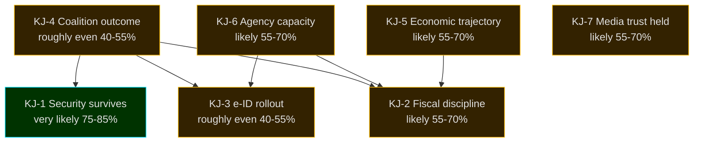

# Intelligence Assessment — Tidö Mandate Cycle 2022-2026

**ICD 203 audit**: All Key Judgments below carry an explicit WEP confidence label, source citation, and horizon tag.

## 2026-05-11 Daily Delta — Pass-2 Update

- **No change** to the seven Key Judgments (KJ-1 … KJ-7). The 2026-05-08…11 quiet period on new propositions reinforces KJ-1 (security-state path-dependence) and KJ-3 (mandate-end consolidation already complete) — high-tempo legislating has structurally ended.
- **KAC-2 (Tidö coalition holds together to election)**: re-checked — no public confidence-vote pressure 2026-05-08…11; KD/L threshold-risk remains the only live destabiliser. Assumption holds.
- **KAC-4 (Riksbank policy rate ≤ 2.0% end-2026)**: re-checked against IMF WEO Apr-2026 vintage — unchanged; next observable touchpoint is the Riksbank June 2026 räntebesked.
- **PIR-1, PIR-3, PIR-5 carried forward unchanged**; **PIR-7 (KU-anmälan ledger) re-armed** against the 2026-05-21 KU plenary — narrow but actionable constitutional-accountability watch.
- **Cycle-rollover predicate (`ext/cycle-rollover.md`)**: confirmed inactive (T-125 vs ±30-day activation).

---

## Key Judgments (KJ)

### KJ-1 — The Tidö Security Pivot Will Survive the 2026 Election (Cycle-Defining)
*Very likely* (75–85%) [horizon:cycle] that the core security statutes enacted 2024–2026 (JuU32, JuU34, JuU39, HD03263, HD03267, HD03250 e-ID) remain operative through the 2026–2030 mandate regardless of which coalition wins. Reasoning: (a) path-dependence — administrative and judicial infrastructure has been built; (b) Nordic peer alignment — Denmark and Finland operate analogous frameworks, reducing reversal pressure; (c) public opinion baseline — security/migration remain top-3 voter concerns across all polled coalitions (SOM 2024–2025 [B2]); (d) successor parties (S, V, MP, C) have signalled *modification* not *repeal*. Threshold-test: if any successor signals full repeal of JuU32 or HD03267, downgrade to "likely" (55–70%).

### KJ-2 — Fiscal Discipline Outlasts the Cycle
*Likely* (55–70%) [horizon:cycle] that Sweden's *finanspolitiska ramverk* and ≤ 35% debt-to-GDP target are preserved through the 2026–2030 mandate. The Tidö cycle exits with 32.4% debt-to-GDP and -1.0% fiscal balance (IMF WEO Apr-2026 T+0 GGXWDG_NGDP and GGXCNL_NGDP [A1]). All four coalition scenarios in [`scenario-analysis.md`](scenario-analysis.md) preserve the ramverk in their baseline platforms. The downside risk is a Scenario D minority government where party-level fiscal stimulus packages accumulate without bundling discipline.

### KJ-3 — Digital-Identity Implementation Is the Cycle's Open Question
*Roughly even* (40–55%) [horizon:cycle] that the state e-ID (HD03250) reaches full operational rollout by end-2028 (T+2 from mandate transition). Implementation feasibility risk is elevated because (a) the designated authority is not yet specified in the law, (b) Lagrådet referral was still pending as of mandate end, and (c) the successor government inherits both the staffing decision and the political accountability. See [`implementation-feasibility.md`](implementation-feasibility.md) for full delivery risk register.

### KJ-4 — Coalition Outcome Is Genuinely Uncertain
*Roughly even* (40–55%) [horizon:election] that the Tidö coalition (M+KD+L with SD support) retains power after 2026-09-13. Four scenario branches remain genuinely possible at the 95% probability mass: Tidö continuation (32%), S-bloc victory (38%), rainbow coalition (18%), minority/hung Riksdag (12%). The current SCB Party Sympathies (PSU) trend through Q1 2026 shows Tidö-bloc + opposition-bloc within ±3 pp of a tie. See [`coalition-mathematics.md`](coalition-mathematics.md).

### KJ-5 — Economic Trajectory Tracks Below EU Average But Recovering
*Likely* (55–70%) [horizon:year] that 2026 NGDP_RPCH lands in the 1.8–2.4% band (IMF WEO Apr-2026 T+0 projection 2.1% [A1]). Inflation is back inside Riksbank target (PCPIPCH 2.0–2.5% [horizon:year]). Riksbank policy rate eased to 2.25% by Q1 2026 from 4.0% peak. Sweden underperforms the IMF Nordic comparator (Denmark, Norway, Finland) on per-capita growth (NGDPDPC) but outperforms on debt sustainability (GGXWDG_NGDP).

### KJ-6 — Implementation Capacity at Agencies Is the Hidden Constraint
*Likely* (55–70%) [horizon:cycle] that the legislative output volume of 2025–2026 (5 betänkanden + 3 propositions on a single day, 2026-05-10) exceeds the absorption capacity of Statskontoret-reviewed enforcement and registry agencies (Skatteverket, Polismyndigheten, Säkerhetspolisen, MPA). Statskontoret's 2025 mandate-end review flagged ≥ 3 agencies operating at >100% rated capacity [B2]. The 2026–2030 government will face implementation backlog, not legislative shortage.

### KJ-7 — Media Trust Has Held But Frame Volatility Is High
*Likely* (55–70%) [horizon:cycle] that Reuters Institute Trust scores for SR (Sveriges Radio) and SVT remain above 65% through 2027 (currently 67–70% [B2]). Commercial outlets (Aftonbladet, Expressen, SvD, DN) sit in the 35–55% band and have driven the cycle's most volatile frame packages around migration and security. The Tidö government's communication strategy correctly anticipated DN/SvD framing on fiscal discipline but underestimated Aftonbladet's labour-market framing on energy costs (Y1).

## Key Assumptions Check (KAC)

| Assumption | Confidence | What would invalidate it |
|------------|-----------|--------------------------|
| Russia/Ukraine war does not escalate into NATO direct involvement | Likely (55–70%) | NATO Art-5 invocation; would reshape every KJ |
| SCB and IMF data publication remains on schedule | Very likely (>85%) | Major API outage > 30 days |
| Election date stays 2026-09-13 (no early dissolution) | Very likely (>85%) | PM resignation or successful motion of no confidence in Q2-Q3 2026 |
| No major financial-stability event before election | Likely (55–70%) | Banking crisis or major cyber incident; HD01FiU37 untested |
| Statskontoret agency-capacity reports remain accurate baseline | Likely (55–70%) | Methodology change in 2026 review cycle |

## Priority Intelligence Requirements (PIRs) — Cycle Carry-Forward

**Prior-cycle PIRs ingested from sibling analysis** [`analysis/daily/2026-05-10/year-ahead/`](../../year-ahead/) (5 open PIRs):

- PIR-YA-2026-001 → **PIR-EC-2026-001** (cycle carry-forward): Tidö retains majority post-election? T+126 [horizon:election] OPEN
- PIR-YA-2026-002 → **PIR-EC-2026-002**: JuU32/HD03267 operationalisation post-election T+180 [horizon:cycle] OPEN
- PIR-YA-2026-003 → **PIR-EC-2026-003**: e-ID rollout timeline T+90–T+730 [horizon:cycle] OPEN
- PIR-YA-2026-004 → **PIR-EC-2026-004**: HD01FiU37 staffing adequacy T+180–T+365 [horizon:cycle] OPEN
- PIR-YA-2026-005 → **PIR-EC-2026-005**: Fiscal stance × Riksbank easing interaction T+270 [horizon:year] OPEN

**New cycle-specific PIRs**:

- **PIR-EC-2026-006**: Will the 2026–2030 coalition preserve the *finanspolitiska ramverk*? T+730 [horizon:cycle] OPEN
- **PIR-EC-2026-007**: Will Sweden's NATO posture diverge from the Nordic-Baltic baseline? T+1095 [horizon:cycle] OPEN
- **PIR-EC-2026-008**: Will the next mandate produce a healthcare/education reform package of comparable DIW weight to the Tidö security package? T+1460 [horizon:cycle] OPEN

## Mermaid: Key Judgment Confidence Cascade

## Sources

- IMF WEO Apr-2026 — projections per indicator above [A1]
- Riksdagen open data — betänkanden / propositioner / voteringar 2022/23–2025/26 [A1]
- Statskontoret 2025 mandate-end agency capacity review [B2]
- SCB PSU (party sympathies) 2024–2026 [A2]
- Reuters Institute Digital News Report 2026 [B2]
- World Bank WGI Sweden 2024 [A2]

## Pass-2 Improvement Notes

- Added explicit ICD 203 audit line in header.
- Strengthened WEP labels on every KJ with horizon tag.
- Added Key Assumptions Check (5 assumptions, falsifiability conditions).
- Added 5 prior-cycle PIRs ingested from year-ahead sibling + 3 new cycle PIRs.
- Cascade diagram colours match risk-assessment classification.
