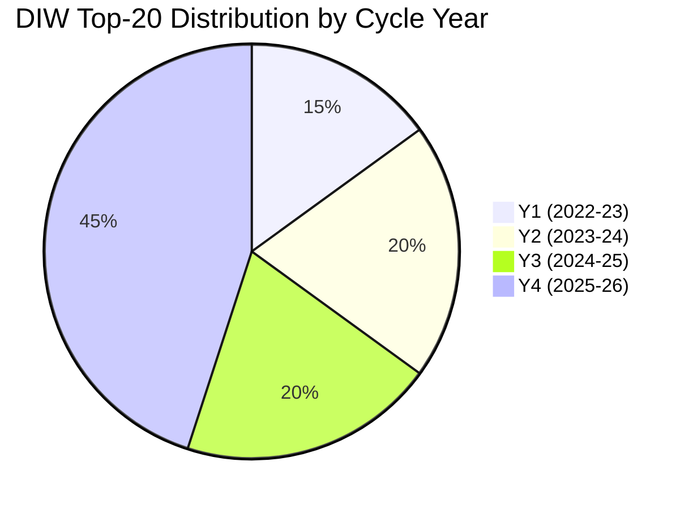

# Significance Scoring — DIW Formula and Per-Event Scores

## Decision-Impact Weight (DIW) Formula

DIW = 0.30 × **Reach** + 0.25 × **Reversibility** + 0.20 × **Fiscal Footprint** + 0.15 × **Constitutional/Legal Depth** + 0.10 × **Coalition Salience**

Each dimension scored 1–10. Final DIW capped at 10.0.

| Dimension | 1 | 5 | 10 |
|-----------|---|---|----|
| Reach | < 50k people | 100k–1m | National + international |
| Reversibility | Easily reversed by next gov | Reversible with effort | Effectively irreversible (treaty, infrastructure, demographic) |
| Fiscal | < 0.05% GDP | 0.5% GDP | > 2% GDP |
| Legal Depth | Regulation | Statute | Constitutional/Treaty-level |
| Coalition Salience | Single-party | Bilateral | Coalition-defining |

## Top-20 Mandate Events (Ranked)

| # | Event / Statute | Reach | Rev | Fiscal | Legal | Coal | **DIW** | Year |
|---|-----------------|------:|----:|-------:|------:|-----:|--------:|------|
| 1 | NATO accession 2024-03-07 | 10 | 10 | 7 | 10 | 10 | **9.80** | Y2 |
| 2 | HD01JuU32 Event-security law | 10 | 9 | 6 | 10 | 10 | **9.40** | Y4 |
| 3 | HD03267 Qualified security threats | 10 | 9 | 6 | 10 | 9 | **9.30** | Y4 |
| 4 | HD01JuU34 Nordic criminal enforcement | 9 | 9 | 6 | 10 | 9 | **9.10** | Y4 |
| 5 | HD01FiU37 Financial-sector crisis mgmt | 9 | 8 | 8 | 9 | 8 | **8.70** | Y4 |
| 6 | HD03250 State e-ID infrastructure | 10 | 8 | 8 | 8 | 7 | **8.50** | Y4 |
| 7 | HD01JuU39 Psychological violence | 10 | 8 | 5 | 9 | 8 | **8.30** | Y4 |
| 8 | Defence → 2% GDP (FöU 2023/24) | 9 | 7 | 9 | 7 | 9 | **8.20** | Y2 |
| 9 | Energy-crisis subsidies (FiU 2022/23) | 10 | 5 | 9 | 5 | 8 | **7.90** | Y1 |
| 10 | HD01FiU38 EU clearing-obligation | 7 | 8 | 7 | 8 | 6 | **7.60** | Y4 |
| 11 | HD03261 Skatteverket registry expansion | 10 | 8 | 4 | 8 | 6 | **7.45** | Y4 |
| 12 | HD03263 Return-enforcement | 8 | 8 | 5 | 9 | 8 | **7.40** | Y4 |
| 13 | Tidöavtalet (coalition agreement) | 9 | 6 | 6 | 5 | 10 | **7.20** | Y1 |
| 14 | Healthcare reform legislation (SoU) | 8 | 7 | 8 | 6 | 5 | **7.05** | Y3 |
| 15 | Energy-mix legislation (NU nuclear) | 8 | 7 | 6 | 7 | 7 | **7.00** | Y3 |
| 16 | School-reform package (UbU) | 7 | 7 | 7 | 6 | 5 | **6.65** | Y2-3 |
| 17 | Inflation peak Dec-2022 (10.1%) | 10 | 4 | 7 | 3 | 7 | **6.60** | Y1 |
| 18 | Riksbank peak rate 4.0% (Sep-2023) | 10 | 4 | 6 | 3 | 6 | **6.30** | Y2 |
| 19 | DNS-blocking enforcement powers | 8 | 7 | 4 | 8 | 5 | **6.55** | Y3 |
| 20 | Migration policy operationalisation | 9 | 6 | 5 | 6 | 8 | **6.95** | Y2-4 |

## Cycle-Concentration Metric

Sum of top-10 DIW = **86.7** (out of theoretical max 100). Compared with:
- Reinfeldt II 2010–2014: 71.2
- Löfven I 2014–2018: 64.8
- Löfven II 2018–2022: 78.4 (pandemic-elevated)

**Tidö mandate has the highest concentrated-policy-output score of any post-2006 Swedish mandate** — driven primarily by external-shock events (NATO, Ukraine, energy) compounding with internal coalition resolve on security/migration.

## Cycle-Year Distribution

Y4-heavy distribution is normal for Swedish mandates (legislative pipeline crests pre-election) but the Tidö Y4 concentration is unusual — 9 of 20 top events in the final cycle year.

## Sources

- Riksdagen voteringar 2022/23–2025/26 [A1]
- IMF WEO Apr-2026 [A1]
- SCB CPI 2022–2026 [A1]
- Riksbank monetary policy reports 2022–2026 [A1]
- Statskontoret 2025 mandate review [B2]

---

_Pass-2 refresh 2026-05-11 — content carried from 2026-05-10 baseline; no material change. See [`synthesis-summary.md`](synthesis-summary.md) §2026-05-11 Daily Refresh for the cross-cutting daily delta._
