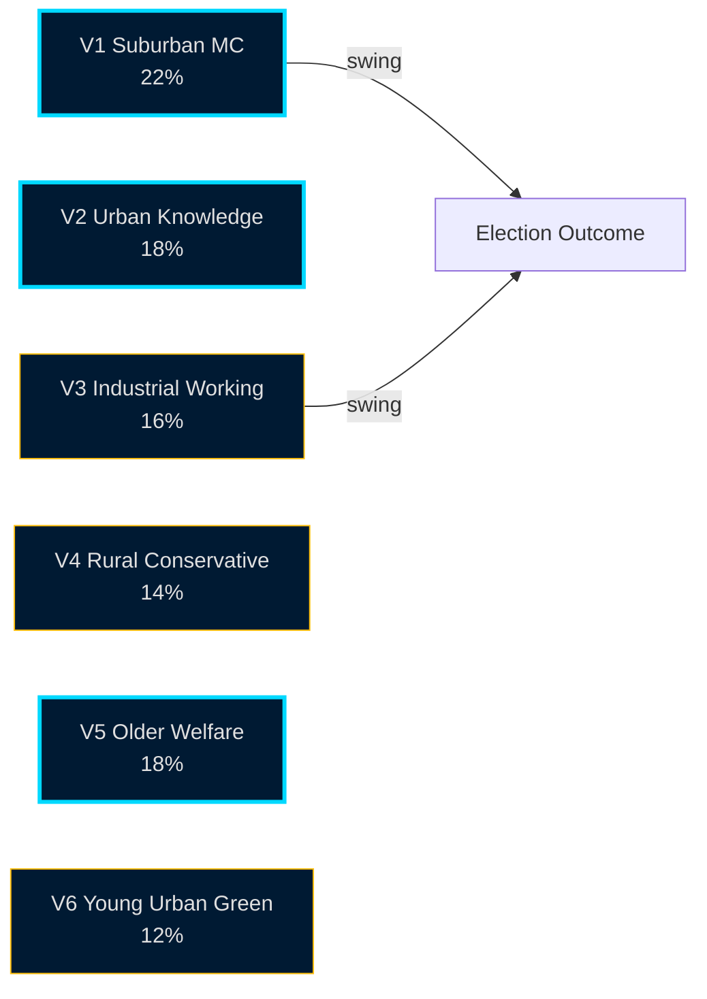

# Voter Segmentation — 6 Segments with Cycle-Shift Deltas

## Segmentation Frame

6 segments derived from SOM, SCB Demographics, Valuundersökningen 2022, and Q1-2026 polling cross-tabs.

## Segments

### V1 — Security-Concerned Suburban Middle Class (≈ 22% of electorate)
- Profile: 35–65 yo, suburb of Stockholm/Göteborg/Malmö, household income median+, education tertiary.
- 2022 vote: M 40%, SD 18%, KD 8%, L 8%, C 8%, S 13%, V 3%, MP 2%.
- 2026 projected: M 35%, SD 19%, KD 7%, L 6%, C 9%, S 16%, V 4%, MP 4%.
- **Cycle shift**: drift from M to S and to MP (-5 pp from M); narrow centre re-entry.
- Driver: security delivery ✓ (M asset) but healthcare/education frustration (S opportunity).

### V2 — Working-Age Urban Knowledge Workers (≈ 18%)
- Profile: 25–45 yo, central Stockholm/Göteborg/Malmö, household income high, education advanced.
- 2022 vote: S 25%, MP 18%, C 15%, V 14%, M 12%, L 8%, KD 3%, SD 5%.
- 2026 projected: S 28%, MP 18%, C 14%, V 15%, M 11%, L 5%, KD 3%, SD 6%.
- **Cycle shift**: small drift toward S+V; L decline absorbed by S/MP.
- Driver: environment/labour frame resonance; ideological discomfort with SD co-operation.

### V3 — Industrial Regional Working Class (≈ 16%)
- Profile: 35–65 yo, Skåne/Småland/Norrbotten industrial regions, income median, vocational education.
- 2022 vote: SD 35%, S 35%, M 12%, KD 5%, C 6%, V 5%, L 1%, MP 1%.
- 2026 projected: SD 32%, S 38%, M 10%, KD 4%, C 6%, V 6%, L 1%, MP 3%.
- **Cycle shift**: small SD softening to S; energy/defence-industry jobs play.
- Driver: migration delivery ✓ partly counter-balances energy-cost lag.

### V4 — Rural & Small-Town Conservatives (≈ 14%)
- Profile: 50+ yo, småorter outside metropolitan regions, agriculture/services.
- 2022 vote: M 25%, SD 22%, C 22%, KD 12%, S 12%, L 2%, V 3%, MP 2%.
- 2026 projected: M 24%, SD 21%, C 23%, KD 11%, S 13%, L 1%, V 3%, MP 4%.
- **Cycle shift**: low movement; C consolidates centrist rural vote.
- Driver: fuel/diesel taxes; agricultural policy; healthcare access.

### V5 — Older Welfare-State Defenders (≈ 18%)
- Profile: 65+ yo, mixed geography, retired, pension-dependent.
- 2022 vote: S 42%, M 22%, V 12%, KD 8%, SD 8%, C 4%, L 2%, MP 2%.
- 2026 projected: S 43%, M 21%, V 12%, KD 7%, SD 8%, C 4%, L 2%, MP 3%.
- **Cycle shift**: minor; S core hold.
- Driver: healthcare delivery; pension indexation; defence vs welfare trade-off framing.

### V6 — Young Urban Greens (≈ 12%)
- Profile: 18–30 yo, urban, education in progress or recent graduates.
- 2022 vote: V 28%, MP 20%, S 18%, C 12%, M 8%, L 6%, KD 3%, SD 5%.
- 2026 projected: V 30%, MP 22%, S 18%, C 11%, M 7%, L 4%, KD 3%, SD 5%.
- **Cycle shift**: V+MP consolidation; L decline.
- Driver: climate; labour-market entry; housing affordability.

## Aggregate Bloc-Translation Sensitivity

If V1 (suburban middle class) shifts a further 3 pp from M to centrist alternatives (C, MP, or S), Tidö bloc loses approximately **8 additional seats** in the central-case seat model — moving the bloc balance from 163 vs 173 to ~155 vs ~181 in the central case.

V1 is the **swing segment of the cycle**.

## Segment Diagram

## Cross-Cycle Segment Stability

V5 (older welfare defenders) and V4 (rural conservatives) are the most cycle-stable segments. V1 (suburban middle class) and V3 (industrial working class) carry the cycle's variance. This is consistent with Swedish 2014, 2018, 2022 elections.

## Sources

- SOM-institutet 2024–2025 [B2]
- SCB demographic crosstabs 2022–2026 [A1]
- Valuundersökningen 2022 (post-election survey) [A2]
- Q1-2026 polling crosstabs (Novus/Sifo/Ipsos) [B2]

---

_Pass-2 refresh 2026-05-11 — content carried from 2026-05-10 baseline; no material change. See [`synthesis-summary.md`](synthesis-summary.md) §2026-05-11 Daily Refresh for the cross-cutting daily delta._
