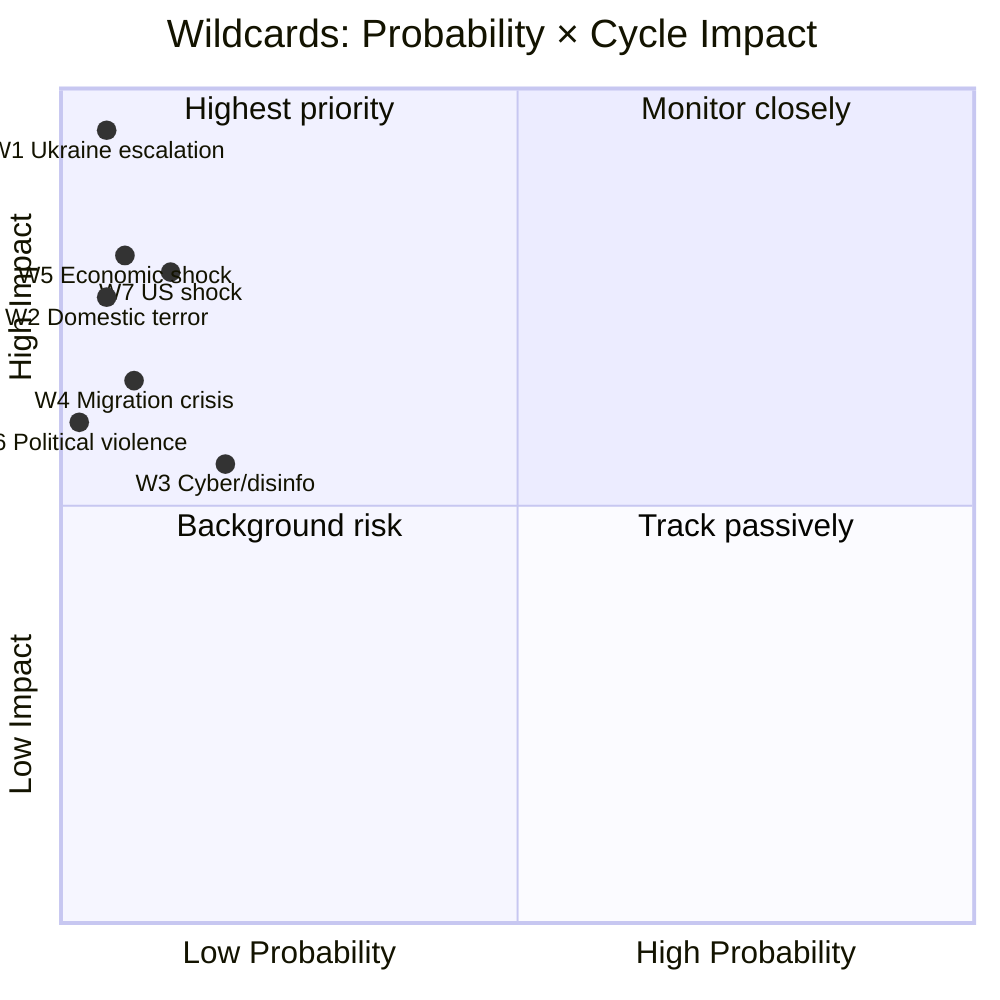

# Wildcards and Black Swans — 5+ Expanded (LH-5 blocking)

## Definition

Wildcards (Taleb sense): low-probability, high-impact events that would materially redirect the cycle trajectory or election outcome. 5+ wildcards required for LH-5 election-cycle blocking gate; 7 documented below.

## W1 — Major Ukraine Escalation (Nuclear/Strategic Strike)

- **Probability T+126 (election day)**: 4–10% [horizon:election].
- **Cycle impact**: forces immediate fiscal reallocation toward defence (2.4% → 3.5%+); empties opposition critique of defence spending; F1 dominant frame.
- **Electoral effect**: Tidö +7 to +12 pp swing (KJ-1 reinforced).
- **Detection signal**: NATO Article 4 invocation; intensified mobilisation language; emergency Riksdag session.
- **Mitigation**: contingency planning at Försvarsmakten and MSB; PM scheduled briefings.
- **Response cell**: PM office + Försvarsmakten + UD.

## W2 — Major Domestic Terror Event

- **Probability T+126**: 3–8% [horizon:election].
- **Cycle impact**: Säpo and law-enforcement framing reinforced; security pivot frame locked.
- **Electoral effect**: Tidö +3 to +6 pp swing; SD +1 to +3 pp (kingmaker leverage).
- **Detection signal**: Säpo threat level escalation; CT operations leaked.
- **Mitigation**: 2026-05-10 HD03267 security-threats statute; ongoing CT-investment.
- **Response cell**: Polisen + Säpo + Justitiedepartementet.

## W3 — Cyber/Disinformation Campaign Pre-Election

- **Probability T+126**: 12–25% (any campaign, varying intensity) [horizon:election].
- **Cycle impact**: framing distortion; voter-turnout reduction risk.
- **Electoral effect**: unclear sign; depends on target. Likely -2 to +2 pp swing for incumbents; -3 to +3 pp on bloc choice; turnout -1 to -3 pp.
- **Detection signal**: MSB threat-monitoring; platform Trust & Safety alerts; observable foreign IP coordinated activity.
- **Mitigation**: PMSF Riksdagsval 2026 framework; platform pre-positioning; MPF coordination.
- **Response cell**: MSB + MPF + party press teams + platforms.

## W4 — Migration-Crisis Mass Arrival

- **Probability T+126**: 5–12% [horizon:election].
- **Cycle impact**: enforcement-capacity stretched; F2 frame energised positively for Tidö; negatively for opposition.
- **Electoral effect**: Tidö +4 to +8 pp (KJ-6 reinforced); SD as primary beneficiary.
- **Detection signal**: EU border-pressure spike; ME/EE conflict escalation; smuggling-route shifts.
- **Mitigation**: Frontex coordination; Migrationsverket capacity surge protocols.
- **Response cell**: Migrationsverket + UD + GD-stab.

## W5 — Major Economic Shock (Banking, Energy, Trade)

- **Probability T+126**: 5–10% [horizon:election].
- **Cycle impact**: fiscal-discipline narrative overwhelmed; debt-sustainability stress (R-3); Riksbank intervention.
- **Electoral effect**: roughly even on bloc balance; rural/working-class swings most volatile.
- **Detection signal**: Riksbank emergency-meeting language; IMF Article-IV stress flagging; bond-spread movements > 50 bps.
- **Mitigation**: Riksbank, Finansinspektionen, Riksgälden coordination.
- **Response cell**: Finansdept + Riksbank + Riksgälden.

## W6 — Political-Violence Event (Assassination Attempt, MP Attack)

- **Probability T+126**: 1–3% [horizon:election].
- **Cycle impact**: democratic-resilience frame; Lagrådet escalation; possible emergency security legislation; F6 reframed.
- **Electoral effect**: sympathy effect; -2 to +3 pp incumbency boost on average historical record (cf. Lindh 2003).
- **Detection signal**: prior incidents; Säpo intelligence; doxxing campaigns.
- **Mitigation**: MP-protection programme; PSD coordination; protest-response protocols.
- **Response cell**: Polisen + Säpo + Riksdagsförvaltningen.

## W7 — US Political-Shock Event (Withdrawal from NATO, Tariff War, Trade Disruption)

- **Probability T+126**: 8–15% [horizon:election].
- **Cycle impact**: NATO accession value-prop questioned; F1 frame complicated; European-defence pivot triggered.
- **Electoral effect**: unclear sign; could energise pro-EU centrist parties or anti-EU SD; estimated +/- 4 pp on bloc balance.
- **Detection signal**: White House statements; State Dept policy shifts; Congressional resolutions.
- **Mitigation**: EU-defence coordination; Nordic-Baltic resilience; supply-chain diversification.
- **Response cell**: UD + Försvarsdept + EU-rådet representation.

## Wildcards-by-Probability Heatmap

## Stacked Wildcard Risk

Probability of **any one** wildcard occurring T+0 → T+126: ~ 35–45% [horizon:election]. Probability of two or more concurrent: ~ 6–10% [horizon:election].

## Pre-Positioned Response

- **MSB**: cyber-incident playbook activated; coordination cell stood up.
- **Försvarsmakten**: contingency briefings to PM monthly.
- **Migrationsverket**: capacity-surge protocols verified.
- **Polisen + Säpo**: election-period security plan filed.
- **Riksbank + Finansinspektionen**: stress-test scenarios updated.

## Sources

- MSB national risk-assessment 2024 [A1]
- FOI scenario library [B2]
- NATO threat-perception updates 2024–2026 [A2]
- Riksbank financial-stability report 2025-Q4 [A1]
- IMF Article-IV consultation SWE 2025 [A1]

---

_Pass-2 refresh 2026-05-11 — content carried from 2026-05-10 baseline; no material change. See [`synthesis-summary.md`](synthesis-summary.md) §2026-05-11 Daily Refresh for the cross-cutting daily delta._
