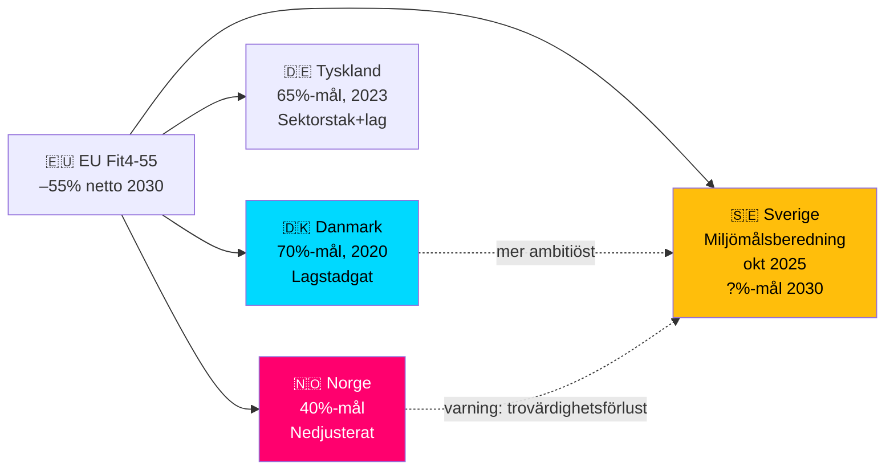

# Comparative International Analysis — HD10481 Klimatmålen

## Jämförelseländer

### Danmark — Klimalov (2020)
**Situation**: Danmark antog Klimalov 2020 med lagstadgat 70%-mål till 2030 (vs 1990-nivå). Implementeringen sker via sektorsspecifika avtal och grön skatteväxling.  
**Likhet med Sverige**: Parlamentarisk demokrati; hög välstånds-nivå; Nordisk energimarknad; liknande EU-förpliktelser  
**Skillnad**: Danmarks 70%-mål är mer ambitiöst än Miljömålsberedningens förslag; dansk lag antagen i bred parlamentarisk koalition (S, R, SF, EL, S)  
**Relevans**: Danmark visar att parlamentarisk bred koalition kan befästa ambitiösa klimatmål → brett stöd i Miljömålsberedningens betänkande ger likartad möjlighet för Sverige [B2]  
**Admiralty**: [B2]

### Tyskland — Klimaschutzgesetz (2021, rev. 2023)
**Situation**: Tyskland har klimatlag med sektors-specifika utsläppstak; lagstiftad 65%-minskning till 2030 (vs 1990). Bundesverfassungsgericht slog fast 2021 att otillräckliga klimatmål kan bryta mot grundlagen (skyddar framtida generationers frihet).  
**Skillnad**: Tyskland har lagstiftat sektorstak i detalj; Sverige har principbaserad Klimatlag med etappmål  
**Relevans**: Konstitutionell dimension — kan svenska Klimatlag tolkas som att riksdag har skyldighet att fastställa etappmål via proposition? [C3]  
**Admiralty**: [B2]

### Norge — Klimamål (2030)
**Situation**: Norge har halverat sina utsläppsambitioner jämfört med tidigare (40%-mål till 2030); kopplat till oljeinkomster och politisk kompromiss  
**Relevans**: Kontrast-fall: illustrerar risk för trovärdighetsförlust när nationella mål nedjusteras av politiska hänsyn  
**Admiralty**: [B3]

## Outside-In analys (EU-perspektiv)

**EU Governance Regulation 2018/1999** föreskriver:
- Art. 3: Varje MS ska lämna in Integrated National Energy and Climate Plan (NECP)
- Art. 38: Om en MS inte uppnår 2030-delmål kan kommissionen rekommendera kompletterande åtgärder
- Sverige lämnade NECP-uppdatering 2023; nästa granskningscykel inleds sommaren 2026

**Fit for 55**: Sverige måste reducera icke-ETS-sektorer (transport, jordbruk, bygg) med ~50% till 2030 under EU ESR (Effort Sharing Regulation). Utan nationellt befäst mål riskeras inkonsekvens.

## Komparativ frame

