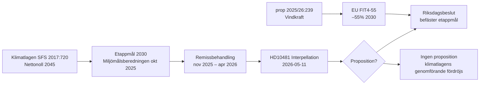

# Cross-Reference Map — HD10481 Klimatmålen

## Policykluster

### Klimat- och miljöpolitik (primär)
- **HD10481** (ip 481): Klimatmålen 2030 — interpellation till Johan Britz (L)
- **HD05TU4y** (yttr TU): Riksdagens skrivelser; bekräftar Miljömålsberedningens betänkande okt 2025
- **HDA1MJU44p** (prot MJU): MJU-sammanträde 2026-05-05; Britz informerade om EU-klimatmål
- **HD024126, HD024132** (mot): Motioner om vindkraft kopplat till klimatmål (NU, apr 2026)

### Energipolitik (sekundär)
- **prop 2025/26:239** (Vindkraft i kommuner): Parallell proposition som stärker förnybar energi → klimatmålskontext
- HD09116 (prot): Debatt 2026-05-06 om klimatmål i plenumkontext

### Arbetsmarknad (koppling via minister)
- Johan Britz är *tillika* arbetsmarknadsminister → interpellationer om klimat och arbetsmarknad kan korsas i svar och debatt

## Lagstiftningskedja

## Koordinerade aktivitetsmönster

| Mönster | Dokument | Indikation |
|---------|----------|------------|
| S-oppositionsoffensiv klimat | HD10481 + tidigare S-ip:ar om klimat 2025/26 | Koordinerad pre-valkampanj (inferred) [C2] |
| MJU-informationsinhämtning | HDA1MJU44p (2026-05-05, 1 vecka före ip) | Utskottets uppföljning; eventuell grund för ip | [A1] |

## Sibling-folder-referenser (cross-type)
- `analysis/daily/2026-05-10/committeeReports/` (föregående dag): Inga direkta klimat-betänkanden
- `analysis/daily/2026-05-11/propositions/` (samma dag): Windkraft-propositionens slutbehandling pågår i NU
- `analysis/daily/2026-05-11/month-ahead/`: Framåtblickande analys inkl. riksdagsavslutning jun 2026

## EU-regulatorisk ram
- **EU 2021/1119** (Europeisk klimatlag): 55%-mål 2030 lagstadgat
- **EU 2018/1999** (Governance Regulation): Art. 38 — kommissionen kan rekommendera åtgärder om nationella 2030-mål ej uppnås
- **Swedish NECP** (National Energy and Climate Plan): Ska uppdateras i enlighet med EU Governance Reg
