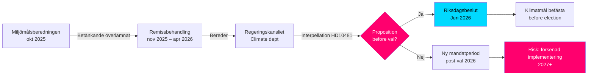

‏---
title: "Klimatmålen inför valet: Interpellation om proposition 2030"
date: "2026-05-11"
author: "James Pether Sörling"
classification: "PUBLIC"
confidence: "HIGH [B2]"
article_type: "interpellations"
subfolder: "interpellations"
---

# أهداف المناخ قبل الانتخابات: استجواب حول اقتراح 2030

**ملخص**: وجّهت عضو الريكسداغ أوسا ويستلوند (S) الاستجواب 2025/26:481 (HD10481) إلى وزير العمل والوزير بالإنابة للمناخ والبيئة يوهان بريتس (L)، سائلةً إذا كانت الحكومة تعتزم تقديم اقتراح بشأن الأهداف المناخية قبل انتخابات 2026. يظل تقرير Miljömålsberedningen المتضمّن اقتراح هدف مرحلي محدَّث لعام 2030 — والذي يحظى بدعم حزبي واسع — منذ أكتوبر 2025 رهنَ دراسة Regeringskansliet دون أي إعلان عن جدول زمني. بغياب اقتراح، تخاطر السويد بإضاعة الفرصة البرلمانية لترسيخ أهداف 2030 خلال الدورة التشريعية الحالية، مما قد يُضعف تطبيق Klimatlagen والتزامات المناخ الأوروبية.

## النقاط الرئيسية في 60 ثانية

- **الاستجواب HD10481** من أوسا ويستلوند (S) إلى يوهان بريتس (L، وزير مناخ بالإنابة): يطالب بإجابة حول اقتراح أهداف مناخية قبل انتخابات سبتمبر 2026
- **تقرير Miljömålsberedningen** (سُلِّم في 2025-10-30) باقتراح هدف مرحلي محدَّث لعام 2030: توافق برلماني واسع خلف المقترحات، لكن الحكومة لم تقدم اقتراحاً
- **يوهان بريتس يعمل وزيراً بالإنابة للمناخ والبيئة** بالتوازي مع دوره وزيراً للعمل (L)، مما يُشير إلى أولويات الحقيبة داخل Tidökoalitionen
- **ضغط الوقت**: يُغلق الريكسداغ قبل الصيف في منتصف يونيو 2026؛ الانتخابات في 11 سبتمبر 2026 (مؤقتاً)؛ يجب تقديم الاقتراح في مايو/يونيو على أبعد تقدير للتصويت في الريكسداغ
- **هدف الاتحاد الأوروبي 55% لعام 2030** (Fit for 55) يُحدد موعداً خارجياً يُعزز الحاجة إلى اقتراح وطني
- **صندوق النقد الدولي WEO أبريل 2026**: نمو الناتج المحلي الإجمالي السويدي 2026 مقدَّر بحوالي 2.0% – اقتصاد في تعافٍ مما يوسّع هامش الاستثمارات المناخية ويُقلّص منطق العرقلة المالية الحادة ضد الاقتراح

## دعم اتخاذ القرار

1. **استراتيجية المساءلة للمعارضة**: تستخدم S الاستجواب كحملة انتخابية مسبقة للإشارة إلى طموحات المناخ غير الكافية لـ Tidökoalitionen — ذو صلة بالحملة الانتخابية القادمة
2. **تحليل الجدول الزمني**: إذا لم تقدم الحكومة الاقتراح في مايو/يونيو 2026 على أبعد تقدير، لن تتمكن الدورة الحالية للريكسداغ من البت في الأهداف المناخية → يستلزم دورة جديدة
3. **تقييم المخاطر للسويد**: بدون هدف وسيط مرتبط قانونياً لعام 2030، تخاطر السويد بتدابير تدقيق من المفوضية الأوروبية وفقدان نقاط المصداقية في المفاوضات المناخية الدولية

## المحفزات الرئيسية

- **فوري [A1]**: أُغلق عملياً نافذة تقديم الاقتراح في الدورة البرلمانية — كان آخر موعد معقول في 2026-05-15 (منذ 4 أيام). اقتراح أهداف المناخ في الدورة *الحالية* أصبح الآن **مستحيلاً تقنياً**.
- **72 ساعة**: إعلان الاستجواب في القاعة مقرر في 2026-05-18؛ نقاش الريكسداغ في حوالي 2026-05-26–29 (آخر موعد للرد)
- **7 أيام**: هل يستطيع الوزير الرد بتعهد واضح بشأن اقتراح في *دورة جديدة* (خريف 2026)؟

**Confidence label**: [B2] — Reliable source (riksdagen.se official data), confirmed via primary source HD10481 + MJU-protokoll HDA1MJU44p

<!-- source-sha: bee8728bc92af41b21edc2b20989739604e92262 -->
