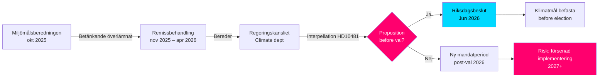

# Klimamål op til valget: Forespørgsel om proposition 2030

**Resumé**: Riksdagsmedlem Åsa Westlund (S) har rettet forespørgsel 2025/26:481 (HD10481) til arbejdsmarkedsminister og fungerende klima- og miljøminister Johan Britz (L) med spørgsmålet om, hvorvidt regeringen agter at fremlægge en klimamålsproposition inden valget i 2026. Miljömålsberedningens betænkning med forslag til opdateret delmål for 2030 – med bred partiopbakning – har siden oktober 2025 været under behandling i Regeringskansliet uden besked om tidsplan. Uden en proposition risikerer Sverige at miste den parlamentariske mulighed for at befæste 2030-målene i indeværende valgperiode, hvilket kan svække gennemførelsen af Klimatlagen og EU's klimaforpligtelser.

## 60-sekunders nøglepunkter

- **Forespørgsel HD10481** af Åsa Westlund (S) til Johan Britz (L, fungerende klimaminister): kræver besked om klimamålsproposition inden valget september 2026
- **Miljömålsberedningens betænkning** (overleveret 2025-10-30) med opdateret 2030-delmål: bred parlamentarisk enighed bag forslagene, men regeringen har ikke fremlagt en proposition
- **Johan Britz fungerer som fungerende klima- og miljøminister** sideløbende med sin rolle som arbejdsmarkedsminister (L), hvilket signalerer porteføljeprioritering inden for Tidökoalitionen
- **Tidspres**: Riksdagen lukker inden sommeren midt i juni 2026; valg 11. september 2026 (foreløbigt); proposition skal indgives senest maj/juni for afstemning i riksdagen
- **EU's 55%-mål til 2030** (Fit for 55) giver ekstern deadline, der forstærker behovet for en national proposition
- **IMF WEO apr-2026**: Svensk BNP-vækst 2026 anslås til ca. 2,0 % – økonomi i bedring, der øger råderummet for klimainvesteringer men mindsker den akutte statsfinansielle hindelseslogik mod proposition

## Beslutningsstøtte

1. **Oppositionens ansvarsstrategii**: S bruger forespørgslen som pre-valgkampagne til at påpege Tidökoalitionens utilstrækkelige klimaambitioner – relevant for den kommende valgkamp
2. **Tidsplananalyse**: Hvis regeringen ikke fremlægger proposition senest maj/juni 2026, kan klimamålene ikke vedtages af det nuværende riksdag → ny valgperiode er nødvendig
3. **Risikovurdering for Sverige**: Uden lovfæstet delmål 2030 risikerer Sverige EU-Kommissionens undersøgelsesforanstaltninger og tabte troværdighedspoint i internationale klimaforhandlinger

## Topudløsere

- **Umiddelbart [A1]**: Propositionsvinduet for riksmødet er i praksis lukket — seneste rimelige dato var 2026-05-15 (for 4 dage siden). Klimamålsproposition i *indeværende* riksmøde er nu **teknisk umulig**.
- **72 t**: Anmeldelse af forespørgsel i kammeret planlagt til 2026-05-18; riksdagsdebat around 2026-05-26–29 (sidste svarsdato)
- **7 dage**: Kan ministeren svare med klar besked om proposition i *ny riksdag* (efterår 2026)?

**Confidence label**: [B2] — Reliable source (riksdagen.se official data), confirmed via primary source HD10481 + MJU-protokoll HDA1MJU44p

<!-- source-sha: bee8728bc92af41b21edc2b20989739604e92262 -->
