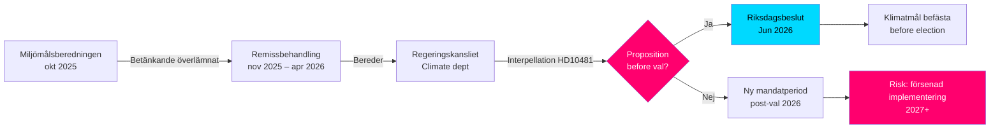

# Klimaziele vor der Wahl: Anfrage zu Proposition 2030

**Zusammenfassung**: Die Riksdagsabgeordnete Åsa Westlund (S) hat die Anfrage 2025/26:481 (HD10481) an den Arbeitsmarktminister und amtierenden Klima- und Umweltminister Johan Britz (L) gerichtet und gefragt, ob die Regierung vor der Wahl 2026 eine Klimazielproposition vorlegen will. Der Bericht der Miljömålsberedningen mit dem Vorschlag für ein aktualisiertes Etappenziel für 2030 – mit breiter Parteiunterstützung – wird seit Oktober 2025 im Regeringskansliet bearbeitet, ohne dass ein Zeitplan bekannt gegeben wurde. Ohne Proposition riskiert Schweden, die parlamentarische Möglichkeit zu verpassen, die 2030-Ziele in der laufenden Legislaturperiode festzuschreiben, was die Umsetzung des Klimatlagen und der EU-Klimaverpflichtungen schwächen könnte.

## 60-Sekunden-Kernpunkte

- **Anfrage HD10481** von Åsa Westlund (S) an Johan Britz (L, amtierender Klimaminister): fordert Auskunft über eine Klimazielproposition vor der Wahl September 2026
- **Bericht der Miljömålsberedningen** (übergeben am 2025-10-30) mit aktualisierten Etappenziel für 2030: breite parlamentarische Einigkeit hinter den Vorschlägen, aber die Regierung hat keine Proposition vorgelegt
- **Johan Britz fungiert als amtierender Klima- und Umweltminister** parallel zu seiner Rolle als Arbeitsmarktminister (L), was eine Portfolioprioritierung innerhalb der Tidökoalition signalisiert
- **Zeitdruck**: Der Riksdag schließt vor dem Sommer Mitte Juni 2026; Wahl 11. September 2026 (vorläufig); Proposition muss spätestens im Mai/Juni eingereicht werden für eine Abstimmung im Riksdag
- **EU-Klimaziel 55 % bis 2030** (Fit for 55) setzt eine externe Frist, die den Bedarf einer nationalen Proposition verstärkt
- **IWF WEO Apr-2026**: Schwedisches BIP-Wachstum 2026 auf ca. 2,0 % geschätzt – Wirtschaft in Erholung, was den Spielraum für Klimainvestitionen erweitert, aber die akute staatsfinanzielle Hinderungslogik gegen die Proposition verringert

## Entscheidungsunterstützung

1. **Rechenschaftsstrategie der Opposition**: S nutzt die Anfrage als Vorwahlkampagne, um auf die unzureichenden Klimaambitionen der Tidökoalition hinzuweisen – relevant für den kommenden Wahlkampf
2. **Zeitplananalyse**: Wenn die Regierung keine Proposition bis spätestens Mai/Juni 2026 einreicht, können die Klimaziele nicht vom derzeitigen Riksdag beschlossen werden → neue Legislaturperiode notwendig
3. **Risikoabschätzung für Schweden**: Ohne gesetzlich verankerte Etappenziel 2030 riskiert Schweden Prüfmaßnahmen der EU-Kommission und verliert Glaubwürdigkeitspunkte bei internationalen Klimaverhandlungen

## Wichtigste Auslöser

- **Sofort [A1]**: Das Propositionsfenster für den Riksmöte ist praktisch geschlossen — der letzte vernünftige Termin war 2026-05-15 (vor 4 Tagen). Eine Klimazielproposition im *laufenden* Riksmöte ist nun **technisch unmöglich**.
- **72 Stunden**: Anmeldung der Anfrage im Kammer geplant für 2026-05-18; Riksdagsdebatte rund um 2026-05-26–29 (letzter Antworttag)
- **7 Tage**: Kann der Minister mit einer klaren Aussage über eine Proposition im *neuen Riksmöte* (Herbst 2026) antworten?

**Confidence label**: [B2] — Reliable source (riksdagen.se official data), confirmed via primary source HD10481 + MJU-protokoll HDA1MJU44p

<!-- source-sha: bee8728bc92af41b21edc2b20989739604e92262 -->
