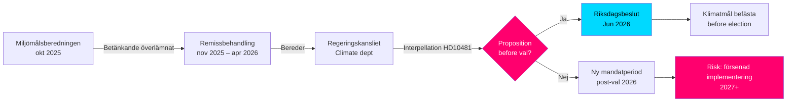

# Objetivos climáticos antes de las elecciones: Interpelación sobre la proposición 2030

**Resumen**: La diputada Åsa Westlund (S) ha dirigido la interpelación 2025/26:481 (HD10481) al ministro de Trabajo y ministro en funciones de Clima y Medio Ambiente Johan Britz (L), preguntando si el gobierno tiene intención de presentar una proposición sobre objetivos climáticos antes de las elecciones de 2026. El informe de la Miljömålsberedningen con la propuesta de un objetivo intermedio actualizado para 2030 — con amplio apoyo partidario — lleva desde octubre de 2025 bajo examen en el Regeringskansliet sin información sobre el calendario. Sin una proposición, Suecia corre el riesgo de perder la oportunidad parlamentaria de consolidar los objetivos de 2030 durante la legislatura actual, lo que podría debilitar la implementación del Klimatlagen y los compromisos climáticos de la UE.

## Puntos clave en 60 segundos

- **Interpelación HD10481** de Åsa Westlund (S) a Johan Britz (L, ministro de clima en funciones): exige respuesta sobre una proposición de objetivos climáticos antes de las elecciones de septiembre de 2026
- **Informe de la Miljömålsberedningen** (entregado el 2025-10-30) con objetivo intermedio actualizado para 2030: amplio consenso parlamentario respaldando las propuestas, pero el gobierno no ha presentado proposición
- **Johan Britz actúa como ministro en funciones de Clima y Medio Ambiente** en paralelo a su papel como ministro de Trabajo (L), lo que señala prioridades de cartera dentro de la Tidökoalitionen
- **Presión de tiempo**: El Riksdag cierra antes del verano a mediados de junio de 2026; elecciones el 11 de septiembre de 2026 (provisional); la proposición debe presentarse a más tardar en mayo/junio para una votación en el Riksdag
- **Objetivo del 55% de la UE para 2030** (Fit for 55) establece un plazo externo que refuerza la necesidad de una proposición nacional
- **FMI WEO abr-2026**: Crecimiento del PIB sueco en 2026 estimado en aprox. 2,0% – economía en recuperación, lo que amplía el margen para inversiones climáticas pero reduce la lógica de obstaculización fiscal aguda contra la proposición

## Apoyo a la toma de decisiones

1. **Estrategia de rendición de cuentas de la oposición**: S usa la interpelación como campaña preelectoral para señalar las insuficientes ambiciones climáticas de la Tidökoalitionen – relevante para la próxima campaña electoral
2. **Análisis del calendario**: Si el gobierno no presenta la proposición a más tardar en mayo/junio de 2026, el Riksdag actual no podrá decidir sobre los objetivos climáticos → se requiere una nueva legislatura
3. **Evaluación de riesgos para Suecia**: Sin objetivo intermedio 2030 con respaldo legal, Suecia corre el riesgo de medidas de escrutinio de la Comisión Europea y pérdida de puntos de credibilidad en las negociaciones climáticas internacionales

## Principales desencadenantes

- **Inmediatamente [A1]**: La ventana para presentar la proposición en la sesión del Riksdag ha cerrado en la práctica — la última fecha razonable fue el 2026-05-15 (hace 4 días). Una proposición de objetivos climáticos en la *sesión actual* es ahora **técnicamente imposible**.
- **72 h**: Anuncio de la interpelación en el hemiciclo previsto para el 2026-05-18; debate en el Riksdag en torno al 2026-05-26–29 (último plazo de respuesta)
- **7 días**: ¿Puede el ministro responder con un compromiso claro sobre una proposición en *la próxima sesión* (otoño 2026)?

**Confidence label**: [B2] — Reliable source (riksdagen.se official data), confirmed via primary source HD10481 + MJU-protokoll HDA1MJU44p

<!-- source-sha: bee8728bc92af41b21edc2b20989739604e92262 -->
