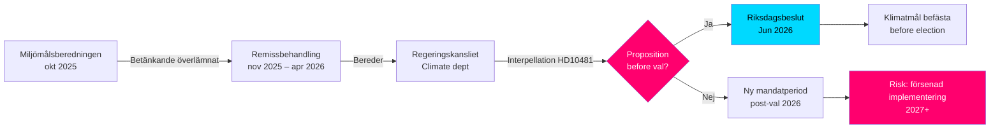

# Ilmastotavoitteet ennen vaaleja: Välikysymys ehdotuksesta 2030

**Tiivistelmä**: Kansanedustaja Åsa Westlund (S) on esittänyt välikysymyksen 2025/26:481 (HD10481) työmarkkinaministeri ja vt. ilmasto- ja ympäristöministeri Johan Britzille (L) siitä, aikooko hallitus esittää ilmastotavoiteproposition ennen vuoden 2026 vaaleja. Miljömålsberedningenin mietintö, jossa ehdotetaan päivitettyä vuoden 2030 välivaihetavoitetta – laajan poliittisen tuen kera – on ollut Regeringskansliets käsittelyssä lokakuusta 2025 lähtien ilman tietoa aikataulusta. Ilman propositiota Ruotsi saattaa menettää parlamentaarisen mahdollisuuden vahvistaa 2030-tavoitteet nykyisellä vaalikaudella, mikä voi heikentää Klimatlagenin ja EU:n ilmastovelvoitteiden täytäntöönpanoa.

## 60 sekunnin pääkohdat

- **Välikysymys HD10481** Åsa Westlundilta (S) Johan Britzille (L, vt. ilmastoministeri): vaatii tietoa ilmastotavoiteproposition esittämisestä ennen syyskuun 2026 vaaleja
- **Miljömålsberedningenin mietintö** (luovutettu 2025-10-30) päivitetyllä 2030-välivaihetavoitteella: laaja parlamentaarinen yksimielisyys ehdotusten takana, mutta hallitus ei ole esittänyt propositiota
- **Johan Britz toimii vt. ilmasto- ja ympäristöministerinä** rinnakkain roolinsa kanssa työmarkkinaministerinä (L), mikä viestii salkkuprioritoinneista Tidökoalitiossa
- **Aikapaine**: Riksdag sulkeutuu ennen kesää kesäkuun puolivälissä 2026; vaalit 11. syyskuuta 2026 (alustava); propositio on jätettävä viimeistään toukokuussa/kesäkuussa äänestämistä varten riksdagissa
- **EU:n 55 prosentin tavoite vuodelle 2030** (Fit for 55) asettaa ulkoisen määräajan, joka korostaa kansallisen proposition tarvetta
- **IMF WEO huhtikuu 2026**: Ruotsin BKT-kasvu 2026 arvioidaan noin 2,0 prosentiksi – palautumisvaiheessa oleva talous lisää tilaa ilmastoinvestoinneille, mutta vähentää akuuttia valtiontaloudellista estologiikkaa propositiota vastaan

## Päätöksentukitiedot

1. **Opposition vastuuttamisstrategia**: S käyttää välikysymystä ennakoivana vaalikampanjana osoittaakseen Tidökoalition riittämättömät ilmastokunnianhimot – relevanttia tulevassa vaaliväittelyssä
2. **Aikatauluanalyysi**: Jos hallitus ei esitä propositiota viimeistään toukokuussa/kesäkuussa 2026, nykyinen riksdag ei voi päättää ilmastotavoitteista → tarvitaan uusi vaalikausi
3. **Ruotsin riskiarvio**: Ilman lakisääteistä 2030-välivaihetavoitetta Ruotsi saattaa altistua EU-komission tutkimustoimenpiteille ja menettää uskottavuuspisteitä kansainvälisissä ilmastoneuvotteluissa

## Tärkeimmät laukaisijat

- **Välittömästi [A1]**: Propositioniäänestysikkuna tälle riksmötelle on käytännössä sulkeutunut — viimeisin kohtuullinen päivämäärä oli 2026-05-15 (4 päivää sitten). Ilmastotavoiteproposition esittäminen *nykyiselle* riksmötelle on nyt **teknisesti mahdotonta**.
- **72 tuntia**: Välikysymyksen ilmoittaminen kammarissa suunniteltu 2026-05-18:lle; riksdagskeskustelu noin 2026-05-26–29 (viimeinen vastauspäivä)
- **7 päivää**: Voiko ministeri vastata selkeästi propositiosta *uudessa riksmötessä* (syksy 2026)?

**Confidence label**: [B2] — Reliable source (riksdagen.se official data), confirmed via primary source HD10481 + MJU-protokoll HDA1MJU44p

<!-- source-sha: bee8728bc92af41b21edc2b20989739604e92262 -->
