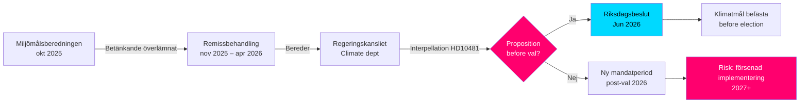

# Objectifs climatiques avant les élections : Interpellation sur la proposition 2030

**Résumé** : La députée Åsa Westlund (S) a adressé l'interpellation 2025/26:481 (HD10481) au ministre du Travail et ministre par intérim du Climat et de l'Environnement Johan Britz (L), lui demandant si le gouvernement envisage de soumettre une proposition sur les objectifs climatiques avant les élections de 2026. Le rapport de la Miljömålsberedningen proposant un objectif intermédiaire actualisé pour 2030 — avec un large soutien politique — est en cours d'examen au Regeringskansliet depuis octobre 2025, sans annonce d'un calendrier. Sans proposition, la Suède risque de manquer l'occasion parlementaire de consolider les objectifs 2030 durant la législature en cours, ce qui pourrait affaiblir la mise en œuvre du Klimatlagen et des engagements climatiques de l'UE.

## Points essentiels en 60 secondes

- **Interpellation HD10481** d'Åsa Westlund (S) à Johan Britz (L, ministre du climat par intérim) : exige une réponse sur une proposition d'objectifs climatiques avant les élections de septembre 2026
- **Rapport de la Miljömålsberedningen** (remis le 2025-10-30) avec un objectif intermédiaire 2030 actualisé : large consensus parlementaire derrière les propositions, mais le gouvernement n'a pas présenté de proposition
- **Johan Britz assume le rôle de ministre par intérim du Climat et de l'Environnement** parallèlement à son rôle de ministre du Travail (L), ce qui signale des priorités de portefeuille au sein de la Tidökoalitionen
- **Pression temporelle** : Le Riksdag ferme avant l'été à la mi-juin 2026 ; élections le 11 septembre 2026 (provisoire) ; la proposition doit être déposée au plus tard en mai/juin pour un vote au Riksdag
- **Objectif de 55 % de l'UE d'ici 2030** (Fit for 55) fixe une échéance externe qui renforce la nécessité d'une proposition nationale
- **FMI WEO avr-2026** : Croissance du PIB suédois en 2026 estimée à environ 2,0 % – économie en reprise, ce qui élargit la marge pour les investissements climatiques mais réduit la logique de blocage budgétaire aiguë contre la proposition

## Aide à la décision

1. **Stratégie de responsabilisation de l'opposition** : S utilise l'interpellation comme campagne pré-électorale pour souligner les ambitions climatiques insuffisantes de la Tidökoalitionen – pertinent pour la prochaine campagne électorale
2. **Analyse du calendrier** : Si le gouvernement ne dépose pas de proposition au plus tard en mai/juin 2026, les objectifs climatiques ne pourront pas être décidés par le Riksdag actuel → nouvelle législature nécessaire
3. **Évaluation des risques pour la Suède** : Sans objectif intermédiaire 2030 inscrit dans la loi, la Suède risque des mesures d'examen de la Commission européenne et la perte de crédibilité dans les négociations climatiques internationales

## Principaux déclencheurs

- **Immédiatement [A1]** : La fenêtre de dépôt de la proposition pour la session du Riksdag est en pratique close — la dernière date raisonnable était le 2026-05-15 (il y a 4 jours). Une proposition sur les objectifs climatiques lors de la *session en cours* est désormais **techniquement impossible**.
- **72 h** : Annonce de l'interpellation en chambre prévue le 2026-05-18 ; débat au Riksdag autour du 2026-05-26–29 (dernier délai de réponse)
- **7 jours** : Le ministre peut-il répondre avec un engagement clair sur une proposition lors de *la prochaine session* (automne 2026) ?

**Confidence label**: [B2] — Reliable source (riksdagen.se official data), confirmed via primary source HD10481 + MJU-protokoll HDA1MJU44p

<!-- source-sha: bee8728bc92af41b21edc2b20989739604e92262 -->
