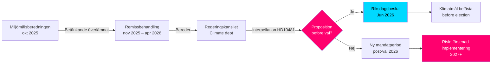

‏---
title: "Klimatmålen inför valet: Interpellation om proposition 2030"
date: "2026-05-11"
author: "James Pether Sörling"
classification: "PUBLIC"
confidence: "HIGH [B2]"
article_type: "interpellations"
subfolder: "interpellations"
---

# יעדי האקלים לפני הבחירות: שאילתה על הצעת חוק 2030

**תקציר**: חברת הפרלמנט (ריקסדאג) אוסה ווסטלונד (S) הגישה שאילתה 2025/26:481 (HD10481) לשר העבודה וממלא מקום שר האקלים והסביבה יוהאן בריץ (L), שאלה האם הממשלה מתכוונת להגיש הצעת חוק לגבי יעדי אקלים לפני בחירות 2026. דוח Miljömålsberedningen המציע יעד ביניים מעודכן לשנת 2030 — עם תמיכה רחבה מצד הסיעות — נמצא מאז אוקטובר 2025 בבחינת Regeringskansliet ללא הודעות על לוח הזמנים. ללא הצעת חוק, שוודיה מסתכנת בהחמצת ההזדמנות הפרלמנטארית לבסס את יעדי 2030 בתקופת הכנסת הנוכחית, מה שעלול להחליש את יישום Klimatlagen ואת התחייבויות האקלים של האיחוד האירופי.

## נקודות מפתח ב-60 שניות

- **שאילתה HD10481** מאת אוסה ווסטלונד (S) ליוהאן בריץ (L, ממלא מקום שר האקלים): דורשת תשובה לגבי הצעת חוק יעדי אקלים לפני בחירות ספטמבר 2026
- **דוח Miljömålsberedningen** (הוגש ב-2025-10-30) עם יעד ביניים מעודכן לשנת 2030: קונצנזוס פרלמנטארי רחב מאחורי ההצעות, אך הממשלה לא הגישה הצעת חוק
- **יוהאן בריץ משמש ממלא מקום שר האקלים והסביבה** במקביל לתפקידו כשר העבודה (L), מה שמאותת על עדיפויות תיק בתוך Tidökoalitionen
- **לחץ זמן**: הריקסדאג נסגר לפני הקיץ באמצע יוני 2026; בחירות ב-11 בספטמבר 2026 (זמני); הצעת החוק חייבת להיות מוגשת לכל המאוחר במאי/יוני להצבעה בריקסדאג
- **יעד האיחוד האירופי 55% לשנת 2030** (Fit for 55) קובע מועד אחרון חיצוני המחזק את הצורך בהצעת חוק לאומית
- **קרן המטבע הבינלאומית WEO אפריל 2026**: צמיחת התמ"ג של שוודיה לשנת 2026 מוערכת בכ-2.0% – כלכלה בהתאוששות, המרחיבה את שולי ההשקעות באקלים אך מצמצמת את ההיגיון לחסימה פיסקלית חריפה נגד הצעת החוק

## תמיכה בקבלת החלטות

1. **אסטרטגיית אחריות האופוזיציה**: S משתמשת בשאילתה כקמפיין טרום-בחירות להצביע על שאיפות האקלים הבלתי מספקות של Tidökoalitionen — רלוונטי לקמפיין הבחירות הקרוב
2. **ניתוח לוח הזמנים**: אם הממשלה לא תגיש הצעת חוק לכל המאוחר במאי/יוני 2026, הריקסדאג הנוכחי לא יוכל להחליט על יעדי האקלים → נדרשת מושב חדש
3. **הערכת סיכונים לשוודיה**: ללא יעד ביניים לשנת 2030 מעוגן בחוק, שוודיה מסתכנת בצעדי בדיקה של הנציבות האירופית ואובדן נקודות אמינות במשא ומתן בינלאומי על האקלים

## טריגרים עיקריים

- **מיידי [A1]**: חלון הגשת הצעת החוק במושב הריקסדאג נסגר הלכה למעשה — המועד האחרון הסביר היה 2026-05-15 (לפני 4 ימים). הצעת חוק יעדי אקלים במושב *הנוכחי* כעת **בלתי אפשרית מבחינה טכנית**.
- **72 שעות**: הכרזת השאילתה במליאה מתוכננת ל-2026-05-18; דיון בריקסדאג סביב 2026-05-26–29 (מועד תגובה אחרון)
- **7 ימים**: האם השר יוכל להשיב עם התחייבות ברורה לגבי הצעת חוק ב*מושב חדש* (סתיו 2026)?

**Confidence label**: [B2] — Reliable source (riksdagen.se official data), confirmed via primary source HD10481 + MJU-protokoll HDA1MJU44p

<!-- source-sha: bee8728bc92af41b21edc2b20989739604e92262 -->
