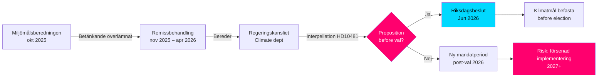

# 選挙前の気候目標：2030年提案に関する質問主意書

**要約**：国会議員オーサ・ウェストルンド（S）は、労働大臣兼気候環境代理大臣ヨーハン・ブリッツ（L）に対して質問主意書2025/26:481（HD10481）を提出し、2026年選挙前に気候目標に関する提案を提出する意向があるかを問いました。幅広い政党支持を得た2030年暫定目標の更新案を盛り込んだMiljömålsberedningenの報告書は、2025年10月からRegeringskanslietで審査されているものの、スケジュールに関する発表はありません。提案がなければ、スウェーデンは現会期中に2030年目標を確立する議会の機会を逃す可能性があり、Klimatlagenの実施とEUの気候公約が弱体化するリスクがあります。

## 60秒でわかるポイント

- **質問主意書HD10481**（オーサ・ウェストルンド（S）からヨーハン・ブリッツ（L、気候代理大臣）へ）：2026年9月選挙前の気候目標提案について回答を求める
- **Miljömålsberedningenの報告書**（2025-10-30提出）で2030年の更新された暫定目標を提案：各党の幅広い合意があるものの、政府は提案を提出していない
- **ヨーハン・ブリッツは労働大臣（L）と気候環境代理大臣を兼務**しており、ティデー連立内での省庁優先順位を示している
- **時間的プレッシャー**：国会は2026年6月中旬の夏前に閉会予定；選挙は2026年9月11日（暫定）；国会での採決には遅くとも5月/6月までに提案を提出する必要がある
- **EUの2030年55%目標**（Fit for 55）は国内提案の必要性を強化する外部期限を設定している
- **IMF WEO 2026年4月**：スウェーデンのGDP成長率2026年は約2.0%と推定 – 回復中の経済が気候投資の余地を広げる一方、提案に対する財政的障害の論理を弱める

## 意思決定支援

1. **野党の説明責任戦略**：SはTideé連立の不十分な気候目標を指摘する選挙前キャンペーンとして質問主意書を活用 – 来る選挙戦に関連
2. **スケジュール分析**：政府が2026年5月/6月までに提案を提出しなければ、現国会は気候目標を決定できない → 新会期が必要
3. **スウェーデンへのリスク評価**：法的拘束力のある2030年暫定目標がなければ、スウェーデンは欧州委員会の精査措置を受けるリスクと国際気候交渉での信頼性ポイントの喪失リスクを抱える

## 主要なトリガー

- **即時[A1]**：国会会期への提案提出ウィンドウは実質的に閉まった — 最後の合理的な期限は2026-05-15（4日前）。*現会期*での気候目標提案は現在**技術的に不可能**。
- **72時間**：本会議での質問主意書発表は2026-05-18予定；国会討議は2026-05-26–29頃（最終回答期限）
- **7日間**：大臣は*新会期*（2026年秋）における提案について明確なコミットメントで回答できるか？

**Confidence label**: [B2] — Reliable source (riksdagen.se official data), confirmed via primary source HD10481 + MJU-protokoll HDA1MJU44p

<!-- source-sha: bee8728bc92af41b21edc2b20989739604e92262 -->
