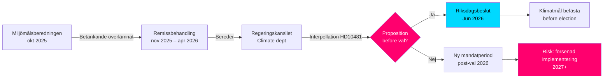

# 선거 전 기후 목표: 2030년 제안서에 관한 질문

**요약**: 국회의원 오사 베스틀룬드(S)는 노동부 장관 겸 기후환경부 장관 대리인 요한 브리츠(L)에게 질문서 2025/26:481(HD10481)을 제출하여, 정부가 2026년 선거 전에 기후 목표에 관한 제안서를 제출할 의향이 있는지 물었습니다. 폭넓은 정당 지지를 받은 2030년 잠정 목표 갱신안을 담은 Miljömålsberedningen 보고서가 2025년 10월부터 Regeringskansliet에서 검토되고 있으나 일정에 관한 발표가 없습니다. 제안서가 없으면 스웨덴은 현 회기 중에 2030년 목표를 확립할 의회 기회를 놓칠 위험이 있으며, 이는 Klimatlagen 이행과 EU 기후 공약을 약화시킬 수 있습니다.

## 60초 핵심 포인트

- **질문서 HD10481**(오사 베스틀룬드(S)→요한 브리츠(L, 기후부 장관 대리)): 2026년 9월 선거 전 기후 목표 제안서에 대한 답변 요구
- **Miljömålsberedningen 보고서**(2025-10-30 제출)에서 2030년 갱신된 잠정 목표 제안: 광범위한 의회 합의가 제안 뒤를 받치고 있으나, 정부는 제안서를 제출하지 않음
- **요한 브리츠는 노동부 장관(L)과 기후환경부 장관 대리 겸임** — 티데연정 내 부처 우선순위를 시사
- **시간적 압박**: 의회는 2026년 6월 중순 여름 방학 전 폐회; 선거는 2026년 9월 11일(잠정); 제안서는 늦어도 5월/6월에 제출해야 의회 표결 가능
- **EU 2030년 55% 목표**(Fit for 55)는 국내 제안서의 필요성을 강화하는 외부 기한을 설정함
- **IMF WEO 2026년 4월**: 스웨덴 GDP 성장률 2026년 약 2.0% 추정 – 회복 중인 경제가 기후 투자 여지를 넓히나 제안서에 대한 급격한 재정 장애 논리를 약화시킴

## 의사결정 지원

1. **야당의 책임 전략**: S는 질문서를 티데연정의 불충분한 기후 목표를 지적하는 선거 전 캠페인으로 활용 – 다가오는 선거 운동과 관련
2. **일정 분석**: 정부가 2026년 5월/6월까지 제안서를 제출하지 않으면, 현 의회는 기후 목표를 결정할 수 없음 → 새 회기 필요
3. **스웨덴 위험 평가**: 법적 구속력 있는 2030년 잠정 목표 없이는 스웨덴은 유럽 집행위원회의 심사 조치와 국제 기후 협상에서의 신뢰도 손실 위험에 처함

## 주요 트리거

- **즉시 [A1]**: 현 의회 회기에서 제안서 제출 창은 사실상 닫혔음 — 마지막 합리적 기한은 2026-05-15(4일 전). *현 회기*의 기후 목표 제안서는 이제 **기술적으로 불가능**.
- **72시간**: 2026-05-18 본회의 질문 발표 예정; 2026-05-26–29 경 국회 토론(최종 답변 기한)
- **7일**: 장관은 *새 회기*(2026년 가을)에서의 제안서에 대해 명확한 약속으로 답변할 수 있는가?

**Confidence label**: [B2] — Reliable source (riksdagen.se official data), confirmed via primary source HD10481 + MJU-protokoll HDA1MJU44p

<!-- source-sha: bee8728bc92af41b21edc2b20989739604e92262 -->
