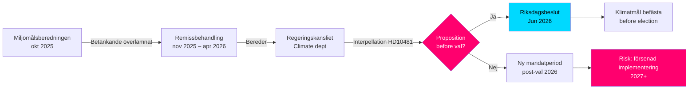

# Klimaatdoelen voor de verkiezingen: Interpellatie over propositie 2030

**Samenvatting**: Rijksdaglid Åsa Westlund (S) heeft de interpellatie 2025/26:481 (HD10481) gericht aan minister van Arbeid en waarnemend minister van Klimaat en Milieu Johan Britz (L), met de vraag of de regering van plan is een klimaatdoelproposie in te dienen vóór de verkiezingen van 2026. Het rapport van de Miljömålsberedningen met een voorstel voor een bijgewerkt tussentijds doel voor 2030 — met brede partijsteun — wordt al sinds oktober 2025 door het Regeringskansliet behandeld zonder mededelingen over een tijdplan. Zonder een propositie riskeert Zweden de parlementaire kans te missen om de 2030-doelen tijdens de huidige zittingsperiode te consolideren, wat de uitvoering van de Klimatlagen en de EU-klimaatverplichtingen kan verzwakken.

## Kernpunten in 60 seconden

- **Interpellatie HD10481** van Åsa Westlund (S) aan Johan Britz (L, waarnemend klimaatminister): eist een antwoord over een klimaatdoelproposie vóór de verkiezingen van september 2026
- **Rapport van de Miljömålsberedningen** (overhandigd op 2025-10-30) met bijgewerkt tussentijds doel voor 2030: brede parlementaire overeenstemming achter de voorstellen, maar de regering heeft geen propositie ingediend
- **Johan Britz fungeert als waarnemend minister van Klimaat en Milieu** naast zijn rol als minister van Arbeid (L), wat portefeuilleprioriteitenen binnen de Tidökoalitionen signaleert
- **Tijdsdruk**: De Riksdag sluit vóór de zomer medio juni 2026; verkiezingen op 11 september 2026 (voorlopig); propositie moet uiterlijk in mei/juni worden ingediend voor een stemming in de Riksdag
- **EU-klimaatdoel 55% voor 2030** (Fit for 55) stelt een externe deadline die de behoefte aan een nationale propositie versterkt
- **IMF WEO apr-2026**: Zweedse bbp-groei 2026 geschat op ca. 2,0% – economie in herstel, waardoor de ruimte voor klimaatinvesteringen wordt vergroot maar de acute budgettaire belemmerende logica tegen de propositie afneemt

## Beslissingsondersteuning

1. **Verantwoordingsstrategie van de oppositie**: S gebruikt de interpellatie als pre-verkiezingscampagne om op de ontoereikende klimaatambities van de Tidökoalitionen te wijzen – relevant voor de aankomende verkiezingscampagne
2. **Tijdplananalyse**: Als de regering uiterlijk in mei/juni 2026 geen propositie indient, kunnen de klimaatdoelen niet worden besloten door de huidige Riksdag → nieuwe zittingsperiode vereist
3. **Risicobeoordeling voor Zweden**: Zonder wettelijk verankerd tussentijds doel 2030 riskeert Zweden onderzoeksmaatregelen van de Europese Commissie en verlies van geloofwaardigheidspunten in internationale klimaatonderhandelingen

## Belangrijkste triggers

- **Onmiddellijk [A1]**: Het propositiedienstvenster voor de Riksdag-zitting is in praktijk gesloten — de laatste redelijke datum was 2026-05-15 (4 dagen geleden). Een klimaatdoelproposie tijdens de *huidige* zitting is nu **technisch onmogelijk**.
- **72 uur**: Aankondiging van de interpellatie in de kamer gepland op 2026-05-18; Riksdagdebat rond 2026-05-26–29 (laatste antwoorddatum)
- **7 dagen**: Kan de minister antwoorden met een duidelijke toezegging over een propositie in een *nieuwe zitting* (najaar 2026)?

**Confidence label**: [B2] — Reliable source (riksdagen.se official data), confirmed via primary source HD10481 + MJU-protokoll HDA1MJU44p

<!-- source-sha: bee8728bc92af41b21edc2b20989739604e92262 -->
