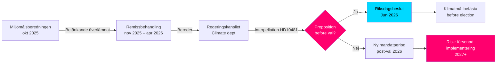

# Klimamål foran valget: Interpellasjon om proposisjon 2030

**Sammendrag**: Stortingsrepresentant Åsa Westlund (S) har rettet interpellasjon 2025/26:481 (HD10481) til arbeidsminister og fungerende klima- og miljøminister Johan Britz (L) med spørsmål om regjeringen har til hensikt å fremme en klimamålsproposisjon før valget i 2026. Miljömålsberedningens betenkning med forslag til oppdatert etappmål for 2030 – med bred politisk støtte – har siden oktober 2025 vært til behandling i Regeringskansliet uten informasjon om tidsplan. Uten en proposisjon risikerer Sverige å gå glipp av den parlamentariske muligheten til å befeste 2030-målene i inneværende valgperiode, noe som kan svekke gjennomføringen av Klimatlagen og EUs klimaforpliktelser.

## 60-sekunders nøkkelpunkter

- **Interpellasjon HD10481** av Åsa Westlund (S) til Johan Britz (L, fungerende klimaminister): krever svar om klimamålsproposisjon før valget september 2026
- **Miljömålsberedningens betenkning** (overlevert 2025-10-30) med oppdatert etappmål for 2030: bred parlamentarisk enighet bak forslagene, men regjeringen har ikke fremmet proposisjon
- **Johan Britz fungerer som fungerende klima- og miljøminister** parallelt med sin rolle som arbeidsminister (L), noe som signaliserer porteføljeprioriteringer innen Tidökoalisjonen
- **Tidspress**: Riksdagen stenger før sommeren midt i juni 2026; valg 11. september 2026 (foreløpig); proposisjon må leveres senest mai/juni for votering i riksdagen
- **EUs 55%-mål til 2030** (Fit for 55) gir en ekstern frist som forsterker behovet for en nasjonal proposisjon
- **IMF WEO apr-2026**: Svensk BNP-vekst 2026 anslås til ca. 2,0 % – økonomi i bedring, noe som øker rommet for klimainvesteringer men reduserer den akutte statsfinansielle hinderlogikken mot proposisjon

## Beslutningsstøtte

1. **Opposisjonens ansvarsstrategii**: S bruker interpellasjonen som pre-valgkampanje for å peke på Tidökoalisjonens utilstrekkelige klimaambisjoner – relevant for den kommende valgkamp
2. **Tidsplananalyse**: Hvis regjeringen ikke legger fram proposisjon senest mai/juni 2026, kan ikke klimamålene vedtas av nåværende riksdag → ny valgperiode er nødvendig
3. **Risikovurdering for Sverige**: Uten lovfestet etappmål for 2030 risikerer Sverige EU-kommisjonens granskningstiltak og tapte troverdighetspoeng i internasjonale klimaforhandlinger

## Topputløsere

- **Umiddelbart [A1]**: Proposisjonssvinduet for riksmøtet er i praksis lukket — siste rimelige dato var 2026-05-15 (for 4 dager siden). Klimamålsproposisjon i *inneværende* riksmøte er nå **teknisk umulig**.
- **72 t**: Kunngjøring av interpellasjon i kammeret planlagt til 2026-05-18; riksdagsdebatt rundt 2026-05-26–29 (siste svarsdato)
- **7 dager**: Kan statsråden svare med klart svar om proposisjon i *ny riksdag* (høst 2026)?

**Confidence label**: [B2] — Reliable source (riksdagen.se official data), confirmed via primary source HD10481 + MJU-protokoll HDA1MJU44p

<!-- source-sha: bee8728bc92af41b21edc2b20989739604e92262 -->
