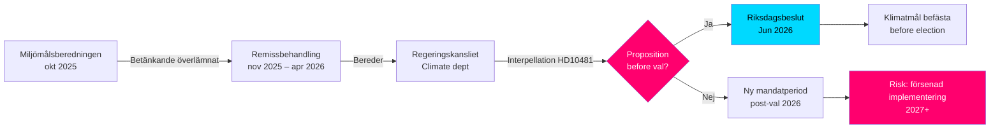

# Klimatmålen inför valet: Interpellation om proposition 2030

**Sammanfattning**: Riksdagsledamoten Åsa Westlund (S) har riktat interpellation 2025/26:481 (HD10481) till arbetsmarknadsminister och vikarierande klimat- och miljöminister Johan Britz (L) med frågan om regeringen avser att lägga fram en klimatmålsproposition innan valet 2026. Miljömålsberedningens betänkande med förslag till uppdaterat etappmål för 2030 – med brett partistöd – har sedan oktober 2025 behandlats av Regeringskansliet utan besked om tidplan. Utan en proposition riskerar Sverige att missa den parlamentariska möjligheten att befästa 2030-målen under innevarande mandatperiod, vilket kan försvaga implementeringen av Klimatlagen och EU:s klimatåtaganden.

## 60-sekundersbullets

- **Interpellation HD10481** av Åsa Westlund (S) till Johan Britz (L, vikarierande klimatminister): kräver besked om klimatmålsproposition innan valet september 2026
- **Miljömålsberedningens betänkande** (överlämnat 2025-10-30) med uppdaterat 2030-etappmål: bred parlamentarisk enighet bakom förslagen men regering har inte presenterat proposition
- **Johan Britz fungerar som vikarierande klimat- och miljöminister** parallellt med sin roll som arbetsmarknadsminister (L), vilket signalerar portföljprioritering inom Tidökoalitionen
- **Tidspress**: Riksdagen stänger inför sommaren mitten av juni 2026; val 11 september 2026 (preliminärt); proposition måste in senast maj/juni för votering i riksdagen
- **EU:s 55%-mål till 2030** (Fit for 55) ger extern deadline som förstärker behovet av nationell proposition
- **IMF WEO Apr-2026**: Svensk BNP-tillväxt 2026 beräknas till ca 2,0 % – ekonomi i återhämtning, vilket ökar utrymmet för klimatinvesteringar men minskar den akuta statsfinansiella hinderslogiken mot proposition

## Beslutsstöd

1. **Oppositionens accountability-strategi**: S använder interpellationen som pre-valskampanj för att peka på Tidökoalitionens otillräckliga klimatambitioner – relevant för kommande valrörelse
2. **Tidplaneanalys**: Om regeringen inte lämnar proposition senast maj/juni 2026, kan klimatmålen inte beslutas av nuvarande riksdag → ny mandatperiod krävs
3. **Riskbedömning för Sverige**: Utan lagstadgat etappmål 2030 riskerar Sverige EU-kommissionens granskningsåtgärder och förlorade trovärdighetspoäng i internationella klimatförhandlingar

## Topptriggrar

- **Omedelbart [A1]**: Propositionsfönstret för riksmötet har i praktiken stängt — senaste rimliga datum var 2026-05-15 (4 dagar sedan). Klimatmålsproposition under *innevarande* riksmöte är nu **tekniskt omöjlig**.
- **72 h**: Anmälning av interpellation i kammaren planerat till 2026-05-18; riksdagsdebatt kring 2026-05-26–29 (sista svarsdatum)
- **7 dagar**: Kan ministern svara med tydligt besked om proposition i *nytt riksmöte* (höst 2026)?

**Confidence label**: [B2] — Reliable source (riksdagen.se official data), confirmed via primary source HD10481 + MJU-protokoll HDA1MJU44p

<!-- source-sha: bee8728bc92af41b21edc2b20989739604e92262 -->
