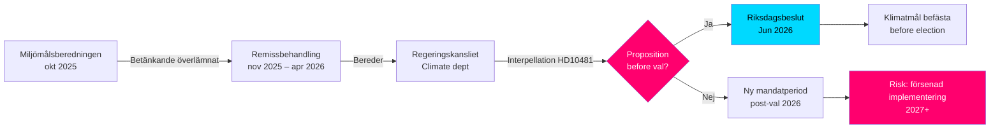

# 选举前的气候目标：关于2030年提案的质询

**摘要**：国会议员奥莎·韦斯特隆德（S）向劳工部长兼气候与环境部代理部长约翰·布里茨（L）提交了质询2025/26:481（HD10481），询问政府是否打算在2026年选举前提交一份气候目标提案。Miljömålsberedningen提出了获得广泛政党支持的更新2030年阶段性目标方案的报告自2025年10月起由Regeringskansliet审查，但未公布任何时间表。若无提案，瑞典将面临在本届会期内错过巩固2030年目标的议会机会，这可能削弱Klimatlagen的执行以及瑞典对欧盟气候承诺的履行。

## 60秒要点

- **质询HD10481**（奥莎·韦斯特隆德（S）→约翰·布里茨（L，代理气候部长））：要求在2026年9月选举前就气候目标提案作出回应
- **Miljömålsberedningen报告**（2025-10-30提交），提出更新2030年阶段性目标：各党广泛共识支持该提案，但政府尚未提交提案
- **约翰·布里茨兼任气候与环境代理部长**与劳工部长（L）——表明Tidökoalitionen内的部委优先级
- **时间压力**：议会将于2026年6月中旬夏休前关闭；选举定于2026年9月11日（暂定）；提案最迟需在5月/6月提交方可由议会表决
- **欧盟2030年55%目标**（Fit for 55）设定了强化国内提案必要性的外部截止日期
- **IMF WEO 2026年4月**：瑞典2026年GDP增长率估计约2.0%——经济复苏扩大了气候投资空间，同时削弱了反对该提案的财政障碍逻辑

## 决策支持

1. **反对派问责策略**：S将质询作为选前竞选活动，指出Tidökoalitionen气候抱负不足——与即将到来的选举运动密切相关
2. **时间表分析**：如果政府最迟在2026年5月/6月前不提交提案，现届议会将无法就气候目标作出决定→需要新会期
3. **瑞典风险评估**：若缺乏具有法律约束力的2030年阶段性目标，瑞典将面临欧盟委员会审查措施的风险，并在国际气候谈判中损失公信力

## 主要触发因素

- **即时[A1]**：本届议会会期的提案提交窗口实际上已关闭——最后合理截止日期为2026-05-15（4天前）。*本届*会期的气候目标提案现在**技术上已不可能**。
- **72小时**：质询将于2026-05-18在全体会议上公布；议会辩论约在2026-05-26–29（最终答复截止日）
- **7天**：部长是否能就*新会期*（2026年秋）的提案作出明确承诺？

**Confidence label**: [B2] — Reliable source (riksdagen.se official data), confirmed via primary source HD10481 + MJU-protokoll HDA1MJU44p

<!-- source-sha: bee8728bc92af41b21edc2b20989739604e92262 -->
