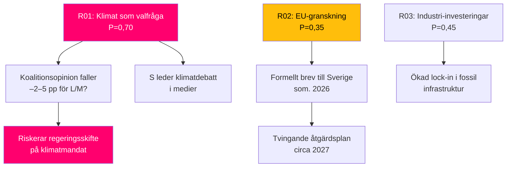

# Risk Assessment — HD10481 Klimatmålen

## 5-dimensionellt riskregister

| Risk-ID | Dimension | Beskrivning | Sannolikhet (L) | Påverkan (I) | L×I | Admiralty |
|---------|-----------|-------------|-----------------|--------------|-----|-----------|
| R01 | Politisk | Klimat blir S:s framgångsrika valfråga; Tidökoalitionen förlorar väljarförtroende på miljöomröstning | 0,70 | 0,80 | **0,56** | [B2] |
| R02 | Juridisk/regulatorisk | EU-kommissionen inleder formellt granskningsförfarande (Art. 38 Governance Reg 2018/1999) om Sverige saknar befästa nationella 2030-mål | 0,35 | 0,75 | **0,26** | [C2] |
| R03 | Ekonomisk | Industrins investeringsbeslut i fossilinfrastruktur fortsätter pga. otydliga mål; stranded assets-risk ökar | 0,45 | 0,65 | **0,29** | [D3] |
| R04 | Institutionell | Klimatlagen urholkas om etappmål skjuts upp; Klimatpolitiska rådet rapporterar bristande lagefterlevnad | 0,40 | 0,70 | **0,28** | [B2] |
| R05 | Internationell | Sverige förlorar trovärdighet i UNFCCC/Parisprocessen; NDC-revision ifrågasätts | 0,30 | 0,60 | **0,18** | [C3] |

## Kaskadkedjor

## Posterior-sannolikheter (med ny evidens)

Baserat på MJU-briefingen 2026-05-05 (HDA1MJU44p) där Johan Britz informerade utskottet om "regeringens arbete för att Sverige ska nå EU:s klimatmål" utan att nämna proposition → uppdaterad bedömning:

- P(proposition lämnas innan sommar 2026) = **0,25** [nedat från 0,40 pga. brist på propositionssignal i MJU-briefing]
- P(proposition uteblir → sköts upp till ny mandatperiod) = **0,75**

## Riskmitigation

| Risk-ID | Möjlig mitigation | Aktör | Tidplan |
|---------|-------------------|-------|---------|
| R01 | Avisera proposition med tydlig tidplan i ministersvar | Johan Britz (L) | Sista svarsdatum 2026-05-29 |
| R02 | Skicka Swedish National Energy and Climate Plan (NECP) update till EU-kommissionen | Klimat- och Näringsdepartementet | Jun 2026 |
| R03 | Publik konsultation med industri om 2030-regelverket | Naturvårdsverket / Energimyndigheten | Q3 2026 |
