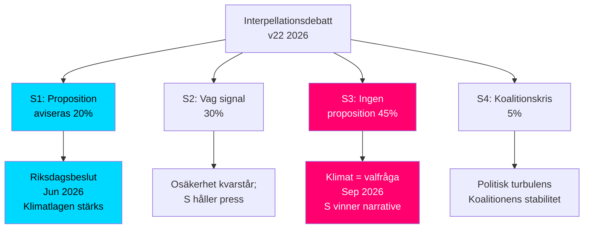

# Scenario Analysis — HD10481 Klimatmålen

## Scenarion

| # | Scenario | Sannolikhet | Ledande indikator |
|---|----------|-------------|-------------------|
| S1 | Proposition aviseras i Johan Britz svar (maj–juni 2026) | 0,20 | Positiv signal i MJU-debatt 22 maj; proposition lämnas jun 2026 |
| S2 | Vag proposition-signal utan tydlig tidplan | 0,30 | Britz svar: "Vi arbetar med proposition för nästa riksmöte" |
| S3 | Ingen proposition – fördröjning till ny mandatperiod | 0,45 | Britz svar tonar ned tidplanen; hänvisar till pågående beredning |
| S4 | Extraordinary: koalitionskris om L kräver proposition som villkor | 0,05 | Intern koalitionskonflikt; L-krav offentliggörs |

**Summa sannolikheter**: 1,00 ✅

### Scenario S1 — Proposition aviseras (P=0,20)
**Utlösare**: L sätter klimat som profilieringsfråga inför val; interna Tidö-förhandlingar lyckas; EU-trycket eskalerar  
**Konsekvenser**: S:s interpellationsattack neutraliseras; Johan Britz framstår som handlingskraftig; L stärker sin miljöprofil  
**Ledande indikator T+7d**: Britz svar innehåller explicit proposition-avisering med tidplan

### Scenario S2 — Vag signal (P=0,30)
**Utlösare**: Interna koalitionskompromisser; M/SD bromsar; L vill men kan inte  
**Konsekvenser**: Fortsatt politiskt tryck från S och MP; mediefokus ökar; EU-granskningsrisk kvarstår  
**Ledande indikator T+7d**: Svar nämner "proposition planeras" utan datum

### Scenario S3 — Ingen proposition (P=0,45, basscenario)
**Utlösare**: SD-skepsis om ambitiösa mål; M prioriterar ekonomiska kostnader; kort parlamentarisk kalender  
**Konsekvenser**: Klimat som valfråga; S-narrativet om "Tidö sviker klimatlöften" förstärks; EU-granskningsrisk materialiseras post-val  
**Ledande indikator T+7d**: Svar hänvisar till "pågående beredning" utan propositionsbesked

### Scenario S4 — Koalitionskris (P=0,05, jokerkort)
**Utlösare**: L-ledarskap formellt kräver klimatproposition som koalitionsvillkor  
**Konsekvenser**: Tidoblobbets trovärdighet testad; möjlig statsministerkris pre-val  
**Ledande indikator**: Offentligt L-uttalande om klimatpropositionskrav
