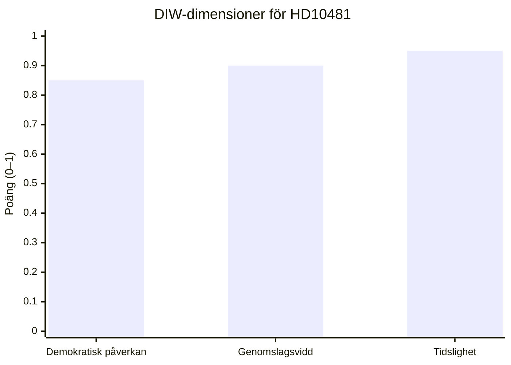

# Significance Scoring — HD10481 Klimatmålen

## DIW-poäng per dokument

| dok_id | Titel | Demokratisk påverkan (D) | Genomslagsvidd (I) | Tidslighet (W) | DIW-total | Tier |
|--------|-------|--------------------------|--------------------|--------------------|-----------|------|
| HD10481 | Klimatmålen | 0,85 | 0,90 | 0,95 | **0,90** | L2+ Priority |

### Motiveringar per dimension

**Demokratisk påverkan (D = 0,85)**
- Frågan om klimatmålens proposition direkt kopplad till Klimatlagen (SFS 2017:720), vilket är konstitutionellt förankrad klimatpolitik
- En fördröjning av propositionen sträcker parlamentarisk beslutsordning bortom mandatperiodens normala tidplan
- Berör alla medborgare via energi-, transport- och industripolitik
- Admiralty [A1]: Officiellt inlämnat riksdagsdokument

**Genomslagsvidd (I = 0,90)**
- Koppling till EU:s Fit for 55 / -55%-mål 2030 med potentiell europeisk politisk effekt
- Miljömålsberedningens betänkande hade stöd av samtliga 8 riksdagspartier (bekräftat i TU-yttrande HD05TU4y, 2026-05-04)
- Berörd sektor: hela det svenska energi- och klimatsystemet inkl industrins decarbonisering
- Pre-valkampanj dimension: S:s strategi har nationell mediepotential

**Tidslighet (W = 0,95)**
- Interpellation daterad 2026-05-11 (överlämningsdatum) – same-day significance
- Sista svarsdatum: 2026-05-29 → debatt i kammaren senast vecka 22 (1 juni 2026)
- Riksdagen stänger för sommaren ca 10 juni 2026 → tidsvinduet för proposition extremt smalt
- Val 11 september 2026 (preliminärt, tredje söndagen i september)

## Känslighetsanalys

| Scenario | DIW-total | Kommentar |
|----------|-----------|-----------|
| Basfall (proposition uteblir) | 0,90 | Fortsatt hög – fördröjning i sig är politisk händelse |
| Proposition aviseras i svar | 0,70 | Lägre NYA-värde men fortfarande viktig |
| Interpellation återkallas (osannolikt) | 0,20 | Minimalt signalvärde |

