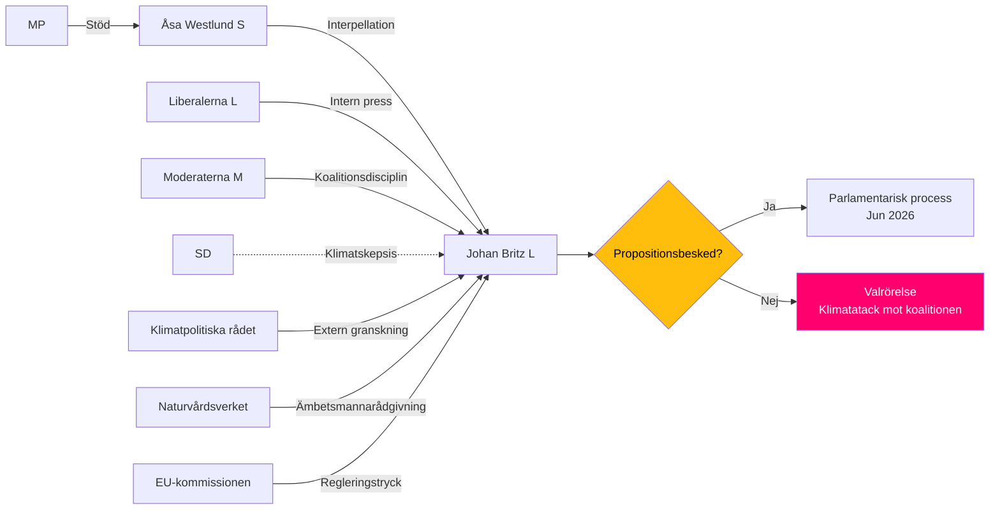

# Stakeholder Perspectives — HD10481 Klimatmålen

## 6-lins intressentmatris

| Intressent | Roll | Position | Inflytande | Intresse | Trolig agerande |
|------------|------|----------|------------|----------|-----------------|
| **Åsa Westlund (S)** | Interpellant | Pro-proposition; accountability-anfall | Hög (riksdag, media) | Hög (valstrategi + klimatövertygelse) | Fortsatt interpellationer om inget svar; presskonferenser |
| **Johan Britz (L)** | Vik. klimat- och miljöminister | Försvarar regeringens klimatarbete; undviker propositionsbesked | Hög (exekutiv) | Medel-hög | Svar fokuserat på EU-arbete; tonar ned propositionsfrågan |
| **Liberalerna (L)** | Koalitionspartner | Traditionellt pro-klimat; men bundet av Tidöavtalet | Medel (koalition) | Hög | Intern press på M/SD att acceptera proposition |
| **Moderaterna (M)** | Ledande koalitionspartner | Klimatambition sekundär efter ekonomi och trygghet | Mycket hög (statsminister) | Medel | Passivt motstånd mot klimatproposition om kostnadsfrågor lyfts |
| **Sverigedemokraterna (SD)** | Koalitionsstöd | Historiskt tveksamt till ambitiösa klimatmål | Hög (riksdagsmajoritet) | Låg-medel | Kan blockera internt i regeringsberedningen |
| **Miljöpartiet (MP)** | Opposition | Stark pro-klimat; stöder Westlunds interpellation | Låg (riksdag) | Mycket hög | Stödjer S-krav; egna interpellationer möjliga |
| **Klimatpolitiska rådet** | Oberoende granskning | Neutral men kritisk om mål ej befästas | Medel (offentlig opinion) | Hög | Kan publicera kritisk rapport om proposition uteblir |
| **Naturvårdsverket** | Implementeringsmyndighet | Behöver tydliga mål för sin planering | Medel-låg | Hög | Intern tjänsteman-lobbying för proposition |
| **Svensk industri (Industrins Klimatråd)** | Ekonomisk aktör | Splittrad: tunga industrier vill ha tydliga spelregler; fossil-beroende vill vänta | Hög (investmentbeslut) | Hög | Aktiv i remissvar; lobbyism mot överdrivna krav |

## Inflytandekarta

## Namngivna aktörer

- **Åsa Westlund (S)**: Riksdagsledamot; interpellant HD10481; tidigare statssekreterare
- **Johan Britz (L)**: Arbetsmarknadsminister och vikarierande klimat- och miljöminister; parlamentarisk statssekreterare (0397205342021)
- **Ulf Kristersson (M)**: Statsminister; ytterst ansvarig för koalitionens klimatpolitik
- **Romina Pourmokhtari**: Ordinarie klimat- och miljöminister (L) – frånvaro möjligen tjänstledighet [unconfirmed]
