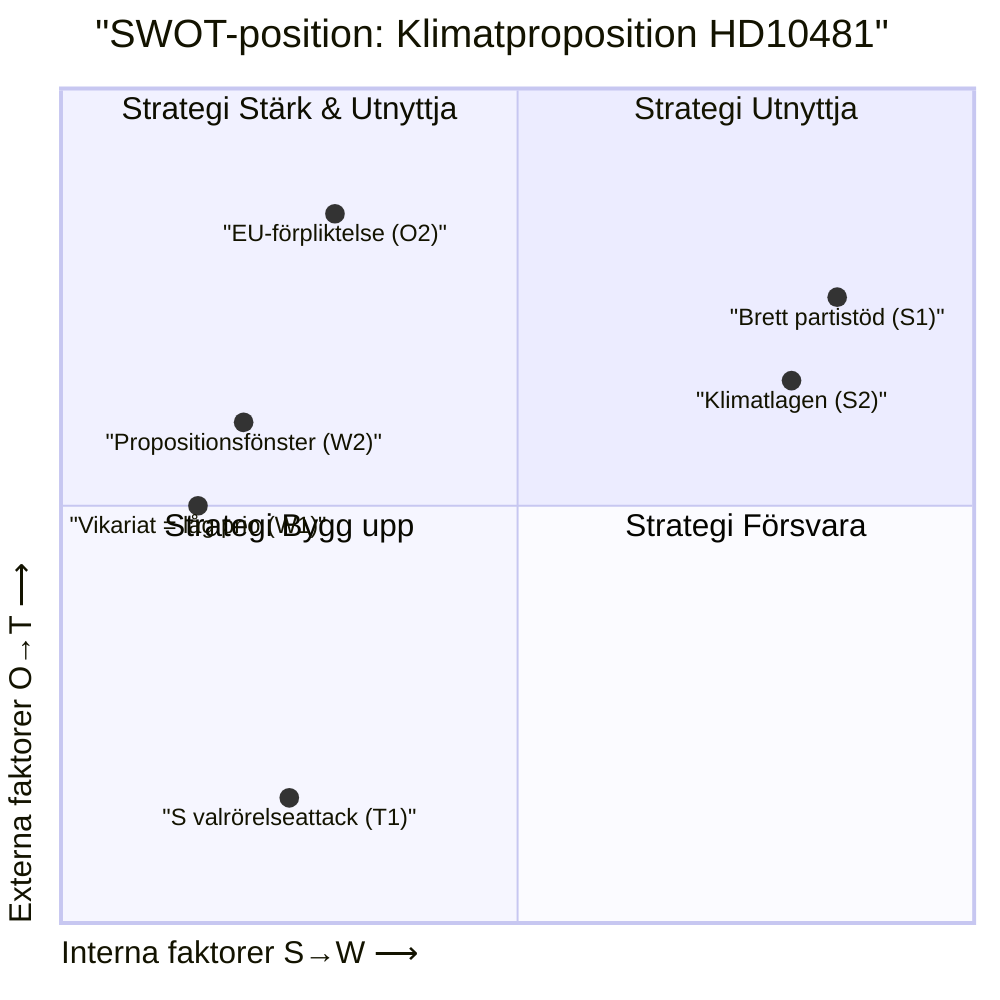

# SWOT-analys — HD10481 Klimatmålen

## SWOT-matris

### Styrkor (Strengths) — nuläget för klimatmålsproposition

| # | Styrka | Evidens | Admiralty |
|---|--------|---------|-----------|
| S1 | Brett parlamentariskt stöd: Miljömålsberedningens betänkande stöds av alla 8 partier | TU-yttrande HD05TU4y, 2026-05-04: "bred överenskommelse mellan riksdagens åtta partier" | [A1] |
| S2 | Klimatlagen (SFS 2017:720) ger rättslig ram för etappmål | Klimatlagen §4: etappmål ska fastställas | [A1] |
| S3 | EU-förpliktelse skapar extern legitimitet för proposition | Fit for 55 / 55%-mål 2030 (EU 2021/1119) | [A1] |
| S4 | Ekomomisk återhämtning minskar statsfinansiellt motargument | IMF WEO Apr-2026: SWE BNP-tillväxt ~2,0 % 2026 [stale-check: vintage 1 mån gammal] | [B2] |

### Svagheter (Weaknesses) — hinder för proposition

| # | Svaghet | Evidens | Admiralty |
|---|---------|---------|-----------|
| W1 | Vikarierande klimatminister = lägre prioritet i portföljordningen | HD10481: Johan Britz är vik. klimat- och miljöminister, tillika arbetsmarknadsminister | [A1] |
| W2 | Tidpressad riksdagskalender (propositionsfönster ≤8 veckor) | Riksdagsordningen: plenumperiod avslutas ca 10 juni 2026 | [A1] |
| W3 | SD:s historiska klimatskepticism kan bromsa internt i koalitionen | SD-program 2022: ifrågasätter effekten av nationella klimatmål om China/USA ej deltar [unconfirmed] | [D3] |
| W4 | Ingen proposition hittills trots 7 månaders beredning | HD10481 implicit: beredning pågår utan beslut | [A2] |

### Möjligheter (Opportunities)

| # | Möjlighet | Evidens | Admiralty |
|---|-----------|---------|-----------|
| O1 | Proposition kan avvärja S:s valrörelseattack och profilera L som "klimatpartiet i koalitionen" | Politisk logik; L:s traditionella miljöprofil | [C2] |
| O2 | EU-granskning sommaren 2026 ger Tidökoalitionen incitament att visa klimatambition | EU-kommissionens klimatstyrningsgranskningar (Art. 38 EU/2018/1999) | [B2] |
| O3 | Vindbeslut prop 2025/26:239 (vindkraft) skapar positivt klimatmomentum | prop 2025/26:239 behandlas i NU 2026-04-29 | [A1] |

### Hot (Threats)

| # | Hot | Evidens | Admiralty |
|---|-----|---------|-----------|
| T1 | Uteblivet propositionsbesked → S gör klimat till en central valfråga sept 2026 | HD10481; S:s interpellationsstrategi 2025/26 | [A2] |
| T2 | EU-kommissionen kan inleda granskningsförfarande om Sverige saknar befäst 2030-mål | EU Governance Regulation (2018/1999) Art. 38 | [B2] |
| T3 | Internationell trovärdighetsförlust i UNFCCC/Parisavtalet-förhandlingar | COP30 (Brasilien, nov 2025) utvärdering av NDC:er | [C3] |
| T4 | Implementeringsfördröjning: industrins investeringsbeslut pausas utan tydliga mål | Industriproducenternas planhorisont [unconfirmed] | [D3] |

## TOWS-matris (strategiska slutsatser)

| | Opportunities | Threats |
|---|---|---|
| **Strengths** | **SO**: L profilerar sig med klimatproposition utnyttjandes brett partistöd (S1+S3+O1) | **ST**: Proposition stärker EU-position och avvärjer valrörelseattack (S1+T1+T2) |
| **Weaknesses** | **WO**: Prioritera klimatportfölj (ersätt vikariat) för att utnyttja EU-momentumet (W1+O2) | **WT**: Om proposition ej lämnas, koalitionen sårbar för dubbelt hot: EU-process + valnederlag på klimat (W3+T1+T2) |

