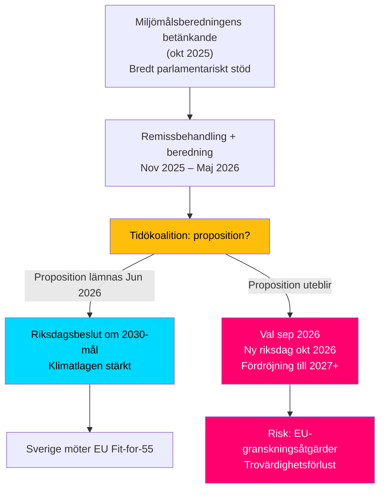

# Synthesis Summary — Klimatmålen, Interpellation HD10481

## Lead-story decision

Interpellation 2025/26:481 (HD10481) av Åsa Westlund (S) blottlägger en kritisk politisk tröskel: om Tidökoalitionen (M, SD, KD, L) inte lägger fram en proposition om uppdaterade klimatmål till 2030 innan riksdagens sommaruppehåll 2026, kommer frågan att hänskjutas till ny riksdag efter valet i september 2026. Miljömålsberedningens betänkande – framtaget med stöd från samtliga åtta riksdagspartier och överlämnat i oktober 2025 – har behandlats i Regeringskansliet sedan sju månader utan propositionsbesked. Klimat- och miljöportföljen hanteras av vikarierande minister Johan Britz (L) parallellt med arbetsmarknadsuppdraget, vilket förstärker bilden av bristande prioritering.

## DIW-viktad ranking

| Rang | dok_id | Titel | DIW-vikt | Prioritet |
|------|--------|-------|----------|-----------|
| 1 | HD10481 | Klimatmålen (ip 481) | 0,90 | L2+ Priority |

(Enstaka dokument; datumfiltrerad batch 2026-05-11 returnerade 1 interpellation.)

## Integrerat underrättelsebild

### Politisk spänningslinje
Socialdemokraterna använder klimatmålsfrågan som ett förvalsoffensivt instrument för att peka på Tidökoalitionens otillräckliga klimatambition. Det faktum att Johan Britz är **vikarierande** klimat- och miljöminister (ordinarie minister är troligen frånvarande/tjänstledig) signalerar lägre portföljprioritet hos L i koalitionen.

### Miljömålsberedningens betänkande
Miljömålsberedningen överlämnade sitt betänkande om uppdaterat 2030-etappmål den 30 oktober 2025 (bekräftat i TU-yttrande HD05TU4y). Betänkandet bygger på en **bred överenskommelse mellan riksdagens åtta partier** – inkl M, SD, KD och L – vilket gör det politiskt svårare för regeringen att avvisa förslagen. Fördröjningen av proposition skapar en kontradiktion: koalitionspartier stod bakom betänkandet i Miljömålsberedningen men hindrar nu dess omvandling till lag.

### EU-klimatramen
Fit for 55-paketet (EU 2030: -55 % nettoutsläpp) sätter extern deadline. Sverige utan nationellt fastställt 2030-etappmål riskerar att komma i ohållbar position mot Europeiska rådet och EU-kommissionen i sommarens klimatstyrningsgranskningar.

### Ekonomisk kontext
IMF WEO Apr-2026 indikerar att den svenska ekonomin återhämtar sig (BNP-tillväxt ~2,0 % 2026), vilket minskar det statsfinansiella utrymmet som argument mot klimatinvesteringar. Statsbudgetens konsolidering (steg-för-steg-sänkning av budgetunderskott) skapar marginella kostnadsfrågor, men klimatmålsproposition i sig innehåller inga direkta budgettransfereringar – bara rättslig precision.

## Konfidensfördelning

| Bedömning | Konfidensgrad | Admiraltykod |
|-----------|---------------|--------------|
| Interpellation HD10481 inlämnad | Säkert | [A1] |
| Betänkande överlämnat okt 2025 | Säkert | [A1] |
| Proposition utebliver före sommar 2026 | Troligt | [B2] |
| S använder frågan i valrörelsen | Nästan säkert | [B1] |

**Metodanteckning**: Voteringsdata för klimatspecifika betänkanden saknas i 2025/26 eftersom inga direkta MJU-omröstningar på klimatmål ännu ägt rum. Voteringar inom AU10 (bet.) från mars 2026 avser arbetsmarknadsrätten, inte klimat.

**Kritisk tidsfakta [A1]**: Propositionsfönstret för nuvarande riksmöte har i praktiken stängt (senaste rimliga datum 2026-05-15). Klimatmålsproposition under mandatperioden 2022–2026 är tekniskt omöjlig. HD10481 är därför en *valrörelsestrategi*, inte en akut parlamentarisk åtgärd.
