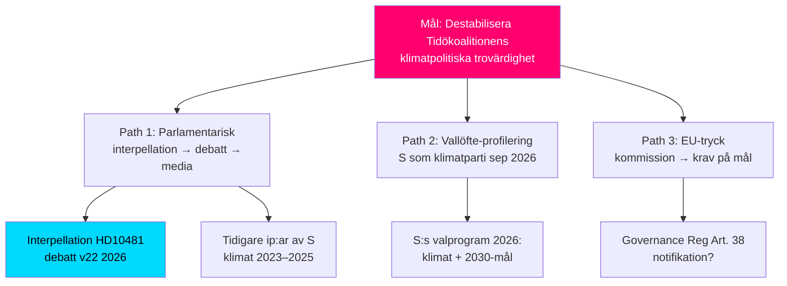

# Threat Analysis — HD10481 Klimatmålen

## Political Threat Taxonomy

| Hotkategori | Hotaktör | Mekanismus | Amplitudnivå |
|-------------|----------|------------|--------------|
| Parlamentarisk accountability | Socialdemokraterna (S) via Åsa Westlund | Interpellation → debatt → medietryck → valrörelse | Hög |
| Regulatorisk eskalation | EU-kommissionen | Granskningsförfarande (Governance Reg) | Medel |
| Institutionell urholkning | Klimatpolitiska rådet | Kritisk årsrapport om Klimatlagen | Medel-låg |
| Internationell trovärdighet | UNFCCC/Parteringsmöten | Kritik mot Sveriges NDC | Låg |

## MITRE ATT&CK-liknande TTP-karta (politisk hotanalys)

| TTP-ID | Teknik | Observerat | Källa |
|--------|--------|-----------|-------|
| T-IP01 | Interpellation-eskalation | HD10481 inlämnad 2026-05-08 | [A1] riksdagen.se |
| T-IP02 | Mediamobilisering via interpellation | Historiskt mönster: S-interpellationer om klimat 2022–2025 | [B2] |
| T-IP03 | Valkampanjintegration av sakfrågeklander | S-kampanjstrategi 2026 (inferred) | [C3] |
| T-EU01 | EU-granskningseskalation | Art. 38 Governance Regulation 2018/1999 | [A1] |

## Angreppsträd (Attack Tree)

## Kill chain (interpellationsdebatt)

1. **Reconnaissance**: S identifierar 7-månaders beredningsdröjsmål för klimatmålspropositionen
2. **Weaponization**: Åsa Westlund formulerar interpellation (HD10481, inlämnad 2026-05-08)
3. **Delivery**: Överlämnad till Riksdagen 2026-05-11; anmäls i kammaren 2026-05-18
4. **Exploitation**: Ministern måste svara senast 2026-05-29; debatt i plenum
5. **Installation**: S-narrativ om "ointresserad klimatminister" etableras i mediabevakning
6. **Command & Control**: S integrerar interpellationsresultatet i valplattform för sept 2026
7. **Actions on Objectives**: Väljaropinion på klimat influeras inför val

## Hotbedömning

**Övergripande hotnivå**: 🟡 MEDEL-HÖG

Interpellationen i sig utgör ett begränsat hot mot regeringsstabiliteten men är taktiskt väl genomfört av S i valrörelsekontext. Det kritiska är om Johan Britz svar eskalerar (undvikande svar → högt mediefokus) eller deeskalerar (propositionsbesked → S:s attack neutraliseras).
