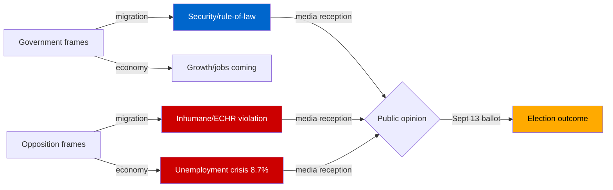

# Media Framing Analysis — Month Ahead: June–July 2026

**Date**: 2026-05-11 | **Subfolder**: month-ahead

## Dominant Frames (Expected June 2026)

### Frame 1: "Pre-election legislative sprint" (descriptive, all outlets)
Government is using remaining spring session to deliver on 2022 Tidö Agreement promises. Volume of major legislation filed in late April–early May 2026 supports this framing. Risk: "governing by press release" counter-narrative if implementation lags.

### Frame 2: "Migration hardlining" (critical outlets, S-leaning)
Permanent residence abolition (HD03262) will be framed as Europe's most restrictive migration regime after Denmark. Expected international coverage in Guardian, DW, EU-observer. Domestic S-aligned media will link to unemployment statistics.

### Frame 3: "ECHR risk" (legal/quality press)
Advokatsamfundet (bar association), UNHCR, and human rights organisations expected to file public commentary on HD03262 ECHR Article 8 compliance. Likely major DN/SvD analytical coverage.

### Frame 4: "Digital state" (tech/innovation press)
HD03250 (national e-legitimation) will receive positive framing in Dagens industri and Computer Sweden as long-overdue infrastructure. Limited political controversy.

### Frame 5: "Juvenile crime age" (tabloids, local press)
Aftonbladet, Expressen, local newspapers covering prop 2025/26:246 (criminal age 13). Highly emotionally charged. SD electoral benefit from tough-crime framing.

## Framing Risk Assessment

## Social Media & Viral Risk

High viral risk on juvenile crime age (prop 246): individual case-driven narratives from police/victim organisations. Migration package: organised civil society campaigns (Röda Korset, Amnesty Sverige) expected.
