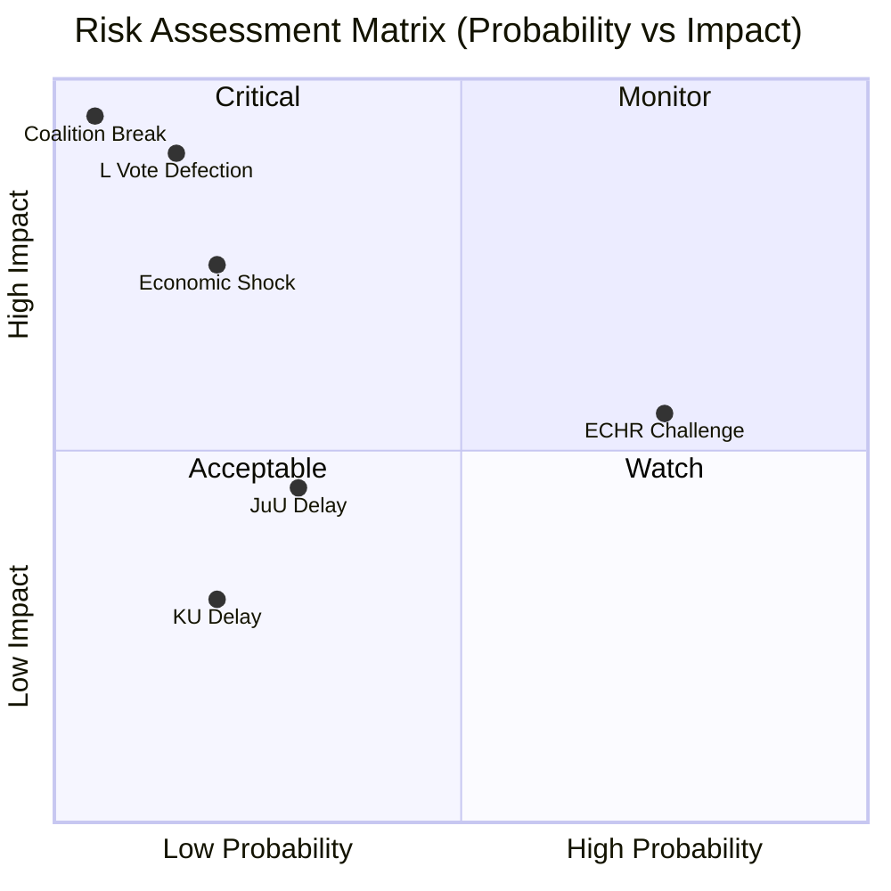

# Risk Assessment — Month Ahead: June–July 2026

**Date**: 2026-05-11 | **Subfolder**: month-ahead | **Horizon**: T+30/T+60

## STRIDE Risk Matrix

| Risk | Type | Actor | Probability | Impact | Mitigation |
|------|------|-------|------------|--------|-----------|
| L MPs vote against HD03262 | Political | L dissidents | Low (15%) | Critical — coalition fracture signal | PM Edholm manages internal discipline |
| ECHR challenge to HD03262 | Legal | Civil society / ECHR applicants | High (75%) | Medium (post-election, not pre-election) | Government will argue EU pact compliance |
| KU delays HD03258 | Procedural | KU cross-party scrutiny | Medium (20%) | Low | Standard committee process |
| JuU hearing delays | Procedural | Opposition tactics | Medium (30%) | Medium | Government controls timeline |
| Economic shock (US tariffs) | External | Global trade | Low-medium | High | IMF already revised growth down to +1.0% |
| Coalition confidence vote | Political | SD/M tension | Very low (5%) | Critical | SD electoral interest aligned with coalition |

## Risk Heat Map

## Economic Risk Factors (IMF WEO-2026-04)

- **GDP growth**: +1.0% for 2025 (below 2024 potential of ~2.1%) — lochkonjunktur more prolonged due to US tariff uncertainty
- **Unemployment headwind**: 8.7% constitutes electoral vulnerability; government's legislative sprint cannot mask labour market weakness
- **Fiscal space**: Conservative fiscal stance limits ability to announce major spending pre-election
- **Riksbank path**: Rate easing continues (HC01FiU24), but mortgage holders' relief is slow to materialise

*Provenance: IMF WEO-2026-04 (April 2026, 1 month, provider: imf); Riksbank evaluation HC01FiU24.*

## Strategic Risk

The government's concentration of migration proposals in a single month (April–May 2026) creates a binary electoral risk: if all pass, the coalition can claim delivery; if any stumbles on ECHR grounds, it becomes an election liability. The government appears to have calculated that the electoral benefit of signaling delivery outweighs the legal risk.
