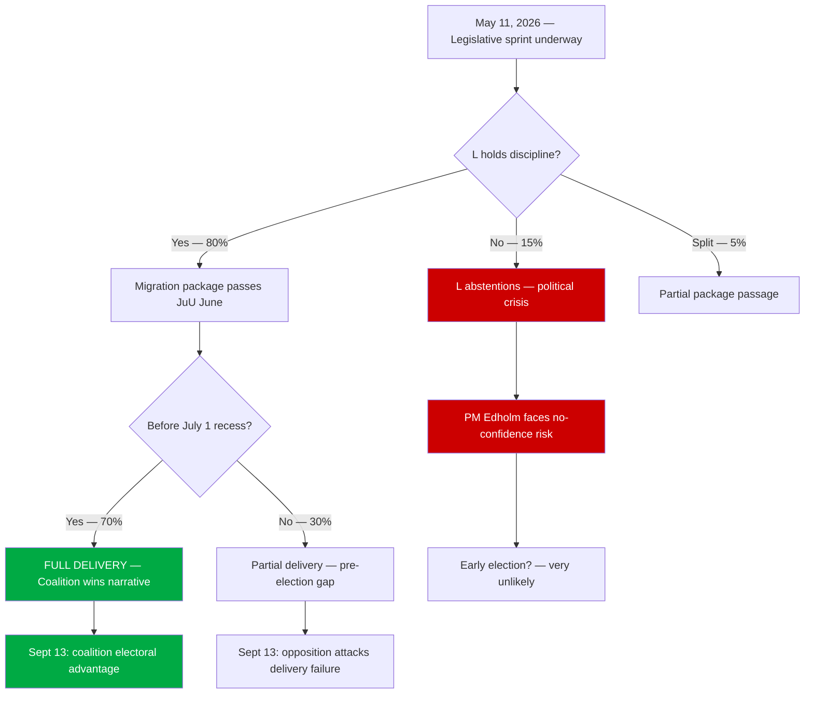

# Scenario Analysis — Month Ahead: June–July 2026

**Date**: 2026-05-11 | **Subfolder**: month-ahead | **Horizon**: month-ahead

## Scenario Tree (T+30 to T+60)

## Scenario Descriptions

### Scenario A: Full Delivery (probability: 55%) [WEP: more likely than not]
All five migration propositions pass JuU committee and plenary before July 1 recess. Coalition demonstrates full delivery on Tidö Agreement. HD03254 (military) also passes with S support.
**Outcome**: Coalition enters September 13 election with strong "delivery" narrative. Migration domination of media cycle continues. Opposition forced to fight on economic terrain.
**Key indicator**: JuU hearing schedule published by May 25.

### Scenario B: Partial Delivery (probability: 35%) [WEP: roughly even]
3–4 of 5 migration propositions pass; HD03258 or HD03267 delayed by KU scrutiny. Coalition claims credit for core reform.
**Outcome**: Minor opposition narrative of "government couldn't deliver its own program." Manageable. Election outcome depends on economic polling.
**Key indicator**: KU schedule for HD03258.

### Scenario C: Coalition Crack (probability: 10%) [WEP: unlikely]
L abstentions on HD03262 (permanent residence abolition) create formal parliamentary crisis. Government must renegotiate or withdraw proposition.
**Outcome**: Severe coalition damage. Edholm personally implicated. SD electoral mobilization against L. Potential no-confidence motion.
**Key indicator**: L internal Riksdag member statements in late May.

## Counterfactual

*If the government had NOT filed the migration package before the summer recess*: The coalition would have entered the election campaign unable to claim Tidö Agreement delivery on migration. SD would have attacked M as an unreliable partner. L might have gained some voters from moderate conservatives. On balance, the filing decision was rational given coalition dynamics.
