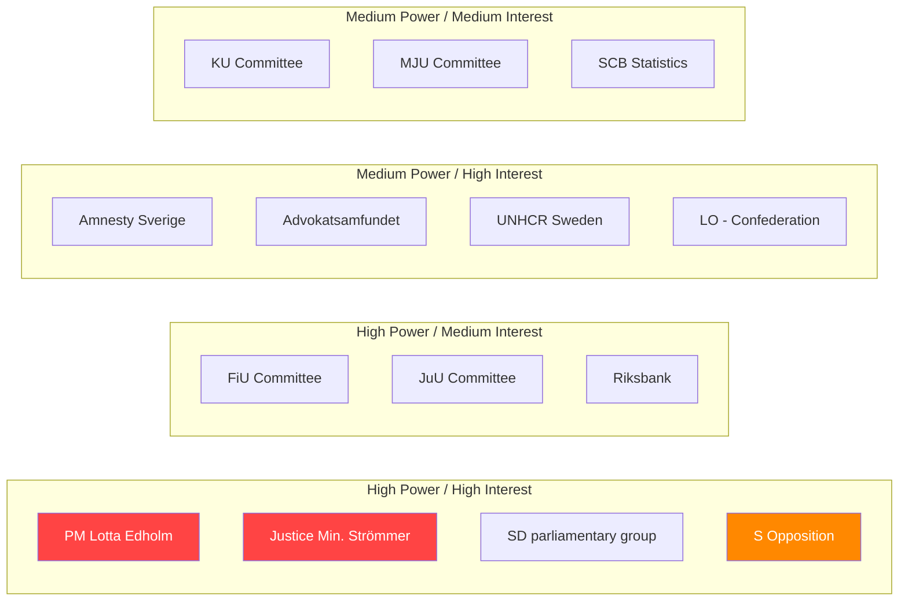

# Stakeholder Map — Month Ahead: June–July 2026

**Date**: 2026-05-11 | **Subfolder**: month-ahead

## Stakeholder Power-Interest Matrix

## Key Stakeholder Positions

| Stakeholder | Position on migration package | Influence mechanism |
|-------------|------------------------------|-------------------|
| PM Edholm | Signatory — supports | Executive authority |
| Gunnar Strömmer | Architect — strongly supports | Legislative initiative |
| SD group | Core supporter — existential | Coalition votes |
| L group | Conditional supporter | 16 votes decisive |
| S opposition | Opposes — economic framing | 87 votes, media |
| MP | Strongly opposes | 25 votes, civil society |
| Amnesty Sverige | Opposes — human rights framing | Media, legal filings |
| Advokatsamfundet | Legal scrutiny | ECHR compliance opinions |
| UNHCR | Internationally critical | Diplomatic + media |
| LO | Focused on labour market | Not migration-focused |
| Swedish Bar | Legal challenge preparation | Courts |
