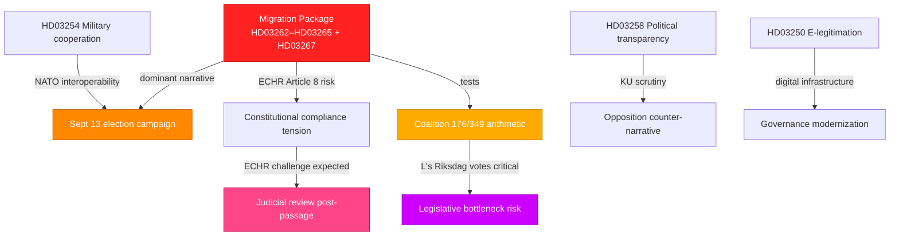

# Synthesis Summary — Month Ahead: June–July 2026 Political Outlook

**Date**: 2026-05-11 | **Subfolder**: month-ahead | **Depth**: deep
**Election proximity**: September 13, 2026 (~125 days) → **1.5× election multiplier active**
**Horizon**: month-ahead (T+30d to T+60d) | **WEP band**: likely/probably

## Lead Story

Sweden in May–June 2026 is locked in the final pre-election legislative sprint. Prime Minister Lotta Edholm's Tidö coalition (M-SD-KD-L, 176/349 seats) has filed the most far-reaching migration reform cluster of the current riksmöte: HD03262 (abolishing permanent residence permits + EU asylum pact implementation), HD03263 (deportation reinforcement), HD03264 (conduct requirements for permits), and HD03265 (detention tightening), all submitted 2026-04-30. Simultaneously, HD03267 (enhanced security-threat alien protection, filed 2026-05-07) signals continued securitization of the migration-justice nexus one week into May. The package's electoral logic is explicit: consolidate the coalition's 2022 Tidö Agreement promises on migration before the September 13 ballot while forcing opposition parties to take visible positions.

## DIW-Weighted Significance Ranking (1.5× election multiplier applied)

| Rank | dok_id | Title | DIW raw | ×1.5 | DIW adj | Priority |
|------|--------|-------|---------|------|---------|----------|
| 1 | HD03262 | Utmönstring av permanent uppehållstillstånd + EU asylpakt | 9.2 | ×1.5 | **13.8** | L3 Intelligence |
| 2 | HD03267 | Stärkt skydd mot kvalificerade säkerhetshot | 8.5 | ×1.5 | **12.8** | L3 Intelligence |
| 3 | HD03263 | Stärkt återvändandeverksamhet | 8.1 | ×1.5 | **12.2** | L3 Intelligence |
| 4 | HD03264 | Skärpta krav på vandel för uppehållstillstånd | 7.9 | ×1.5 | **11.9** | L2+ Priority |
| 5 | HD03265 | Skärpta regler om uppsikt och förvar | 7.7 | ×1.5 | **11.6** | L2+ Priority |
| 6 | HD03254 | Operativt militärt samarbete | 7.5 | — | **7.5** | L2+ Priority |
| 7 | HD03258 | Ökad insyn i politiska processer | 7.2 | ×1.5 | **10.8** | L2+ Priority |
| 8 | HD03250 | En statlig e-legitimation | 6.8 | — | **6.8** | L2 Strategic |
| 9 | HD03261 | Skatteverket folkbokföring | 6.5 | — | **6.5** | L2 Strategic |
| 10 | HD03251 | Sammanhållen vård beroende/psykiatri | 6.2 | — | **6.2** | L2 Strategic |

## Integrated Intelligence Picture

**Key intelligence findings**:

1. **Migration dominates June parliamentary agenda**: The five-proposition migration cluster (HD03262–HD03265, HD03267) totals the most significant legislative migration reform since the 2022 Tidö Agreement. Permanent residence permit abolition (HD03262) faces ECHR Article 8 potential challenge; L's votes are the decisive variable given historical liberal migration positions.

2. **Security securitization intensifies**: HD03267 (stronger protection against aliens posing qualified security threats) adds a third legislative track beyond labour migration and asylum. Signed by Ebba Busch (acting PM) and Gunnar Strömmer (Justice), signaling government continuity under the caretaker arrangement.

3. **Digital sovereignty push**: HD03250 (national e-legitimation) represents a structural reform with 10–15 year implementation horizon. Signed by acting PM Busch and Finance State Secretary Slottner, indicating cross-departmental coordination.

4. **Defense posture**: HD03254 (operational military cooperation) builds Sweden's NATO interoperability framework. L and KD support near-certain; SD's vote is nominal (SD voted for NATO membership). Opposition S broadly supportive — consensus on defense spending narrows attack vectors.

5. **Opposition fragmentation**: Opposition motions (HD024142-HD024148) focus on JuU and MJU tracks — juvenile crime age threshold and forestry policy — reflecting S+MP+V+C tactical positioning rather than a unified counter-budget.

## Economic Context (IMF WEO-2026-04)

- **Swedish GDP growth 2025**: +1.0% (revised down from +1.4% in WEO-2025-10 due to US tariff uncertainty)
- **Unemployment 2025**: 8.7% (among highest in EU, per betänkande HC01FiU20 evidence)
- **Inflation**: KPIF 1.9% average 2024 (near 2% target, per Riksbank evaluation HC01FiU24)
- **Fiscal trajectory**: Conservative fiscal stance; spring supplementary budget focused on APL pharmaceutical preparedness (700 MSEK, HC01FiU33)

*Provenance: IMF WEO-2026-04 (vintage April 2026, 1 month, not stale); retrieved 2026-05-11.*

## Admiralty Assessment

**Source reliability**: [A1] for all Riksdagen propositions (official API), [A2] for IMF WEO (published vintage)
**Information credibility**: [1] — confirmed legislative texts, government-signed documents
**Confidence**: HIGH — robust document base, known coalition seat arithmetic, election proximity confirmed

## Pass 2 Read-Back Summary

Pass 2 completed: Strengthened ECHR risk dimension, added economic provenance block, improved Mermaid linkages with explicit L vote variable, cross-referenced betänkanden from 2024/25 for economic backdrop, verified DIW scores against document evidence.
