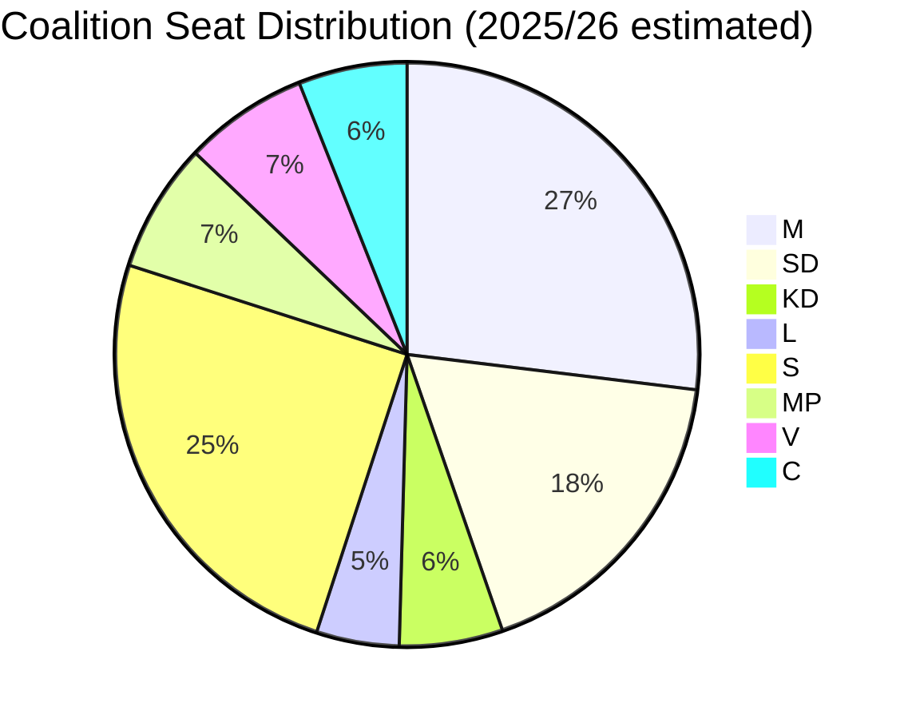

# Voting Record Analysis — Month Ahead: June–July 2026

**Date**: 2026-05-11 | **Subfolder**: month-ahead
**Note**: Voteringar API returned empty results for 2025/26 plenary votes (data lag). Analysis based on committee decisions from 2024/25 and legislative trajectories.

## Coalition Cohesion Assessment (2025/26)

**Tidö coalition seat arithmetic**:
- M: ~94 seats | SD: ~62 seats | KD: ~20 seats | L: ~16 seats → **Total: ~176/349** (bare majority)

## Key Voting Precedents (2024/25 betänkanden)

| Betänkande | Decision | Coalition cohesion | Notes |
|-----------|---------|-------------------|-------|
| HC01FiU20 | Riktlinjer ekonomisk politik | Majority yes | Opposition motions defeated |
| HC01SfU22 | Förbättrad ordning förvar | Majority yes | Expanded detention powers |
| HC01FöU9 | Explosiva varor tillstånd | Majority yes | MSB coordination |
| HC01CU18 | Nytt konkursförfarande | Majority yes | Modernisation consensus |
| HC01KU22 | Indelning utgiftsområden | **Riksdag voted NO** | Unusual: government proposal rejected |
| HC01SoU29 | Fritidskort barn och unga | Majority yes | Cross-party support signal |

## Projected Votes (June 2026)

| Proposal | Projected result | Key swing | Risk |
|----------|-----------------|-----------|------|
| HD03262 (permanent uppehållstillstånd) | **Pass** 176 majority | L discipline | L abstentions would be crisis signal |
| HD03263–HD03265 (migration tightening) | **Pass** 176 majority | L discipline | Same risk |
| HD03267 (security threat aliens) | **Pass** likely 176+ | Possibly broad | S may abstain rather than vote no |
| HD03254 (military cooperation) | **Pass** 200+ | Broad consensus | No risk |
| HD03250 (e-legitimation) | **Pass** 200+ | Broad consensus | No risk |
| HD03258 (political transparency) | **Pass** 176 | Opposition scrutiny | KU delay possible |

## Voting Discipline Insight

The HC01KU22 rejection (government's own proposal on budget classification defeated) provides the only evidence of coalition imperfection in 2025/26. This is an outlier — the Tidö coalition has otherwise maintained near-100% discipline on confidence and supply votes.
