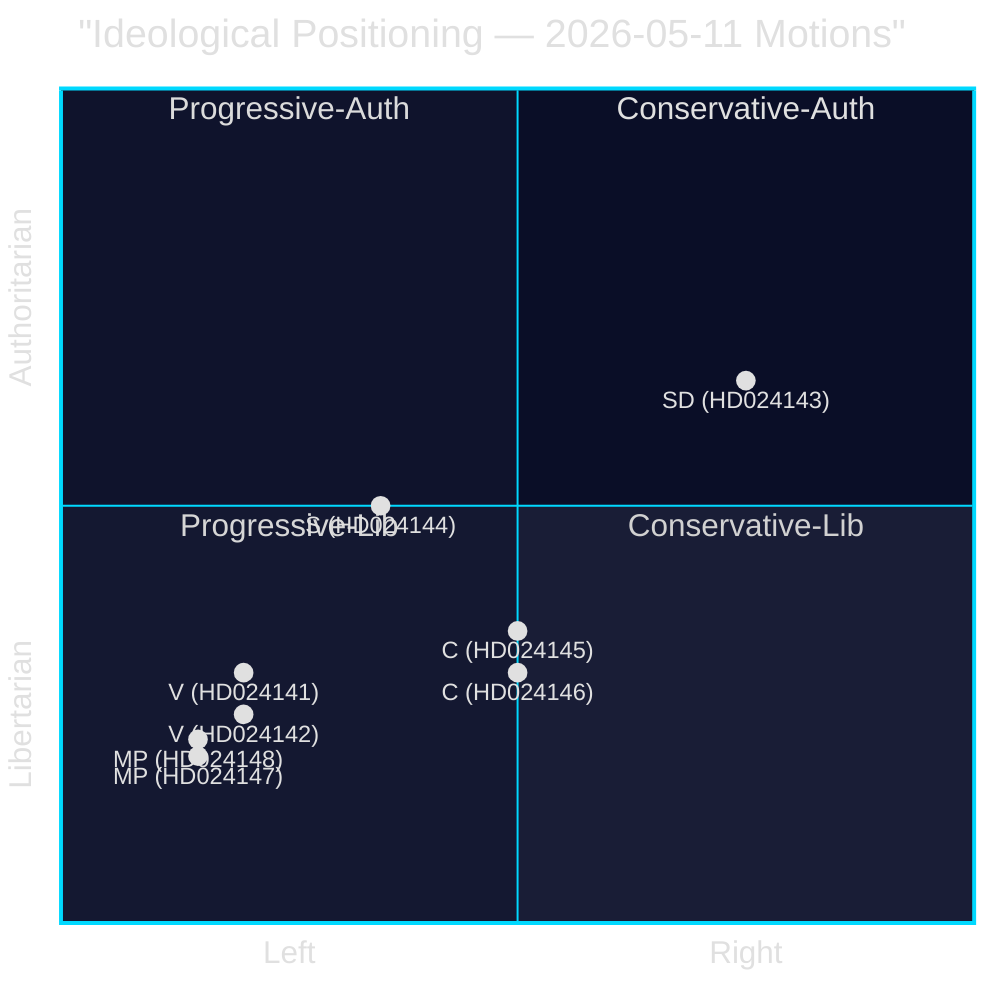

# Political Classification — Opposition Motions — 2026-05-11

**Family**: A | **Confidence**: HIGH

## Ideological Classification

| Document | Party | Left-Right Position | Auth-Lib Position | Policy Domain | Frame |
|----------|-------|--------------------|--------------------|---------------|-------|
| HD024141 | V | Far-left (1.5/10) | Libertarian-Green (3/10) | Environment/Forestry | Rights-based ecology |
| HD024142 | V | Far-left (1.5/10) | Civil liberties (2/10) | Criminal Justice | Children's rights |
| HD024143 | SD | Nationalist-right (7.5/10) | Moderate-auth (7/10) | Environment/Forestry | National sovereignty/land use |
| HD024144 | S | Centre-left (3.5/10) | Moderate (5/10) | Environment/Forestry | Evidence/procedure |
| HD024145 | C | Liberal-centre (5/10) | Liberal (4/10) | Economy/Forestry | Competitiveness |
| HD024146 | C | Liberal-centre (5/10) | Liberal (3.5/10) | Criminal Justice | Smart-on-crime, UNCRC |
| HD024147 | MP | Green-left (2/10) | Libertarian-eco (2.5/10) | Environment/Forestry | Planetary limits |
| HD024148 | MP | Green-left (2/10) | Civil liberties (2/10) | Criminal Justice | Children's rights |

## Policy Domain Classification

### Environment/Forestry (Prop. 2025/26:242)
- **Consensus view (government)**: Deregulation = economic growth, reduced red tape, competitive sector
- **Opposition spectrum**: Rejection (V, MP) → Procedural caution (S) → Production enhancement (C) → Conditional support (SD)
- **EU-compliance dimension**: V, S, MP cite Nature Restoration Law, Habitats Directive; government asserts compliance

### Criminal Justice/Youth (Prop. 2025/26:246)
- **Consensus view (government)**: Stricter enforcement = crime reduction, deterrence, public safety
- **Opposition spectrum**: Partial acceptance with age limits (V) → Smart-on-crime redesign (C) → Research-based return (MP)
- **Unique feature**: Three parties spanning left-green-centre all reject the age-13 threshold — scientific consensus matters more than partisan division

## Mermaid: Ideological Positioning

**Evidence Anchors**:

| Claim | Evidence | Retrieved | Confidence |
|-------|----------|-----------|------------|
| C positions as smart-on-crime | HD024146 motivering: "smart on crime-ansats" | 2026-05-11 | HIGH |
| MP cites EU Nature Restoration Law | HD024147 motivering: EU-rätt citations | 2026-05-11 | HIGH |
| SD cites land freedom for biodiversity | HD024143 motivering: biologisk mångfald | 2026-05-11 | HIGH |
