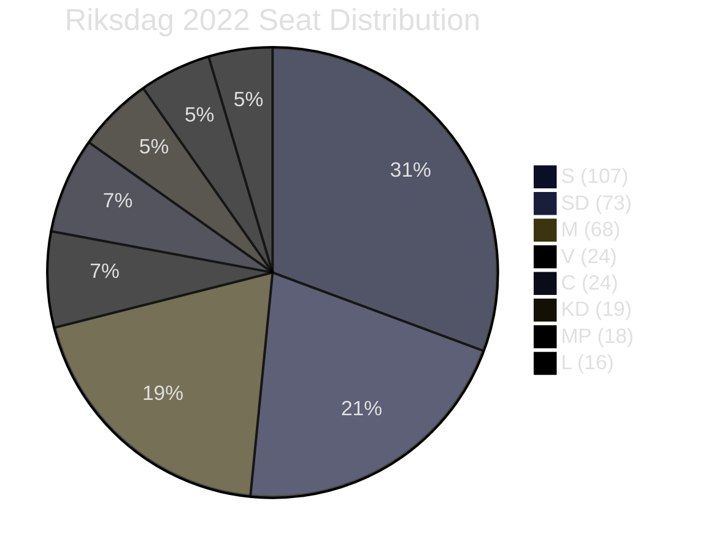

# Coalition Mathematics — Opposition Motions — 2026-05-11

**Family**: D | **Confidence**: HIGH | **Data**: 2022 election seat counts, extrapolated to 2026

## Current Riksdag Composition (2022 election baseline)

| Party | Seats (2022) | Coalition |
|-------|-------------|-----------|
| S | 107 | Opposition |
| SD | 73 | Government support |
| M | 68 | Government |
| V | 24 | Opposition |
| C | 24 | Opposition |
| KD | 19 | Government |
| MP | 18 | Opposition |
| L | 16 | Government |
| **Total** | **349** | |

**Government majority (M+KD+L+SD)**: 176 seats  
**Opposition (S+V+C+MP)**: 173 seats  
**Majority threshold**: 175 seats

## MJU and JuU Committee Vote Modelling

### MJU (Miljö- och jordbruksutskottet) — Forestry Proposition

Typical MJU composition mirrors chamber proportions. Assuming 17-member committee:

| Party | Committee Seats (est.) | On Prop. 2025/26:242 |
|-------|----------------------|---------------------|
| S | ~5 | Against (pause/study) |
| SD | ~3 | Conditional support (HD024143) |
| M | ~3 | For |
| V | ~1 | Against |
| C | ~1 | Against (different reasons) |
| KD | ~1 | For |
| MP | ~1 | Against |
| L | ~1 | For |

**Government + SD**: 8 seats → majority if SD stays  
**If SD defects**: Government seats = 5, Opposition = 8+3 = possible amendment majority

**Key variable**: SD's 3 committee seats are the decisive swing. If land-exemption demand is not met, SD joins opposition on the specific clause → amendment passes.

### JuU (Justitieutskottet) — Youth Offenders Proposition

| Party | Committee Seats (est.) | On Prop. 2025/26:246 |
|-------|----------------------|---------------------|
| S | ~5 | Absent (no motion on age-13) |
| SD | ~3 | For (supports age lowering) |
| M | ~3 | For |
| V | ~1 | Partial against (age-13) |
| C | ~1 | Against (age-13 + Art.29) |
| KD | ~1 | For |
| MP | ~1 | Against |
| L | ~1 | For |

**Government + SD**: 8 seats  
**V+C+MP**: 3 seats (plus potentially S abstention on age-13 clause)  
**Assessment**: Government prevails in JuU unless S actively votes against age-13 (no motion filed suggests S is not taking a strong position)

## Post-2026 Coalition Scenarios

### Scenario 1: Centre-Left Majority (S+V+C+MP)
**Required seats**: 173 seats barely short of majority; needs additional gains  
**If C gains from M**: C could enable centre-left majority  
**Policy implications**: Forestry bill amended/reversed; age-13 reversed; rehabilitation-focused youth justice  
**Probability**: ~45% based on current polling range

### Scenario 2: Centre-Right Re-elected (M+KD+L+SD)
**Currently holding 176 seats**; could lose 1-2 seats if C breaks fully  
**Policy implications**: Forestry bill passed (with SD amendments); age-13 enacted  
**Probability**: ~45% based on current polling range

### Scenario 3: Minority Government / Grand Compromise
**Very close election**: No bloc majority  
**Policy implications**: C becomes kingmaker; SD forestry exemption likely; age-13 possibly shelved  
**Probability**: ~10%

## Mermaid: Seat Distribution

**Evidence Anchors**:

| Claim | Evidence | Retrieved | Confidence |
|-------|----------|-----------|------------|
| Current seat counts | Riksdagen 2022 election result | 2026-05-11 | HIGH |
| Government majority 176 seats | M+KD+L+SD calculation | 2026-05-11 | HIGH |
| SD as swing on MJU | HD024143 explicit conditions | 2026-05-11 | HIGH |
| S no motion on age-13 (JuU) | Document search: 0 S motions on 2025/26:246 | 2026-05-11 | HIGH |
