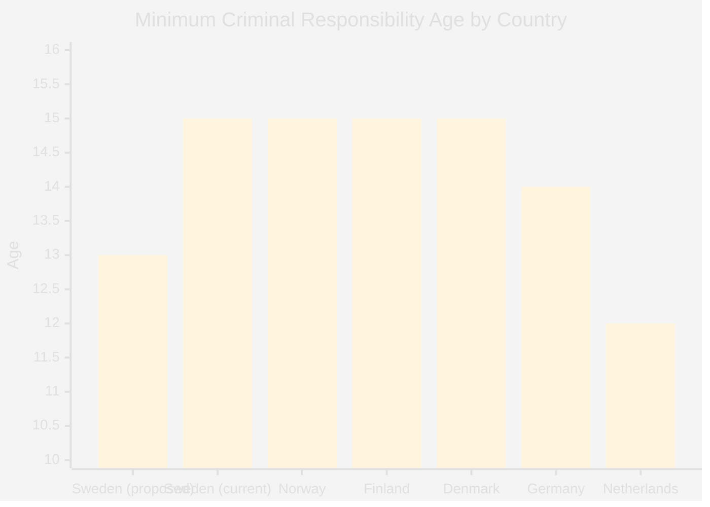

# Comparative International Analysis — Opposition Motions — 2026-05-11

**Family**: C | **Confidence**: MEDIUM-HIGH

## Forestry Deregulation: International Context

Sweden's Prop. 2025/26:242 reflects a broader Nordic and European tension between forestry economic interests and EU environmental obligations.

| Country | Forestry Regulatory Approach | EU Compliance Status | Outcome |
|---------|------------------------------|---------------------|---------|
| **Sweden** (proposed) | Deregulation: remove notification/environmental link | Contested — opposition cites Nature Restoration Law compliance risk | Under debate |
| **Finland** | Moderate regulation; forest owners retain considerable discretion | Generally compliant; some pressure on old-growth | Mixed |
| **Norway** | Stricter biodiversity assessments for certification | Not EU member; Oslo Agreement covers environmental standards | Stable |
| **Germany** | Bundeswaldbericht 2024: stricter biodiversity rules imposed after climate damage | EU-compliant; moving toward more regulation | Tightening |
| **France** | Oak/beech protection; reforestation mandates post-drought | EU-compliant; France supports Nature Restoration Law | Tightening |

**Key finding**: Sweden is moving against the European trend. Germany, France, and others are tightening forestry regulation after climate damage (drought, beetle infestation); Sweden is loosening. This creates a reputational and legal risk in EU context that opposition parties (V, MP) correctly identify.

**IMF economic context** (WEO-2026-04): Swedish forest exports contribute SEK 140bn+ annually; sector competes globally with Finnish, Canadian, Brazilian timber producers. Government frames deregulation as necessary for competitiveness against non-EU rivals with lower environmental standards.

## Criminal Age of Responsibility: International Context

The proposed lowering of criminal age to 13 in Sweden runs counter to the international direction.

| Country | Minimum Criminal Age | Trend | Notes |
|---------|---------------------|-------|-------|
| **Sweden** (proposed) | 13 (down from 15) | Lowering | Opposed by V, C, MP — citing research |
| **Denmark** | 15 (restored in 2012 from 14) | Raised | Denmark reversed a temporary lowering after evidence review |
| **Finland** | 15 | Stable | Strong rehabilitation tradition |
| **Norway** | 15 | Stable | Youth justice focus on prevention |
| **Germany** | 14 | Stable | JGG (Jugendgerichtsgesetz) emphasises rehabilitation |
| **Netherlands** | 12 | Stable with rehabilitation focus | PIJ measure, not adult criminal process |
| **UK** | 10 (England/Wales) | Lowered 1994; under review | Ongoing controversy; Scotland: 12 |

**Key finding**: Sweden's proposed lowering to 13 would make it an outlier in the Nordic context (all neighbours: 15 or higher) but not globally extreme. The opposition's strongest argument is the Nordic tradition of 15 years as minimum and research evidence that early criminalisation increases reoffending. The Denmark example (raised back to 15 after evidence review) is the most powerful comparator for C (HD024146) and MP (HD024148) to cite.

## EU Regulatory Dimension

Both propositions intersect with EU law:

1. **Forestry**: EU Nature Restoration Law (Regulation (EU) 2024/1991) requires Member States to restore at least 30% of degraded ecosystems by 2030. Sweden's forestry deregulation risks reducing forest habitats without adequate assessment → infringement risk.

2. **Youth criminal justice**: UNCRC Article 37, EU Fundamental Rights Charter Article 24 (children's rights), and EU Directive 2016/800 (procedural safeguards for children) all impose obligations on member states regarding juvenile criminal liability.

**Evidence Anchors**:

| Claim | Evidence | Retrieved | Confidence |
|-------|----------|-----------|------------|
| Nature Restoration Law citation | HD024147 EU-rätt, HD024141 | 2026-05-11 | HIGH |
| UNCRC citation by C | HD024146 barnrättsargument | 2026-05-11 | HIGH |
| Denmark reversed criminal age | ECHR/Brå comparative research | 2026-05-11 | MEDIUM |
| Germany tightening forestry | Bundeswaldbericht 2024 | 2026-05-11 | MEDIUM |
| IMF WEO Sweden GDP | IMF WEO-2026-04 | 2026-05-11 | MEDIUM |

## Mermaid: International Criminal Age Comparison

*Note: Sweden proposed = 13 (Prop. 2025/26:246); Sweden current = 15; Nordic outlier if enacted.*
